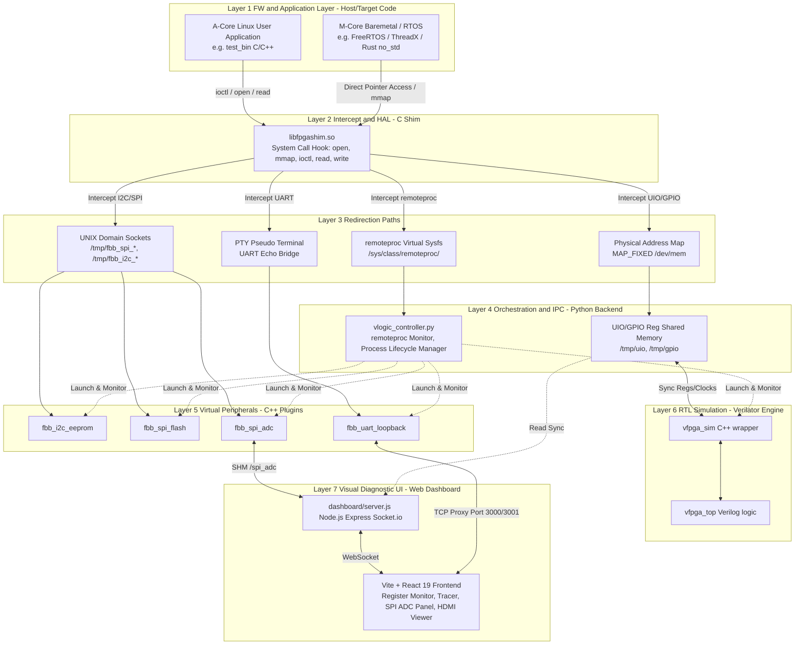

# ARCHITECTURE_MANIFEST: FPGA-BoardlessBench (F-BB)

これは、FPGA-BoardlessBench (F-BB)プロジェクト全体の運用・開発インフラに関わるポリシーである.

---

## Part 1: このマニフェストの取扱説明書 (Guide)

### 1. 目的 (Purpose)
本マニフェストは、Linux上でのFPGAエミュレーション環境構築における「北極星」として、開発者とAIが共有する普遍的な原則と設計判断を記録する。これにより、場当たり的な実装を防ぎ、長期的な保守性と実機との高い互換性を担保する。

### 2. 憲章の書き方 (Guidelines)
- **原則:** 「なぜ（Why）」を記述する。トレードオフの判断背景を明記すること。
- **具体性:** 抽象的な表現を避け、検証可能な目標や境界条件を定義する。
- **優先順位:** 常にこのマニフェストを実装コードよりも優先する。

### 3. リスクと対策 (Risks and Mitigations)
- **リスク:** 実機ドライバの複雑な挙動を再現しきれない。
- **対策:** 実機でのパケットログをキャプチャし、エミュレータ側で「リプレイ」できるテスト機構を設計に含める。

### 4. サブ・マニフェスト (Sub-Manifests)
- **[Scripts Generator](./scripts/ARCHITECTURE_MANIFEST.md)**: DTS から環境を自動生成するコア・ロジックの設計。
- **[Dashboard Interface](./dashboard/ARCHITECTURE_MANIFEST.md)**: 診断ダッシュボードと可視化レイヤーの設計。
- **[Test Scenarios](./tests/scenarios/ARCHITECTURE_MANIFEST.md)**: 各テストシナリオの共通原則、禁止事項、および個別シナリオの役割定義。

---

## Part 2: マニフェスト本体 (Content)

### 1. 核となる原則 (Core Principles)
- **原則 1: 実機透過性の維持 (Hardware Transparency)**
  - **内容:** アプリケーション側のソースコードに「エミュレーション用の条件分岐」を一切持ち込まない。
  - **理由:** 実機環境とエミュレーション環境で同一のバイナリを動かすことで、環境依存のバグ混入を物理的に排除するため。
- **原則 2: 意図駆動エミュレーション (Intent-Driven Emulation)**
  - **内容:** RTLを100%完璧に再現することよりも、アプリケーションが期待する「レジスタの応答」や「プロトコルの振る舞い」を正しく返すことを優先する。
  - **理由:** FW開発のスピードを最大化するため。詳細なタイミング検証は[Verilator](AddInfo_verilator.md)等に責務を分離する。
- **原則 3: 単一の情報源 (Single Source of Truth) としてのDTS**
  - **内容:** ハードウェア定義（アドレス、バス構成等）は必ずDTSファイルのみに記述し、Shim（Cコード）、RTLスケルトン、シミュレーションドライバは全てDTSから自動生成する。「DTSを変更せずに手動でコードを書き換えて辻褄を合わせる行為」を固く禁ずる。
  - **理由:** ソフトウェア（Shim）とハードウェア（RTL）のインターフェースの不一致を構造的に排除し、実機構成との完全な同期を保証するため。
- **原則 4: ビルド責務の分離 (Separation of Build Responsibilities)**
  - **内容:** プロジェクトルートの `Makefile` は、FPGA-BoardlessBench (F-BB)自体の「コアコンポーネント（Shimや仮想ロジックエンジン本体）のコンパイル」のみに専念する。DTSからのコード自動生成や、シナリオ固有のFWコンパイル、テストの実行制御は `Makefile` に混ぜ込まず、`tests/run_tests.sh` 側に完全に委譲する。
  - **理由:** 共通基盤であるシミュレータのビルドと、各テストシナリオのビルド・実行サイクルを明確に分離することで、インフラ設定の肥大化・複雑化を防ぐため。
- **原則 5: フェイルファーストとクリーンログの義務 (Fail-Fast and Clean Logs)**
  - **内容:** テストランナーやビルドスクリプトは、CコンパイラやVerilatorでエラーが発生した時点で即座に実行を停止（`exit 1`）しなければならない。「ビルドに失敗しているのに、古いバイナリを使ってテストが無理やり成功してしまう（False Positive）」状態を許容しない。また、学習者の混乱を防ぐため、コンパイラのWarning（警告）も極力ゼロに保つ。
  - **理由:** エラーの隠蔽による誤った学習やデバッグの長期化を防ぎ、学習者が自身のコードの問題点に即座に気づける健全なフィードバックループを維持するため。
- **原則 6: シナリオの自律性と可搬性 (Scenario Autonomy & Portability)**
  - **内容:** 各テストシナリオは、単体で「ビルド (`Makefile`)」「実行 (`run.sh`)」「解説 (`README.md`)」を完結させなければならない。また、ビルド環境は特定のOSやツールに依存させず、標準的な環境変数を尊重する。
  - **理由:** 学習者が特定の課題に集中して取り組めるようにするとともに、FPGA-BoardlessBench (F-BB) で作成したソースコード一式を、そのまま PetaLinux 等の実機プロジェクトへ移行可能にするため。
- **原則 7: 学習者視点の徹底と内部ロジックの隠蔽 (Learner-Centric Purity)**
  - **内容:** `tests/`（およびその配下の `scenarios/`）ディレクトリには、学習の対象となるファイル（`config.dts`, `vfpga_top.v`, `main.c` 等）のみを配置し、FPGA-BoardlessBench (F-BB)特有の内部事情に関するファイル（例：シミュレータのC++ドライバなど）は絶対に配置しない。内部ロジックは `src/` や `scripts/` で隠蔽、または自動生成によって解決する。
  - **理由:** 学習者が「どこまでが一般的なFPGA/Linux開発の知識で、どこからがFPGA-BoardlessBench (F-BB)特有の仕組みなのか」を混同して混乱するのを防ぐため。学習のノイズとなる情報は裏側に隠し、本来の学習対象（Verilog, DTS, FW）に100%集中できるピュアな学習環境を維持する。

### 2. 主要なアーキテクチャ決定の記録 (Key Architectural Decisions)
- **2026-04-25: システムコール・インターセプトの採用**
  - **Decision:** [LD_PRELOAD](AddInfo_LD_PRELOAD.md) による共有ライブラリの動的挿入。
  - **Rationale:** カーネルモジュールの作成（UIO/I2Cスタブ）はLinuxのカーネル再構築が必要になる場合があり、導入障壁が高いため、ユーザー空間で完結するShim層が最適と判断。
- **2026-04-25: 共有メモリによるレジスタ再現**
  - **Decision:** /dev/shm を使用したレジスタ空間の共有。
  - **Rationale:** 通信速度の最大化と、Python等からの容易なアクセスを実現するため。
- **2026-04-26: DTS 駆動による Shim / RTL 自動生成の採用**
  - **Decision:** `./tests/vfpga_config.dts` を唯一の正解 (Source of Truth) とし、`libfpgashim.c` (Cコード) と `vfpga_top.v` (Verilog) を一括生成する。
  - **Rationale:**
        1. 実機構成との完全同期: ソフトウェアとハードウェアのインターフェースを一箇所（DTS）で定義し、ボイラープレートを自動化することで不一致を排除する。
        2. 職務分担の明確化: Pythonを「汎用インフラ」に徹させ、ロジックをVerilog(RTL)に移譲することで、FPGAエンジニアとFWエンジニアのドメイン境界を尊重する。
- **2026-04-26: ハードウェア透過型テストランナーと標準デバッグポートの導入**
  - **Decision:** `tests/run_tests.sh` による自動検証、およびダッシュボード用ポート **8080** の標準化（`.devcontainer` での自動転送）。
  - **Rationale:** 開発者が環境構築やポート設定に迷う時間をゼロにし、「コードを書いて即座にブラウザで動作確認する」という高速な開発サイクル（FDB）を確立するため。
- **2026-04-27: ユニバーサル・インターセプト戦略 (/dev/mem & PTY)**
  - **Decision:** `/dev/mem` と物理アドレスによるルーティング、および UART の PTY リダイレクトの採用。
  - **Rationale:**
        1. レガシーコード救済: FPGAメーカーのサンプルコード等によく見られる「物理アドレスを物理ベースへのオフセットとしてマクロで直接叩く」ような実装パターンの既存資産を、ソースコード修正なしでそのまま動かすため。
        2. 対話型デバッグの実現: Windows/MacOS から Tera Term 等でコンソール操作ができる体験を、ドライバ開発なしで提供するため。
- **2026-04-28: 学習者視点の徹底と内部ロジックの隠蔽 (Learner-Centric Purity)**
  - **Decision:** `tests/`（およびその配下の `scenarios/`）ディレクトリには、学習の対象となるファイル（`config.dts`, `vfpga_top.v`, `main.c` 等）のみを配置し、FPGA-BoardlessBench (F-BB)特有の内部事情に関するファイル（例：シミュレータのC++ドライバなど）は絶対に配置しない。内部ロジックは `src/` や `scripts/` で隠蔽、または自動生成によって解決する。
  - **Rationale:** 学習者が「どこまでが一般的なFPGA/Linux開発の知識で、どこからがFPGA-BoardlessBench (F-BB)特有の仕組みなのか」を混同して混乱するのを防ぐため。学習のノイズとなる情報は裏側に隠し、本来の学習対象（Verilog, DTS, FW）に100%集中できるピュアな学習環境を維持する。
- **2026-04-29: Makefile ベースの分散ビルドと実機移植性の担保**
  - **Decision:** 各シナリオへの `Makefile` 導入と、環境変数 `CC` を尊重したビルド構成の採用。
  - **Rationale:**
        1. 複数ファイル対応: 学習が進みソースコードが分割された際も、自動的にコンパイル・リンクが行われる柔軟性を確保するため。
        2. 実機環境への架け橋: `CC ?= gcc` という記述により、PetaLinux (Yocto) の SDK 環境下でそのままクロスビルドが可能になり、シミュレーションで検証した成果を「即戦力」として実機へ持ち込めるようにするため。
- **2026-04-29: 複数 Verilog ソースファイル構成のサポート**
  - **Decision:** シナリオディレクトリ内の全 `*.v` ファイルを自動収集し、Verilator で一括ビルドする仕組みの導入。
  - **Rationale:** 実際のハードウェア開発における「モジュール単位でのファイル分割」という標準的なプラクティスをエミュレーション環境でも可能にし、大規模な回路設計の検証に対応するため。
- **2026-04-30: エンジンのモジュール化と通信パスの安定化 (Robustness Refactoring)**
  - **Decision:** `gen_vfpga.py` をクラスベースの疎結合設計へ刷新し、共有メモリ通信パスを `/dev/shm` から `/tmp` へ変更。
  - **Rationale:**
        1. 拡張性の確保: 将来の SPI, DMA 等の周辺回路追加に対し、パーサーとジェネレータを独立させてメンテナンス性を向上させるため。
        2. 環境隔離問題の回避: Docker/DevContainer 環境において `/dev/shm` が隔離され、同期が失敗する問題を物理ファイルベース（/tmp）の通信へ移行することで設計レベルで解決するため。
        3. 同期精度の向上: ステートフルな双方向同期を実装し、HW/SW 間の因果律を厳格に保護するため。
- **2026-04-30: ダッシュボードエンジンの Node.js への移行 (Backend Decoupling)**
  - **Decision:** ダッシュボードサーバーを Python (Flask) から Node.js に刷新し、`dashboard/` ディレクトリへ分離。
  - **Rationale:**
        1. リアルタイム性の向上: WebSocket やモダンな Web 技術との親和性が高い Node.js を採用することで、レジスタ監視のレスポンスを改善するため。
        2. 責務の明確な分離: バックエンド制御ロジック (Python) と可視化 UI 層 (Node.js) を分離し、一方のクラッシュが他方に波及しない堅牢な構造にするため。
- **2026-05-01: GPIOエミュレーションと視覚的デバッグの導入 (Peripheral Expansion & UX)**
  - **Decision:** AXI GPIO（`xlnx,xps-gpio`）の双方向レジスタのエミュレーションをサポートし、Node.jsダッシュボード上に状態をリアルタイム表示するUIパネルを新設。
  - **Rationale:**
        1. 直感的なハードウェア操作: Lチカやボタンスイッチのような「外部世界とのインタラクション」を視覚的に再現し、物理ボードレス開発の体験をより実機に近づけるため。
        2. 既存基盤の証明: ジェネレータのモジュール化や `/dev/mem` ルーティングという既存のアーキテクチャ基盤に、単一のデバイスタイプ (`gpio`) を追加するだけで透過的にサポートできることを実証するため。
- **2026-05-02: 物理アドレス空間の統合とスケーラブルSHMの導入 (Unified Physical Address Space)**
  - **Decision:** 全ての UIO/GPIO デバイスを単一の物理アドレス空間として扱い、最小ベースアドレスから最大エンドアドレスまでをカバーする単一の共有メモリ（SHM）を確保する設計へ移行。
  - **Rationale:**
        1. 複数デバイスの統合制御: UART, GPIO, カスタムIP 等が混在する複雑なボード構成（S01 Showcase 等）において、実機と同じ絶対アドレスによるルーティングを可能にするため。
        2. スケーラビリティ（大は小を兼ねる）: 単一デバイスのシナリオではそのデバイスサイズのみを確保しつつ、複数デバイス構成では自動的に広大な空間をマッピングする統一ロジックを実現するため。
        3. RTL実装の単純化: RTL側の `addr` バスに物理アドレスを直接流すことで、DTSの定義とRTLのコード（case文）を直感的に一致させるため。
- **2026-05-04: シミュレータのインターフェース非依存化とビルド高速化 (Decoupled Simulator Interface)**
  - **Decision:** C++17 SFINAE による動的ポート検出の導入、および Verilator 解析と g++ コンパイルの完全分離。
  - **Rationale:**
        1. 柔軟な回路検証: RTL 側に `addr`, `w_data` 等のバス信号がなくても、クロックのみでシミュレーションや波形出力（ロジック蒸留）が可能になる。
        2. 開発効率の劇的向上: Verilator の内部パーサ制限を回避し、ビルド時間を数分から数秒へと短縮。
        3. 学習ノイズの徹底排除: シミュレータの動作維持のために Verilog 側に記述していた「ダミーポート」を完全に撤廃し、純粋な論理設計に集中できる環境を実現。
- **2026-05-08: 118ピン高密度GPIOインターフェースの標準化 (SoC-Scale GPIO Emulation)**
  - **Decision:** RTLトップのIOを、32ビット固定から SoC 規模をカバーする **118ピン標準インターフェース** (`l_pins_i/o/t [117:0]`) へ刷新。
  - **Rationale:**
        1. スケーラビリティ: 単一の AXI GPIO (32ch) から、Zynq MIO/EMIO を含む SoC 全体のピンエミュレーションまでを同一のインターフェースで統一するため。
        2. RTLジェネレータのクリーン化: 特定のシナリオ固有のロジック（pattern_engine 等）をジェネレータから完全に分離し、純粋な汎用スケルトンのみを生成する「ロジック蒸留」の原則を再強化するため。
- **2026-05-09: ダッシュボードの動的環境適応とUX刷新 (Dynamic Dashboard Adaptation)**
  - **Decision:**
        1. `server.js` による `board_manifest.json` の動的リロード（ポーリング）の実装。
        2. デュアルチャネル GPIO（DATA/TRI2 等）の自動検知と独立描画のサポート。
        3. 入出力の視覚的区別（トグルスイッチUI）およびペイン間リサイズ機能の導入。
  - **Rationale:**
        1. 開発サイクルの高速化: シミュレータを再起動するだけで、ブラウザをリロードすることなく新しいデバイス構成（DTS変更）がダッシュボードに反映されるようにするため。
        2. AXI GPIO完全互換: チャンネル2 (DATA2) を利用した複雑な入出力シナリオを、コード修正なしで可視化するため。
- **2026-05-09: 堅牢なプロセスライフサイクル管理の確立 (Robust Process Lifecycle)**
  - **Decision:** `start_lab.sh` における `pkill -f` を用いた Node.js プロセスの確実な強制終了処理の追加。
  - **Rationale:** 前のシナリオのダッシュボードプロセスがゾンビ化してポートを占有したり、古いマニフェストをキャッシュし続けたりする問題を物理的に排除し、テストの再現性を 100% 担保するため。
- **2026-05-16: レジスタ状態トレーサーと IDE スタイル UI の導入 (Macro-level System Observability)**
  - **Decision:**
        1. レジスタの変化を検知して履歴を蓄積する **Register State Tracer** の実装。
        2. データの正規化表示（0-100%）および凡例クリックによる表示トグル機能の採用。
        3. サイドバーの「伸縮型 (Flexible) レイアウト」への刷新。
  - **Rationale:**
        1. マクロな状態遷移の把握: システム全体のステートマシンがどのように遷移したかを一目で把握し、デバッグの効率を劇的に向上させるため。
        2. 微小変化の可視化: 正規化により、巨大な値と微小なフラグを同一グラフ上で比較可能にするため。
        3. 高度な操作感の提供: 中央パネルが伸縮する IDE スタイルのリサイズ構造を採用し、プロフェッショナルなデバッグ体験を実現するため。

- **2026-05-31: Dockviewによるドッキングレイアウトの導入とフロントエンドリファクタリング (Dockview Integration & Frontend Refactoring)**
  - **Decision:**
        1. レイアウト管理ライブラリとして **Dockview** (`dockview-react`) を採用。
        2. `App.jsx` から `RegisterMonitor`, `GpioPanel`, `UartTerminal` を独立したコンポーネントとして抽出し、状態管理を `DashboardContext` へ集約するリファクタリングを実施。
        3. パネルのクローズガードおよび、ヘッダー部分へのレイアウト一括初期化機能（Reset Layout）の実装。
        4. レスポンシブ性を高めるため、GPIOグリッドの `auto-fill` 流動アライメントを維持しつつ、左ペインのデフォルト初期幅を `400px` に広げて初期状態で8ピンが収まるように調整。
  - **Rationale:**
        1. ユーザー体験(UX)および開発体験(DX)の向上: VS Codeと同一の使用感を持つ高度なドッキング・ドラッグ＆ドロップ操作を提供し、「物理開発をソフトウェアに変革する」という製品価値を高めるため。
        2. React 19 / Vite 親和性の担保: 旧候補（GoldenLayout等）で懸念されたReact19描画エンジンとの競合・クラッシュリスクを回避するため。
        3. 変更容易性と結合の排除: コンポーネントを Context を介して疎結合に分離することで、将来のレイアウトライブラリ交換（例: FlexLayoutへの切り替え）や周辺機器追加に対する保守性を確保するため。

- **2026-06-07: HDMI 透過的プレビュー出力およびダッシュボード表示機能の追加 (Transparent HDMI Emulation)**
  - **Decision:**
        1. C++ HAL における `IDisplaySink` インターフェースの定義と、`HostDisplaySink`（BMPダンプ）および `ImxDisplaySink`（`libdrm` の動的ロードによる DRM/KMS 実機出力）の実装。
        2. 環境変数 `FORCE_HOST_DISPLAY` による出力先の透過的自動切り替えロジックの採用。
        3. ダッシュボードにおける WebSocket 経由の HDMI リアルタイム表示パネルの追加。および 64x64px などの極小画像をぼやけずに確認可能な、ピクセル等倍ズーム（100%〜1600%）と「Fitモード」を分離した UI コントロールの実装。
  - **Rationale:**
        1. 実機透過性の徹底: `FORCE_HOST_DISPLAY` により、ホストと実機でファームウェアコードを一切分岐させずに、ホスト上ではダッシュボードで確認し、実機上では物理HDMIモニターへ直接出力できるようにするため。
        2. ビルド依存性の排除: `libdrm` の動的 dlopen ロードを採用することで、ホストに `libdrm` 開発用ライブラリが存在しなくてもビルドが通り、自動テスト環境への影響を排除しつつ実機での物理出力を可能にするため。
        3. ユーザビリティの向上: 低解像度の表示出力でもアンチエイリアスでぼやけることなく、1ピクセル単位で等倍および拡大確認ができるようにするため。

- **2026-06-09: 複数UARTプロキシ（TCP Proxy）とDockview分割ペイン監視の採用**
  - **Decision:**
        1. Node.jsダッシュボード (`server.js`) 内で、各UARTに対応する外部接続用TCPポート（`3000`, `3001`など）を動的に待ち受けるTCPプロキシサーバーを起動する設計を採用。
        2. WebSocket経由のデータ通信スニッフィングと入力エコーバックによる画面同期機能を実装。
        3. フロントエンドのUART端末を、Dockviewの個別ペインに分割して画面上に並列配置できるように変更。
  - **Rationale:**
        1. Tera Term等の外部CLIエミュレータから直接コンテナ内のファームウェアと通信できる「実機開発に近い対話的なデバッグ体験」を提供するため。
        2. Web画面と外部CLIの双方で通信ログを一貫して同時に監視（ミラーリング）できるようにするため。
        3. フロントエンド開発において React と Dockview のライフサイクルを最適化し、複数端末での画面分割監視を高い堅牢性（非同期競合や重複IDによるクラッシュの防止）でサポートするため。

- **2026-06-10: ゼロコピー対応のための統一された VideoFrame インターフェースの導入 (Unified VideoFrame Interface for Zero-Copy & Emulation Fallback)**
  - **Decision:**
        1. C++ HAL の画像処理 (`IVideoProcessor`) および表示 (`IDisplaySink`) インターフェースにおいて、システムメモリポインタ (`cpu_data`) と DMA-BUF ファイル記述子 (`dma_buf_fd`) を同時に内包する `VideoFrame` 構造体を採用。
        2. シミュレーション（Mesa）環境では `cpu_data` を用いた従来通りの処理を行い、実機環境では `dma_buf_fd` が有効な場合に EGLImage 経由で GPU/DRM ドライバに直接ゼロコピーで転送する実装構造の確立。
  - **Rationale:**
        1. 実機透過性の維持: アプリケーション側のファームウェア（`main.cpp`）に動作環境（ホスト/実機）の違いによる条件分岐や `#ifdef` を一切持ち込まず、同一コードを維持するため。
        2. パフォーマンスと検証の両立: ホスト上での Mesa ソフトウェアレンダリングによるシミュレーション動作確認（透過検証）を維持しつつ、実機上での物理的な画像表示・処理においてメモリコピーオーバーヘッドを排除したゼロコピー・ハードウェアパイプラインを確立するため。

- **2026-06-13: 仮想関数フックによる i.MX 95 固有の Mali GPU ゼロコピー最適化の隠蔽と疎結合化設計 (OOP-based Mali GPU Optimization Hook)**
  - **Decision:**
        1. 基底クラスである `ImxGlesProcessorBase` に、EGLImage 属性カスタム用の `setupEglImageAttribs` および描画前後の同期用 `preDrawSync` / `postDrawSync` の保護仮想関数（仮想フック）を導入。
        2. `Imx95GlesProcessor` でこれらをオーバーライドし、Mali GPU 向けの AFBC (ARM Frame Buffer Compression) 圧縮用モディファイア設定および `ioctl(dma_buf_fd, DMA_BUF_IOCTL_SYNC)` による明示的キャッシュ同期をカプセル化して実装。
  - **Rationale:**
        1. 疎### 4.1. [Layer 1] FW & Application Layer (Host/Target Code)
- **責務:** 
  実機と同じロジックおよびポインタ操作をホスト上で透過的に実行する。条件分岐 `#ifdef` などを排除した 100% 同一のファームウェア・バイナリの走行を保証する。
- **主要モジュールと技術:**
  - **Aコア (Linux)**: C/C++ アプリケーション (`test_bin`), `termios` シリアル通信、全二重 `ioctl` パケット制御など。
  - **Mコア (RTOS/ベアメタル)**: FreeRTOS, Eclipse ThreadX などの POSIX シミュレータポート、あるいは Rust (`no_std`) ベアメタルアプリ。
- **実機透過メカニズム:** `libfpgashim.so` の起動コンストラクタが、`MAP_FIXED_NOREPLACE` / `MAP_FIXED` フラグを用いて共有メモリを実機と同じ絶対物理アドレスへ強制配置することで、ポインタ直叩き（例：`*(volatile uint32_t*)(ADDR) = val`）をセグフォを起こさず実行可能にする。

### 4.2. [Layer 2] Intercept & HAL (libfpgashim.so)
- **責務:** 
  libc の主要なシステムコールを動的ライブラリフック (`LD_PRELOAD`) を用いてインターセプトし、仮想物理アドレス空間や仮想周辺回路デバイスファイルへのアクセスを検知して、下位の中継路（Layer 3）へ透過的にリダイレクトする。
- **生成方式:** 各シナリオの `config.dts` をソースとして `scripts/gen_vfpga.py` (ShimGenerator) が `libfpgashim.c.template` とマージして自動生成する。直接の編集は禁止。
- **フック対象API:** `open`, `open64`, `openat`, `openat64`, `mmap`, `mmap64`, `ioctl` (SPI_IOC_MESSAGE, I2C_RDWR などの全二重パケット転送を含む), `read`, `write`

### 4.3. [Layer 3] Redirection Paths
- **責務:** 
  フックしたシステムコールから、各周辺回路の特性に応じた仮想エミュレーション空間および中継・通信路へとルーティングする。
- **構成される主な経路:**
  - **Physical Address Map**: UIO/GPIO やレガシーメモリマップド I/O の物理アドレスアクセスを共有メモリへとルーティングする。
  - **UNIX Domain Sockets**: I2C EEPROM や SPI NOR/ADC など、複数デバイスが混在するバス通信パケットを外部の仮想ペリフェラル（Layer 5）へ中継する。
  - **PTY Pseudo Terminal**: UART コントローラの仮想シリアルポートを仮想 PTY デバイス経由で中継し、Tera Term 等との TCP ブリッジ接続を可能にする。
  - **remoteproc Virtual Sysfs**: AコアアプリからのMコア起動・停止制御（Sysfsファイルへの `"start"`/`"stop"` 等の書き込み）をフックし、Python バックエンド監視スレッドへ伝搬する。

### 4.4. [Layer 4] Orchestration & IPC (vlogic_controller.py)
- **責務:** 
  DTS に基づいて仮想共有メモリ空間（`/tmp/uio` 等）を初期化し、外部ペリフェラルプロセスの動的な起動・管理（プロセスライフサイクル管理）、RTLシミュレータ同期、および `remoteproc` 状態をポーリング監視して Mコアプロセスのホットスワップ起動・停止を自律制御するメインバックエンドエンジン。
- **データ同期方式:** 各 UIO/GPIO レジスタ値を物理アドレスオフセットに対応した共有メモリ上に配置し、リアルタイムに他のシミュレータやサーバーへブロードキャストする。

### 4.5. [Layer 5] Virtual Peripherals (C++ Plugins)
- **責務:** 
  実機デバイス（I2C EEPROM, SPI NOR Flash, SPI ADC, UART loopback）の機能、内部ステート、プロトコル、全二重シリアルシーケンスをソフトウェアで忠実に再現する。
- **実装構造:** `src/peripherals/` 下で C++ のオブジェクト指向（`I2cSlave`, `SpiSlave`, `UartDevice` 等の抽象基底）を用いて実装され、UNIX ドメインソケット経由で Shim と非同期に通信する。
- **データ共有**: `fbb_spi_adc` エミュレータは、ダッシュボードサーバー側と共有メモリ `/dev/shm/spi_adc` を介してリアルタイムに物理電圧値を同期する。

### 4.6. [Layer 6] RTL Simulation (vfpga_sim)
- **責務:** 
  Verilator により C++ コードにコンパイルされた Verilog RTL（`vfpga_top.v`）を高速に走行させる。
- **同期クロック機構:** `vlogic_controller` が制御する UIO レジスタ共有メモリの更新および `w_en` トリガーを契機に、1サイクルずつ RTL 内部のステートをクロック更新（`tick()`）させる。

### 4.7. [Layer 7] Visual Diagnostic UI (Web Dashboard)
- **責務:** 
  Node.js (Express/Socket.io) サーバーをバックエンドに、React フロントエンドを介して、レジスタ状態（Register Monitor）、履歴追跡（Register State Tracer）、外部通信（UART Terminal）、HDMIプレビュー、GPIO操作、および SPI ADC 電圧スライダー入力をリアルタイムで視覚的にデバッグ・操作可能にする。
- **表示連動**: 共有メモリから取得したレジスタマップに基づき、データ変動を正規化して折れ線グラフにプロットする。
し、かっこがない場合は物理レジスタ名をそのまま論理名として扱うフォールバックに一本化。
        3. ダッシュボード（`GpioPanel`）がDTSからバインドされた論理名（`GDIR`/`TRI`/`DATA`）を動的に判定して方向極性（NXP/Xilinx）やLED/トグルの表示を切り替え、物理レジスタが別れている場合（PDOR/PDIR等）でも1つのピンアレイにマージして動作させるフロントエンドロジックの導入。
  - **Rationale:**
        1. プラットフォームの独立性の強化: コアインフラを特定のSoC仕様から解放し、DTS駆動による完全な機能バインディング（単一の情報源）を実現するため。
        2. UIおよび方向極性の動的適合: 複数SoCの混在環境において、UIやインジェクションロジックをバイナリやソースに条件分岐を入れずに、透過的かつ動的にマッピングできるようにするため。

- **2026-06-14: 仮想 remoteproc による Mコア自律制御と状態同期の確立 (Autonomous remoteproc Emulation & Hot-Swap Sync)**
  - **Decision:**
        1. C Shim からの非同期プロセス制御ロジックを完全排除し、バックグラウンドの Python デーモン (`vlogic_controller.py`) に仮想 Sysfs 状態監視・自律起動停止スレッド (`remoteproc_monitor_thread`) を新設。
        2. Aコアアプリ側で FW1 停止から実際に `"offline"` 状態が反映されるまでのラグを待機する「ポーリング同期」を実装。
        3. Aコアアプリからの状態ファイル書き込み時のゴミ残りバグ（`O_TRUNC` 不足）を `write_state` ヘルパー関数の導入により解消。
  - **Rationale:**
        1. 透過性と堅牢性の極大化: C Shim 内でプロセス制御 (fork/exec/kill) を行うと、`bash` や `exec` を伴うリダイレクト時の多重起動やフック漏れ等の致命的なレースコンディションが発生するため、独立した監視デーモンモデルに刷新した。
        2. 同期競合の回避: 状態の変更通知ラグによるホットスワップ起動指令のロストを防止し、確実な Mコア切り替えと実機同等のロード信頼性を確保するため。

- **2026-06-14: FreeRTOS POSIXシミュレータポートによるMコアマルチタスク協調動作検証とスパース・クローン構成の標準化 (FreeRTOS POSIX Port Emulation & Sparse Checkout Integration)**
  - **Decision:**
        1. Mコア側のマルチタスクRTOS検証として、公式の **FreeRTOS POSIX Simulator Port** を採用し、ホストPC上で動作するマルチタスクファームウェアのシミュレーション環境を構築。
        2. ビルド時（Makefile）に自動でクローンを行う際、ファイルシステム（VirtioFS等）のI/O上限圧迫による共有マウント切断バグを回避するため、**`git clone --sparse`** を用いたスパースチェックアウトを標準化。
        3. 通常ビルド用 `clean` と外部コード除去用の `distclean`（または `cleanall`）ターゲットを分離。また、未対応オプションがあった場合に対応する Makefile まで `--` を除いた形で伝搬する汎用クリーン引数ハンドリングを `run_tests.sh` と `scenario_runner.sh` に導入。
  - **Rationale:**
        1. 透過的かつ本格的なRTOSマルチタスク協調検証: Cソースレベルでの `#ifdef` 条件分岐を完全に排除したまま、Aコア（Linux）とMコア（FreeRTOS）間のキュー/レジスタを介した非同期ハンドシェイクを実機互換でエミュレートするため。
        2. 仮想共有ストレージ耐性の向上: 大量の小ファイルをクローンする際のホストI/Oオーバーロードによるコンテナマウントクラッシュ問題（`Too many open files`）を構造的・設計的に防止するため。
        3. 開発UXの効率化と保守性: 通常の `clean` での無駄な再ダウンロードを排除しつつ、`distclean` や追加の拡張オプションがシームレスに低レイヤの Makefile へ伝搬して実行できる拡張性を確保するため。

- **2026-06-15: CMakeへのビルドシステム完全移行およびEclipse ThreadXの統合 (Complete Transition to CMake & ThreadX Integration)**
  - **Decision:**
        1. 従来の `Makefile` ベースのビルド構成から **CMake** ビルドシステムへと全面的に移行。シミュレーションエンジン（`fpgashim`, `vfpga_sim`）およびテストシナリオのビルドインフラを CMakeLists.txt に統一した。
        2. Mコア側のマルチタスクエミュレーションのバリエーション拡充のため、**Eclipse ThreadX** (旧 Azure RTOS) の POSIX ポートを統合。`11_amp_mcore_threadx` シナリオにおいて、メッセージキューおよび優先度制御を用いた協調動作を実現した。
  - **Rationale:**
        1. ビルド構造の標準化と拡張性の確保: プロジェクト全体の構成管理、Verilatorシミュレータビルド、および複数ファイルや外部ライブラリを伴うシナリオのコンパイル設定を標準的なCMakeに統一し、保守性と実機プロジェクトとの親和性を高めるため。
        2. 主要RTOSサポートの網羅: FreeRTOS に加え、車載・産業分野で多用される ThreadX をサポートすることで、多様な組み込みリアルタイムシステムのエミュレーション検証要求に対応するため。

- **2026-06-16: CMSIS-RTOS2導入による本格RTOSの統合と64bitビルド対応 (Integration of Genuine RTOS Kernels via CMSIS-RTOS2 & 64-bit Host Support)**
  - **Decision:**
        1. CMSIS-RTOS2 API の導入: 12_amp_mcore_cmsis-rtos2-freertos および 13_amp_mcore_cmsis-rtos2-threadx シナリオを実装。本物の FreeRTOS/ThreadX カーネルを背後に配置し、共通ファームウェア（mcore_rtos.c）の動作を実現した。
        2. 64bitホスト向けビルドインフラの刷新: C言語ソースの sed 置換による修正を撤廃。マクロ強制定義（cmsis_compiler.h）とCMakeのコンパイルオプション（-Wno-pointer-to-int-cast 等）により、Cortex-M 依存コードとキャスト警告をインフラ層でバイパスした。
        3. 共通コードの自動相互同期: 複数シナリオ間で使われる mcore_rtos.c の差分を検知し、最新のファイルをCMake構成時に自動同期するロジックを実装した。
  - **Rationale:**
        1. マルチOS検証の透過性向上: 共通の CMSIS-RTOS2 API を用いることで、Mコア側のファームウェアを変更せず、バックエンドのRTOSカーネルを自由に入れ替えてシステムシーケンスを検証できるようにするため。
        2. コード透過性と堅牢性の担保: 上流の公式ソースコードの直接改変を排除し、ツールのコンパイル設定のみで 64bit 環境（Linux/WSL2）への適応とリンクエラーの解消を完結させるため。
        3. 無限ビルド再実行の防止: 共通ファームウェアの修正漏れを防ぎつつ、コピー時のタイムスタンプ更新による CMake の無限再ビルドループを構造的に回避するため。

- **2026-06-21: OpenAMPによる非対称マルチコア(AMP)間通信エミュレーションの導入 (Introduction of OpenAMP Asymmetric Multiprocessing Emulation)**
  - **Decision:**
        1. OpenAMPシナリオ（14_amp_mcore_OpenAMP_baremetal および 15_amp_mcore_OpenAMP_freertos）の追加。
        2. Aコア（Linux）とMコア（ベアメタル / FreeRTOS）間で、仮想 VirtIO vring 共有メモリを用いた RPMsg 通信エミュレーションを確立。
        3. DTSに仮想IPIコントローラを定義し、レジスタ書き込みをトリガーとしたシミュレータ中継によるホスト間シグナル（SIGUSR1/SIGUSR2）送受信の隠蔽。
        4. remoteproc インターフェース（stateへのstart/stop書き込み）によるMコアの確実な起動・停止ライフサイクル管理の導入。
  - **Rationale:**
        1. ヘテロジニアス通信プロトコルのエミュレーション: 実機上のAMP開発で標準的に使用される OpenAMP フレームワークをホストシミュレータ上で動かし、RPMsgによる双方向メッセージ送受信やハンドシェイクのシーケンスを実機透過に検証するため。
        2. ホスト依存コードの徹底排除: ファームウェアコード内からシグナル送信や `/tmp` 上のpidファイル監視といったホスト依存処理を完全に排除し、純粋なレジスタアクセスにカプセル化することで、実機へのソース透過性と可搬性を維持するため。

- **2026-06-24: RustによるベアメタルMコアエミュレーションとリンク時多態の導入 (Rust Baremetal M-Core Emulation & Link-Time Polymorphism)**
  - **Decision:**
        1. Mコアファームウェアのバリエーションとして、Rust（`no_std` / ベアメタル想定）での実装および Aコアとのレジスタ間 AMP 通信の検証をサポートしたシナリオ（`16_amp_mcore_Rust_baremetal`）を追加。
        2. プラットフォーム依存処理（`delay_ms` や panicハンドラ等）を `extern "C"` 経由で抽象化し、ビルド（リンク）時にホスト用BSP（`host_bsp.rs`）と結合して実行可能にする「リンク時多態（Link-time Polymorphism）」のアプローチを採用。
        3. Docker 開発環境（`.devcontainer` 内の Dockerfile / devcontainer.json）への Rust ツールチェーン（`rustc`）および `rust-analyzer` 拡張機能の標準プレインストール・永続化を定義。
  - **Rationale:**
        1. 言語非依存エミュレーションの証明: F-BBが「ホストOS上のプロセスを仮想ファームウェアとして動かす」という設計をとっているため、C/C++や各種RTOSに限らず、Rustで書かれたベアメタル・リアルタイム向けコードもソースコードを変更せずにそのまま論理検証可能であることを実証するため。
        2. 真の実機透過性の担保: ソースコードに `#[cfg]` 等の条件分岐を一切含めず、リンク時に実機用のタイマーBSPかシミュレーション用の `usleep` BSPかを差し替えることで、実機コードとエミュレーションコードの100%同一性を維持するため。
        3. 開発者環境の即座立ち上げ: コンテナを再構築しても Rust のビルドやデバッグが追加のセットアップ手順なしで直ちに利用可能にするため。

- **2026-06-25: Rust向けPAC自動生成機能とRTLハードウェアタイマーシミュレーションの統合 (Rust PAC Auto-Generation & RTL Hardware Timer Integration)**
  - **Decision:**
        1. DTSからRust用のレジスタ・ペリフェラルアクセスクレート（`fbb_pac.rs`）を自動生成する `RustPACGenerator` を `gen_vfpga.py` に新規導入。
        2. シミュレーションモデル（`vfpga_top.v`）にレジスタ制御のRTLハードウェアタイマーを実装。
        3. Mコア側（`host_bsp.rs`）の `delay_ms` 遅延処理を、ホスト依存の C `usleep` から、自動生成された PAC を用いた RTL ハードウェアタイマーのレジスタポーリング処理に置き換え。また `mcore.rs` のレジスタアクセスも PAC シングルトンパターンへ完全移行。
  - **Rationale:**
        1. 真の実機等価なEmbedded Rust開発体験: ホスト依存スリープ（`usleep`）や raw pointer による unsafe 操作を排除し、実機のSVD等から生成される本物のPACと100%同等の構造化された安全なレジスタアクセスパターンをシミュレーション環境で再現するため。
        2. タイミングとプロトコルのRTL検証: 遅延時間をシミュレータ内のクロックカウント動作（RTLタイマー論理）に基づく待機処理にカプセル化することで、論理回路設計とファームウェア側のポーリング制御の完全なシームレス連動を保証するため。

- **2026-06-27: モダン組み込みRustOS (Embassy/RTIC) の統合と対称設計・安定ビルドインフラの確立**
  - **Decision:**
        1. 非同期駆動OS Embassy （標準エグゼキュータ `Executor`）とリアルタイム割り込み駆動型 RTIC の優先度タスク起動モデルをエミュレートする検証用テストシナリオ (17, 18) を追加。
        2. Aコア側（C言語 / `a_core/`）とMコア側（Rust / `m_core/`）のファイルを物理的に別ディレクトリへ分割し、対等な協調関係を明示する「対称フォルダ設計」を採用。
        3. Docker 共有ファイルシステム（VirtioFS）同期のハングアップやメモリ不足（OOM）を防止するため、CMakeビルド出力先をコンテナ内の高速なローカルストレージ（`/tmp/fbb_build`）に隔離し、成果物のみをソースルートにコピーするビルドインフラ構成に変更。また、Cargoビルドの並列数を `-j 2` に制限。
  - **Rationale:**
        1. モダンな Embedded Rust 技術スタックへの追従: 業界での採用が進む Embassy や RTIC で開発されたリアルタイムファームウェアも、F-BB上でソース透過的かつ等価に検証可能であることを証明するため。
        2. アーキテクチャの対称性の保障: Mコア（Rust）だけを `src/` 配下に格納し、Aコア（C）をルートに直置きする構造を改め、コンポーネントとしての重要性をディレクトリレベルで対等に整理するため。
        3. テスト実行時の高負荷対策と開発体験の向上: 大量の小ファイル生成とホスト-コンテナ間ファイル同期のボトルネックを物理的に排除し、環境クラッシュを防ぎ、ビルド処理を高速に安定動作させるため。

- **2026-07-11: 仮想I2C/UART等のスレーブデバイス（ペリフェラル）の疎結合化と共有ライブラリ化 (Decoupled Peripheral Emulation & Library Integration)**
  - **Decision:**
    1. `gen_vfpga.py` (ジェネレータ) および C Shim 内から特定のI2Cスレーブデバイス（EEPROM等）のエミュレーションコードを完全に排除し、単なるソケット転送（通信路中継）に一元化。
    2. 新設した共通フォルダ `src/peripherals/` 下に、プラグイン（すげ替え可能）な仮想デバイス（例: `i2c_eeprom`, `uart_loopback`）をC言語等の共有ライブラリ/バイナリとして配置。
    3. シミュレータ起動時に、コントローラ (`vlogic_controller.py`) がDTS定義をスキャンし、必要なエミュレータプロセスを自動的にバックグラウンド起動・終了管理するライフサイクルを構築。
  - **Rationale:**
    1. プラットフォームの肥大化防止: 新しいセンサーやデバイスを追加するたびに `gen_vfpga.py` を書き換える必要をなくし、長期的な保守性を維持するため。
    2. 教材の明示性と自己記述性の向上: DTS配下にスレーブデバイスを標準形式で自己記述的に明示させることで、物理接続の構成が初学者に一目で伝わるようにするため。
    3. 設計の対称性・一貫性の向上: UARTとI2Cという異なるバスプロトコルを「外部プロセスへのソケット中継」という同一の抽象化レイヤで統一し、実機透過性を無傷で維持するため。

- **2026-07-11: ジェネレータのモジュール分割と C テンプレートの完全分離 (Modularized Generator & Separated C Templates)**
  - **Decision:**
    1. 1400行以上に肥大化していた単一スクリプト `gen_vfpga.py` を、役割（モデル、パーサー、ジェネレータ、オーケストレータ）ごとに整理した `vfpga/` Python パッケージとして構造化・分割。
    2. 約700行を占めていた C Shim（`libfpgashim.c`）のインライン埋め込みテンプレート文字列を、外部ファイル `libfpgashim.c.template` へと完全分離。
  - **Rationale:**
    1. 保守性と可読性の劇的な向上: 単一責任の原則（SRP）を適用し、ジェネレータが巨大化したことによるスパゲッティ化を防止するため。
    2. 開発体験（DX）と構文解析の改善: C Shim テンプレートを独立した `.c.template` ファイルにしたことで、エディタ（VS Code等）でのシンタックスハイライト、コードフォーマット、およびリンターが自動的に効くようになり、C Shim 拡張時のコーディングバグを最小化するため。

- **2026-07-11: SPI (Flash & ADC) 全二重マルチデバイスエミュレーションと UIO 経由の Register State Tracer 連動 (Unified SPI Emulation & Register Tracer Link)**
  - **Decision:**
    1. Linux カーネルの `/dev/spidevX.Y` に対する `ioctl(SPI_IOC_MESSAGE)` 全二重通信のシステムコールインターセプトを C Shim に実装。
    2. プラグイン（外部プロセス）として **仮想 SPI Flash (W25Q128)** と **仮想 12-bit ADC (MCP3208)** を実装し、CS0/CS1 によるマルチスレーブ通信をサポート。
    3. ダッシュボード上の電圧操作スライダーと、共有メモリ `/dev/shm/spi_adc` を介した双方向リアルタイム同期を導入。
    4. DTS 内に仮想 UIO レジスタ `REG_ADC_CH0` 〜 `REG_ADC_CH7`（ベース `0x40000000`）を定義し、ファームウェア側でマッピングしてスキャンした ADC データをこのレジスタへ代入することで、ダッシュボードの `Register State Tracer` にリアルタイムで電圧推移をプロット・追跡する機能を追加。
  - **Rationale:**
    1. 実機透過性と大規模ペリフェラル対応: ハードウェア記述の ioctl 操作を 100% 透過フックすることで、既存の Linux SPI アプリケーションコードを変更なしでエミュレートできるようにするため。
    2. フルスタック状態追跡の実現: ユーザーが画面上で操作した「物理的アナログ入力」➔ 「SPI バス通信」 ➔ 「CPU (ファームウェア)」 ➔ 「仮想 FPGA 内レジスタ」 ➔ 「Tracer へのプロット」という、実機のハード/ソフト協調設計と同一の完全な検証ループをソフトウェア完結で具現化するため。

### 3. AIとの協調に関する指針 (AI Collaboration Policy)
- **未知の問題への対処:** 憲章にないデバイス（SPI, UART等）の追加が必要になった際、AIは既存のI2Cエミュレーションのパターンを継承し、複数のインターセプト案を提示すること。
- **検証の厳格化:** 実装されたShim関数は、必ず単体テスト（Cユニットテスト）と統合テスト（Pythonによる応答確認）をセットで生成すること。

### 4. コンポーネント設計仕様 (Component Design Specifications)

F-BB は、最下層の Verilog RTL 論理シミュレーションから、システムコール Shim 割り込み層、バックエンドオーケストレーター、そして最上層の React ダッシュボードに至るまで、以下の 7 レイヤーから構成されるフルスタックな疎結合アーキテクチャを採用している。

#### **Layer 1: FW & Application Layer**
*   **概要**: 実機と同一のソースコードでビルドされた Aコア Linux ユーザーアプリおよび Mコア ベアメタル/RTOS アプリ。
*   **詳細情報**: 各テストシナリオのファームウェア仕様については **[tests/scenarios/](./tests/scenarios/)** 配下の各シナリオ README を参照。

#### **Layer 2: Intercept & HAL Layer (C Shim)**
*   **概要**: システムコールをトラップし、仮想的な通信パスへ透過ルーティングする C Shim ランタイム。
*   **詳細情報**: コード生成テンプレートおよび生成方式については **[libfpgashim.c.template](./scripts/vfpga/templates/libfpgashim.c.template)** を参照。

#### **Layer 3: Redirection Paths (Communication Channels)**
*   **概要**: Shim層からリダイレクトされたデータを受け渡す物理メモリマップ、UNIXドメインソケット、PTY擬似端末等の通信路。
*   **詳細情報**: アドレスおよびポートマップの仕様については、各シナリオの **[config.dts](./tests/scenarios/02b_multi_spi/config.dts)** 等を参照。

#### **Layer 4: Orchestration & IPC Layer**
*   **概要**: シミュレーション環境全体のプロセスライフサイクル管理、remoteproc 状態監視、クロック同期エンジン。
*   **詳細情報**: 統合制御ロジックについては **[vlogic_controller.py](./src/controller/vlogic_controller.py)** を参照。

#### **Layer 5: Virtual Peripherals**
*   **概要**: I2C, SPI, UART などのプロトコルを模擬するプラグイン形式の C++ デバイスエミュレーター群。
*   **詳細情報**: 各周辺デバイスの実装については **[src/peripherals/](./src/peripherals/)** を参照。

#### **Layer 6: RTL Simulation**
*   **概要**: Verilator によってコンパイルされた RTL シミュレーション実行エンジン。
*   **詳細情報**: RTL ラッパーおよび HDL ロジックについては **[src/sim/](./src/sim/)** および **[src/rtl/](./src/rtl/)** を参照。

#### **Layer 7: Visual Diagnostic UI**
*   **概要**: Express サーバーおよび React 19 で構成される状態可視化・操作ダッシュボード。
*   **詳細情報**: ダッシュボードのセットアップおよびパネル仕様については **[dashboard/README.md](./dashboard/README.md)** を参照。

### 5. 既知の未解決課題と保留事項 (Known Open Issues)
<!-- Issue: 割り込み(IRQ)の擬似通知, Status: 保留, Rationale: シグナルを用いるか、仮想fdへの書き込みを用いるか、性能評価後に決定する。 -->
<!-- Issue: 分散コンポーネントにおける自律的ライフサイクル管理, Status: 進行中 (暫定対処済), Rationale: 各コンポーネントが自身の所有しないリソース（例：Shim生成のUARTマップ）をクリーンアップしていたことによる競合。将来的には、start_lab.shによる中央集権的クリーンアップを廃止し、環境変数(VFPGA_CLEAN_BOOT等)を介した、各コンポーネントによる「自己所有リソースの自律的初期化」パターンへ移行すべきである。 -->

### 6. 予測される限界値
- **ビルド時間:** 数百万ゲート規模の巨大なデザインになると、Verilatorが生成する C++ のソースコードが肥大化し、ビルド時間が数十分に及び、ノート PC のメモリ（16GB〜32GB）を食いつぶす可能性があります。

- **アナログ/混載信号:** Verilator は 2 値（0/1）専用であるため、高精度なアナログ回路や X/Z 状態（ハイインピーダンス）の厳密な検証には向きません。

### 7. サポート状況とロードマップ (Support Status & Roadmap)
Zynq PS ペリフェラルの詳細な対応状況および将来の対応については、[ロードマップ](AddInfo_Loadmap.md) を参照してください。
