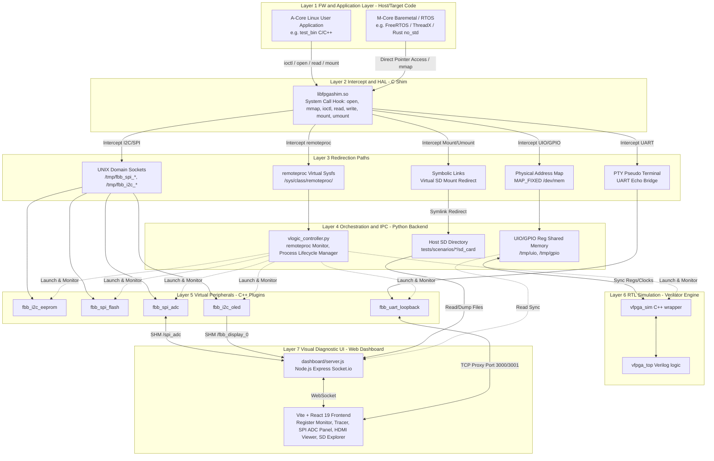

# ARCHITECTURE_MANIFEST: FPGA-BoardlessBench (F-BB)

これは、FPGA-BoardlessBench (F-BB)プロジェクト全体の運用・開発インフラに関わるポリシーである.

---

## Part 1: このマニフェストの取扱説明書 (Guide)

### 1. 目的 (Purpose)
本マニフェストは、Linux上でのFPGAエミュレーション環境構築における「北極星」として、開発者とAIが共有する普遍的な原則と設計判断を記録する。これにより、場当たり的な実装を防ぎ、長期的な保守性と実機との高い互換性を担保する。

### 2. 憲章の書き方 (Guidelines)
- **原則:** 「なぜ（Why）」を記述する。トレードオフの判断背景を明記すること。
- **具体性:** 抽象的な表現を避け、検証可能な目標や境界条件を定義する。
- **優先順位:** 常にこのマニフェストを実装コードよりも優先する。

### 3. リスクと対策 (Risks and Mitigations)
- **リスク:** 実機ドライバの複雑な挙動を再現しきれない。
- **対策:** 実機でのパケットログをキャプチャし、エミュレータ側で「リプレイ」できるテスト機構を設計に含める。

### 4. サブ・マニフェスト (Sub-Manifests)
- **[Scripts Generator](./scripts/ARCHITECTURE_MANIFEST.md)**: DTS から環境を自動生成するコア・ロジックの設計。
- **[Dashboard Interface](./dashboard/ARCHITECTURE_MANIFEST.md)**: 診断ダッシュボードと可視化レイヤーの設計。
- **[Test Scenarios](./tests/scenarios/ARCHITECTURE_MANIFEST.md)**: 各テストシナリオの共通原則、禁止事項、および個別シナリオの役割定義。
- **[i.MX HAL Scenario](./tests/scenarios/P01_frdmIMX/hal/ARCHITECTURE_MANIFEST.md)**: 実機とシミュレータ環境における UART/GPIO の差異を吸収し、コードの透過性を担保する i.MX HAL の設計。

---

## Part 2: マニフェスト本体 (Content)

### 1. 核となる原則 (Core Principles)
- **原則 1: 実機透過性の維持 (Hardware Transparency)**
  - **内容:** アプリケーション側のソースコードに「エミュレーション用の条件分岐」を一切持ち込まない。
  - **理由:** 実機環境とエミュレーション環境で同一のバイナリを動かすことで、環境依存のバグ混入を物理的に排除するため。
- **原則 2: 意図駆動エミュレーション (Intent-Driven Emulation)**
  - **内容:** RTLを100%完璧に再現することよりも、アプリケーションが期待する「レジスタの応答」や「プロトコルの振る舞い」を正しく返すことを優先する。
  - **理由:** FW開発のスピードを最大化するため。詳細なタイミング検証は[Verilator](AddInfo_verilator.md)等に責務を分離する。
- **原則 3: 単一の情報源 (Single Source of Truth) としてのDTS**
  - **内容:** ハードウェア定義（アドレス、バス構成等）は必ずDTSファイルのみに記述し、Shim（Cコード）、RTLスケルトン、シミュレーションドライバは全てDTSから自動生成する。「DTSを変更せずに手動でコードを書き換えて辻褄を合わせる行為」を固く禁ずる。
  - **理由:** ソフトウェア（Shim）とハードウェア（RTL）のインターフェースの不一致を構造的に排除し、実機構成との完全な同期を保証するため。
- **原則 4: ビルド責務の分離 (Separation of Build Responsibilities)**
  - **内容:** プロジェクトルートの `Makefile` は、FPGA-BoardlessBench (F-BB)自体の「コアコンポーネント（Shimや仮想ロジックエンジン本体）のコンパイル」のみに専念する。DTSからのコード自動生成や、シナリオ固有のFWコンパイル、テストの実行制御は `Makefile` に混ぜ込まず、`tests/run_tests.sh` 側に完全に委譲する。
  - **理由:** 共通基盤であるシミュレータのビルドと、各テストシナリオのビルド・実行サイクルを明確に分離することで、インフラ設定の肥大化・複雑化を防ぐため。
- **原則 5: フェイルファーストとクリーンログの義務 (Fail-Fast and Clean Logs)**
  - **内容:** テストランナーやビルドスクリプトは、CコンパイラやVerilatorでエラーが発生した時点で即座に実行を停止（`exit 1`）しなければならない。「ビルドに失敗しているのに、古いバイナリを使ってテストが無理やり成功してしまう（False Positive）」状態を許容しない。また、学習者の混乱を防ぐため、コンパイラのWarning（警告）も極力ゼロに保つ。
  - **理由:** エラーの隠蔽による誤った学習やデバッグの長期化を防ぎ、学習者が自身のコードの問題点に即座に気づける健全なフィードバックループを維持するため。
- **原則 6: シナリオの自律性と可搬性 (Scenario Autonomy & Portability)**
  - **内容:** 各テストシナリオは、単体で「ビルド (`Makefile`)」「実行 (`run.sh`)」「解説 (`README.md`)」を完結させなければならない。また、ビルド環境は特定のOSやツールに依存させず、標準的な環境変数を尊重する。
  - **理由:** 学習者が特定の課題に集中して取り組めるようにするとともに、FPGA-BoardlessBench (F-BB) で作成したソースコード一式を、そのまま PetaLinux 等の実機プロジェクトへ移行可能にするため。
- **原則 7: 学習者視点の徹底と内部ロジックの隠蔽 (Learner-Centric Purity)**
  - **内容:** `tests/`（およびその配下の `scenarios/`）ディレクトリには、学習の対象となるファイル（`config.dts`, `vfpga_top.v`, `main.c` 等）のみを配置し、FPGA-BoardlessBench (F-BB)特有の内部事情に関するファイル（例：シミュレータのC++ドライバなど）は絶対に配置しない。内部ロジックは `src/` や `scripts/` で隠蔽、または自動生成によって解決する。
  - **理由:** 学習者が「どこまでが一般的なFPGA/Linux開発の知識で、どこからがFPGA-BoardlessBench (F-BB)特有の仕組みなのか」を混同して混乱するのを防ぐため。学習のノイズとなる情報は裏側に隠し、本来の学習対象（Verilog, DTS, FW）に100%集中できるピュアな学習環境を維持する。

### 2. 主要なアーキテクチャ決定の記録 (Key Architectural Decisions)

本プラットフォームのこれまでの進化における主要な設計合意と決定（Decision）、およびその設計根拠（Rationale）の記録です。

> [!NOTE]
> **【歴史的変遷から読み解くプロジェクトの基本方針】**
> F-BB プラットフォームは、過去の数次にわたる意思決定を経て、以下の一貫した設計方針を確立しています：
> 1. **「実機透過性」の徹底**: システムコール Shim（LD_PRELOAD）や物理メモリの強制マッピングにより、ファームウェア側にシミュレーション用の条件分岐（`#ifdef`等）を一切挟まず、実機と 100% 同一のバイナリを走行させる。
> 2. **「DTS 駆動」による一元化**: 周辺ペリフェラルの構成、レジスタ配置、論理名はすべて `config.dts` を「唯一の情報源」とし、Shim や RTL、UI パラメータを自動生成・動的バインドすることで、ハード/ソフト間の仕様不一致を排除する。
> 3. **「疎結合ペリフェラル」とプラグイン化**: 各種バス（I2C/SPI/UART）のエミュレーターを Python 側から切り離し、C++ 抽象クラスでオブジェクト指向化された独立プロセス（プラグイン）として構築することで、SoC依存性を排除しスケーラビリティを担保する。
>
> 過去のすべての意思決定履歴（2026-04-24 からの変遷）については、**[AddInfo_history.md](./AddInfo_history.md)** を参照してください。

以下は常に最新の修正が表示されています。機能が更新されるたびに過去ログに移動しています。

- **2026-07-12: PL-side SPI Bridge による RTL-外部プロセス間双方向同期とダッシュボード LED マッピング (RTL-to-External SPI Bridge & Dashboard GPIO LED Mapping)**
  - **Decision:**
    1. シミュレータ (`sim_main.cpp`) と外部周辺デバイスプロセス (`fbb_spi_adc`) を UNIX ドメインソケット経由でブリッジ接続する `PlSpiBridge` を実装。RTL 側の SPI 物理ピン状態（SCLK, MOSI, CS_N）をキャプチャしてスレーブに中継し、MISO データを RTL へ書き戻す 4バイト一括送受信ロジックを確立。
    2. ダッシュボード上の「GPIO/Pin Array」表示を有効化するため、`config.dts` 内にベースアドレス of 整合順序（マッピング時に負 of オフセットが発生するバグを回避するため、アドレスが最小 of UIO デバイス `0x40000000` を必ず先頭に定義する制約）を考慮してダミー of GPIO デバイス (`vfpga_gpio@40002000`) を追加。
    3. RTL 内で SPI 物理ピン状態（SCLK/MOSI/CS_N/MISO）および内部ステートを 118 チャネル GPIO of `l_pins_o[7:0]` へマッピングし、ダミー GPIO DATA レジスタ読み出し時に `l_pins_o` を自動返却する回路を記述。
    4. クリーンビルド後 of シミュレータ起動時に、対向周辺デバイスが未ビルドであることに起因するソケット接続待ちハングアップを根本解決するため、`scenario_runner.sh` of 起動シーケンスを修正し、コントローラ起動前にプロジェクト全体を完全ビルドするよう統一。
  - **Rationale:**
    1. PL側マスタ検証 of リアリティ向上: PS（ソフトウェア）が直接周辺デバイスと喋るのではなく、PL側（RTL）of ステートマシンが駆動する SPI 物理ピン of 挙動をエミュレートし、外部 of 実周辺デバイスと直結させることで、本物 of ASIC/SoCと同等 of 物理レイヤ検証を可能にするため。
    2. UI連動と状態監視 of 統合: ダッシュボード上 of 汎用 GPIO LED パネルを拡張することなく、DTS of レジスタ定義と RTL of 読み出しデコードのみを結合する疎結合アプローチにより、開発者がシリアル通信 of クロックとステートを視覚的に観測可能にするため。
    3. テストインフラ of 堅牢性確保: ビルドタイミング of レースコンディションを排除し、依存バイナリ of 未存在によるデッドロック（ハングアップ）をアーキテクチャレベルで防止するため。

- **2026-07-18: システムコールフック（mount/umount）による仮想SDカード透過的マウントとダッシュボード統合 (Virtual SD Card Redirection & Dashboard Integration)**
  - **Decision:**
    1. C-Shimにおいて、`/dev/mmcblk0*` に対する `mount`, `umount`, `umount2` システムコールをフックし、ホスト側のシナリオ固有ディレクトリ（`sd_card/`）との間に動的シンボリックリンクを張ることで、ファームウェア側のマウント状態をエミュレート。
    2. ダッシュボードサーバーおよび React UI に仮想SDカード情報管理（`/api/sdcard/*`）および `SdCardPanel` を追加し、マウント状況・ファイルツリー探索・Text/HEXプレビュー機能の切り替えを統合。
  - **Rationale:**
    1. 透過性の担保: ファームウェアから仮想ブロックデバイス（SDカード）を操作する際、条件分岐コードを一切挟まず、通常の `mount` / `umount` を用いて透過的にファイルシステム操作を実行可能にするため。
    2. 診断の高度化: ファイルシステム上のファイルの生成や変更をホスト側からダッシュボードを介してリアルタイムに可視化し、対話型UARTコンソールによるステップバイステップ実行時の状態観察性を向上するため。

### 3. AIとの協調に関する指針 (AI Collaboration Policy)
- **未知の問題への対処:** 憲章にないデバイス（SPI, UART等）の追加が必要になった際、AIは既存のI2Cエミュレーションのパターンを継承し、複数のインターセプト案を提示すること。
- **検証の厳格化:** 実装されたShim関数は、必ず単体テスト（Cユニットテスト）と統合テスト（Pythonによる応答確認）をセットで生成すること。

### 4. コンポーネント設計仕様 (Component Design Specifications)

F-BB は、最下層の Verilog RTL 論理シミュレーションから、システムコール Shim 割り込み層、バックエンドオーケストレーター、そして最上層の React ダッシュボードに至るまで、以下の 7 レイヤーから構成されるフルスタックな疎結合アーキテクチャを採用している。

#### **Layer 1: FW & Application Layer**
*   **概要**: 実機と同一のソースコードでビルドされた Aコア Linux ユーザーアプリおよび Mコア ベアメタル/RTOS アプリ。
*   **詳細情報**: 各テストシナリオのファームウェア仕様については **[tests/scenarios/](./tests/scenarios/)** 配下の各シナリオ README を参照。

#### **Layer 2: Intercept & HAL Layer (C Shim)**
*   **概要**: システムコールをトラップし、仮想的な通信パスへ透過ルーティングする C Shim ランタイム。
*   **詳細情報**: コード生成テンプレートおよび生成方式については **[libfpgashim.c.template](./scripts/vfpga/templates/libfpgashim.c.template)** を参照。

#### **Layer 3: Redirection Paths (Communication Channels)**
*   **概要**: Shim層からリダイレクトされたデータを受け渡す物理メモリマップ、UNIXドメインソケット、PTY擬似端末等の通信路。
*   **詳細情報**: アドレスおよびポートマップの仕様については、各シナリオの **[config.dts](./tests/scenarios/02b_multi_spi/config.dts)** 等を参照。

#### **Layer 4: Orchestration & IPC Layer**
*   **概要**: シミュレーション環境全体のプロセスライフサイクル管理、remoteproc 状態監視、クロック同期エンジン。
*   **詳細情報**: 統合制御ロジックについては **[vlogic_controller.py](./src/controller/vlogic_controller.py)** を参照。

#### **Layer 5: Virtual Peripherals**
*   **概要**: I2C, SPI, UART などのプロトコルを模擬するプラグイン形式の C++ デバイスエミュレーター群。
*   **詳細情報**: 各周辺デバイスの実装については **[src/peripherals/](./src/peripherals/)** を参照。

#### **Layer 6: RTL Simulation**
*   **概要**: Verilator によってコンパイルされた RTL シミュレーション実行エンジン。
*   **詳細情報**: RTL ラッパーおよび HDL ロジックについては **[src/sim/](./src/sim/)** および **[src/rtl/](./src/rtl/)** を参照。

#### **Layer 7: Visual Diagnostic UI**
*   **概要**: Express サーバーおよび React 19 で構成される状態可視化・操作ダッシュボード。
*   **詳細情報**: ダッシュボードのセットアップおよびパネル仕様については **[dashboard/README.md](./dashboard/README.md)** を参照。

### 5. 既知の未解決課題と保留事項 (Known Open Issues)
<!-- Issue: 割り込み(IRQ)の擬似通知, Status: 保留, Rationale: シグナルを用いるか、仮想fdへの書き込みを用いるか、性能評価後に決定する。 -->
<!-- Issue: 分散コンポーネントにおける自律的ライフサイクル管理, Status: 進行中 (暫定対処済), Rationale: 各コンポーネントが自身の所有しないリソース（例：Shim生成のUARTマップ）をクリーンアップしていたことによる競合。将来的には、start_lab.shによる中央集権的クリーンアップを廃止し、環境変数(VFPGA_CLEAN_BOOT等)を介した、各コンポーネントによる「自己所有リソースの自律的初期化」パターンへ移行すべきである。 -->

### 6. 予測される限界値
- **ビルド時間:** 数百万ゲート規模の巨大なデザインになると、Verilatorが生成する C++ のソースコードが肥大化し、ビルド時間が数十分に及び、ノート PC のメモリ（16GB〜32GB）を食いつぶす可能性があります。

- **アナログ/混載信号:** Verilator は 2 値（0/1）専用であるため、高精度なアナログ回路や X/Z 状態（ハイインピーダンス）の厳密な検証には向きません。

### 7. サポート状況とロードマップ (Support Status & Roadmap)
Zynq PS ペリフェラルの詳細な対応状況および将来の対応については、[ロードマップ](AddInfo_Loadmap.md) を参照してください。
