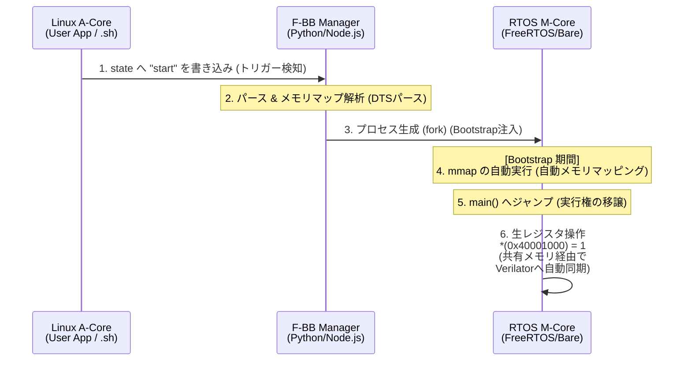

# ARCHITECTURE PROPOSAL: Remoteproc-Driven Automated Memory Mapping
**Status:** PROPOSED  
**Target Version:** v2.1.0-alpha  
**Author:** F-BB Core Architect Group  

---

## 1. 背景と課題 (Background & Challenges)

現行の `FPGA-BoardlessBench (F-BB)` は、Linux環境（WSL2含む）において `LD_PRELOAD` を用いてアプリケーションのシステムコール（`open`, `mmap`, `ioctl` 等）をフックし、VerilatorによってC++化されたRTLシミュレータへと動的にルーティングする優れたアーキテクチャを有している。

しかし、マルチコアSoC環境（AMP構成：Linuxが動作するAコア ＋ RTOS/ベアメタルが動作するMコア）の検証において、以下の**決定的な技術的課題**が存在する。

1. **システムコールの不在（契機の欠落）**
   実機のリアルタイムコア（Mコア）用ファームウェア（FreeRTOSやベアメタル）は、Linux OSの管理下にないため、周辺ペリフェラルやFPGAへのアクセスに `mmap` 等のシステムコールを使用しない。以下のように、物理アドレスポインタを直接操作（生レジスタ叩き）する。

   ```c
   *(volatile uint32_t*)(0x40001000) = 0x01; // 物理アドレスへの直接アクセス
   ```

2. **ホストOS（Linux）によるセグメンテーション違反**
   上記コードをそのままホストPC上のLinuxプロセス（スレッド）としてコンパイルして実行すると、ホストLinuxはカーネル保護のため `Segmentation Fault` を発生させ、プロセスを強制終了する。システムコールを発行しないため、`LD_PRELOAD` によるフックもすり抜けてしまう。

3. **コード透過性の喪失**
   これを回避するために現行仕様では、PCシミュレーション時のみ共有メモリのポインタへ差し替える「仮想HAL（`fbb_hal_gpio.h` 等）」や `#ifdef` マクロの導入をユーザーに強いており、「実機コードを1行も書き換えない」というF-BB of 思想（透過性）がMコア側において損なわれている。

---

## 2. コアアイデア：Remoteprocブート同期による自動mmapインジェクション

実機における非対称マルチプロセッシング（AMP）の標準ブートフローである **Linux Kernel Remoteproc (Remote Processor Framework)** の挙動をシミュレータ側でエミュレートし、それを「Mコア側へのメモリマッピング（mmap）の自動注入トリガー」として再定義する。

実機では、Linuxのユーザ空間から Sysfs 経由でリモートコアへファームウェアを転送し、リセットを解除（起動）する。

```bash
echo "mcore_rtos.elf" > /sys/class/remoteproc/remoteproc0/firmware
echo "start" > /sys/class/remoteproc/remoteproc0/state
```

F-BBにおいて、この `"start"` の書き込みをフックし、Mコア用プロセスをバックグラウンドで起動する**直前・直後**のタイミングで、F-BBのインフラ層が `mmap` を肩代わりして実行（インジェクション）する。これにより、Mコア側コードは完全な実機コードのまま、セグフォを起こさずにVerilatorと通信可能となる。

---

## 3. 詳細アーキテクチャ・動作メカニズム

全体の処理シーケンスおよびコンポ―ネント構造を以下に定義する。

### 3.1. 仮想Sysfsファイルシステムの構築

F-BBの初期化時、ホストPC環境（またはDocker内）の特定のディレクトリ（例: `/tmp/fbb/sys/class/remoteproc/remoteproc0/`）に、実機と全く同一のインターフェースを持つ名前付きパイプ（FIFO）または疑似ファイル `firmware` と `state` を生成する。

Linuxアプリ側の自動起動スクリプト（`.sh`）の環境変数またはシンボリックリンクを調整し、実機用のブートコマンドがこの仮想Sysfsに向くようにルーティングする。

### 3.2. ブート・インジェクション・シーケンス



1. **トリガー検知:** Linuxアプリ側の起動スクリプトが `state` に `"start"` を書き込む。F-BBのバックエンドマネージャ（Daemon）がこれを検知。
2. **DTSパース:** マネージャはターゲットとなる `.dts` ファイルから、Mコアに割り当てられている `reserved-memory`（保留メモリ領域：例 `0x40000000` 付近のペリフェラル空間）のアドレス情報を抽出する。
3. **プロセス生成とBootstrap注入:** マネージャはMコア用の実行バイナリを起動するが、そのエントリーポイント（`main`関数）が呼ばれる前に、F-BBが提供するスタートアップルーチン（カスタム `crt0.o` またはリンカスクリプトハック）を介在させる。
4. **自動メモリマッピング（インジェクションの実行）:**
   Mコアプロセス内の初期化ルーチンが、F-BB of 共有メモリ（Verilatorのレジスタ空間）に対して、内部的に `mmap` を実行する。このとき、`mmap` の第1引数（固定アドレス指定：`MAP_FIXED`）を利用し、**実機の物理アドレス（例: `0x40001000`）と全く同じホスト仮想アドレス空間**に強制的にマッピングする。
5. **実行権の移譲:** マッピング完了後、本来のユーザーコードの `main()` にジャンプする。
6. **生レジスタ操作と同期:** Mコア内でユーザーコードが実行され、実機物理アドレスへの生レジスタ書き込みを行うと、前段でインジェクトされた共有メモリ（仮想アドレス空間）を介して、ホストLinux上の Verilator シミュレータへ同期が自動実行される。

---

## 4. ユースケースと実装アプローチ

Mコアファームウェアに `mmap` を認識させる（契機を作る）具体的なアプローチとして、開発環境の要件に応じて以下の3つのいずれか、あるいは組み合わせを採用する。

### アプローチA：リンカスクリプト ＋ スタートアップ（crt0）拡張【推奨・コード透過性100%】

* **手法:** Mコアのコンパイル時、F-BB専用のスタートアップオブジェクト（`fbb_crt0.o`）をリンクする。
* **仕組み:** GCCの `__attribute__((constructor))` またはセクション配置を利用し、`main()` が実行される前に自動的に `mmap` 処理を行う関数を実行させる。
* **メリット:** ユーザーのソースコード（C/C++）は、実機用のレジスタ直叩きコードから**1文字も変更する必要がない**。

### アプローチB：`LD_PRELOAD` の拡張適用

* **手法:** Linux側アプリと同様に、Mコア側プロセスにも `LD_PRELOAD` を適用する。
* **仕組み:** Mコアが起動した瞬間、ロードされるラッパーライブラリが自動的に共有メモリの `mmap` を完了させ、特定のアドレス空間を上書き充填する。
* **メリット:** コンパイル段階での変更すら不要になり、完全にバイナリレベルでのシミュレーション移行が可能となる。

### アプローチC：低レイヤーマクロのDTS駆動自動生成

* **手法:** プロジェクト全体の共通ヘッダ、またはSoCのベースアドレス定義マクロ（例: `IMX_GPIO_BASE`）を、F-BBのDTSコンパイラが自動生成する。
* **仕組み:**
  ```c
  #ifdef BOARDLESS_BENCH_SIM
  // F-BBマネージャがmmapしたポインタをグローバル変数として保持
  extern uint32_t* fbb_vaddr_base;
  #define GPIO_BASE_ADDR  fbb_vaddr_base
  #else
  #define GPIO_BASE_ADDR  0x40001000 // 実機物理アドレス
  #endif
  ```
* **メリット:** リンカやOSの高度な機能に依存せず、確実かつ軽量に動作する。

---

## 5. 本アーキテクチャがもたらす革新（メリット）

1. **エンドツーエンドの透過性（True Transparence）**
   Linux側のアプリケーションコードだけでなく、リアルタイムOS（FreeRTOSなど）やベアメタル側のコードも含め、SoC全体のファームウェア資産を**マルチコア・クロスコンパイルするだけでそのままPC上で100%動作・検証可能**になる。

2. **システム起動シーケンスの完全デバッグ**
   「Linuxのブート → スクリプト実行 → RemoteprocによるMコアロード → Mコア起動 → コア間通信（RPMsg等）の開始」という、時間軸と依存関係が絡み合うシステム全体のブートシーケンス（因果関係）を、実機なしでクロックレベル（VCD波形出力）で追跡・デバッグできるようになる。

3. **ハードウェア・セーフティの網羅的検証**
   Mコア側でも相互インターロック（Mutual Interlock）やグリッチフィルタのシミュレーション機能がそのまま生レジスタアクセス経由で機能するため、マルチコア間で発生しがちな「ペリフェラルの奪い合いによるハードウェア破壊」を安全にデスクトップ上で検知・撲滅できる。
