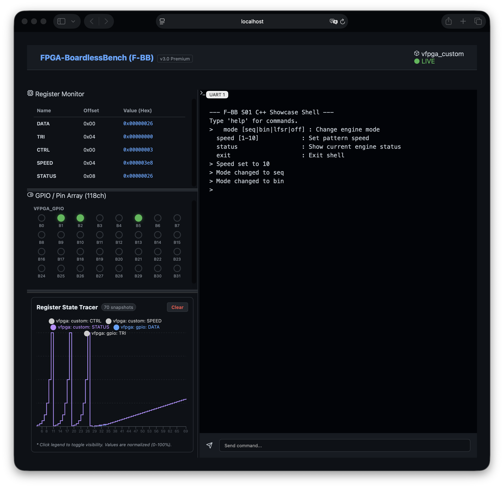

# FPGA-BoardlessBench (F-BB)

**Software-only FPGA testing & FPGA Simulation environment / 物理ボード不要のFPGAシミュレーション・Verilogテストベンチ環境**

FPGA-BoardlessBench (F-BB)は、FPGAを搭載した実機や評価ボードが無い環境でも、FPGAで提供されるデバイスを操作するファームウェアの開発を行えるようにするためのソフトウェア完結型テスト環境（Software-only FPGA testing environment）です。Linuxのシステムコールをインターセプトし、エミュレートしたFPGAのデバイスへリダイレクトすることで、あたかも物理的なFPGAを操作しているかのような開発体験ができます。

もし上記の紹介文を読んで、**「SystemVerilogのUVMもRenodeも知らず、AXIバスの複雑さを無視したハリボテ（おもちゃ）だ」** と直感した方は、正しい見解の持ち主です。[こちら](https://github.com/search?q=%22awesome-opensource-hardware%22%20OR%20%22awesome-fpga%22&type=repositories)へどうぞ。

しかし、**「よく分からないが、これでFW開発が劇的に楽になりそうだ」** と直感した方は、ぜひこの先もお読みください。本プロジェクトが、あなたのFPGA/FW開発を強力に支える武器になるかもしれません。

## 主な機能

- **DTS駆動の自動生成**: Device Tree Source (`.dts`) をソースとして、Shim（インターセプト層）、RTLスケルトン、コンフィグレーションヘッダを自動生成します。
- **アプリケーション透過性**: [LD_PRELOAD](AddInfo_LD_PRELOAD.md) を用いたShimにより、`open`, `mmap`, `ioctl` などのハードウェアアクセスをエミュレートします。作成したアプリケーションを評価ボードや実機で動作させる際にソースコード修正は一切不要です。
- **物理アドレスベースの動的ルーティング**: `/dev/mem` を介した物理アドレスへの直接アクセスをインターセプトし、DTSで定義された仮想デバイス空間へ動的にルーティングします。
- **マルチデバイス・マルチバス対応**: 複数のI2Cバスの個別識別や、UART通信のPTYリダイレクト（TCPブリッジ経由でのコンソール対話）、SoC規模（最大118チャネル）の双方向GPIOエミュレーションをサポートします。
- **RTL統合シミュレーション**: [Verilator](AddInfo_verilator.md) を用いた高速なRTLシミュレーションをサポートし、共有メモリ経由でレジスタ値を同期します。
- **Webダッシュボード**: Webベースのインターフェース（ポート 8080）を介して、レジスタやGPIOの入出力状態をリアルタイムで監視・操作できます。また、レジスタの変化履歴を記録し、波形として可視化する **Register State Tracer** を備えています。
  * **標準レジスタ/GPIO監視画面 (例: `S01_cpp_lfsr_sequencer` シナリオ)**
    
- **HDMI プレビュー出力エミュレーション**: DRM/KMS 経由での物理モニターへの出力と、ダンプファイル（`/tmp/hdmi_output.bmp`）を介したダッシュボード上へのリアルタイムプレビューに対応。ホスト環境と実機評価ボード環境を同一コードで透過的にサポートし、ダッシュボード上でピクセル等倍〜1600%のズーム・スクロール操作が可能です。
- **波形デバッグサポート**: シミュレーション中の全信号を VCD 形式で出力。GTKWave 等の波形ビューアを用いて、ハードウェア内部のタイミング詳細をデバッグ可能です。
  

## FPGA-BoardlessBench (F-BB) の位置づけ:一般的な開発手法との比較

FPGA開発において、実機検証（Physical Board）や純正シミュレータ（Vendor Tools）は不可欠ですが、F-BB は「実機への依存」と「低速なシミュレーション」という2つの壁を回避するように設計しています。

| 比較項目 | 既存のプロトタイピング (Aldec, S2C等) | ベンダー純正環境 (Vivado, Quartus等) | F-BB (BoardlessBench) |
| :--- | :--- | :--- | :--- |
| **初期コスト** | 極めて高額 (数百万〜) | 基本無料〜数十万 (ライセンス) | **$0 (Open Source)** |
| **環境構築** | 専用ハードと配線が必要 (数日) | 巨大なIDEのインストールが必要 (数時間) | **数分 (Docker/Git Clone)** |
| **実行速度** | 実機と同等 (高速) | 極めて低速 (サイクル毎の計算) | **高速 (C++コンパイル実行)** |
| **デバッグ性** | 物理的な観測に限界がある | 正確だが1回のシミュ実行が重い | **全信号を瞬時にVCD出力可能** |
| **CI/CD親和性** | 物理デバイスが必要なため困難 | ライセンス制限や実行時間の問題 | **GitHub Actions等で即時実行可能** |

## FPGA-BoardlessBench (F-BB) の応用例：実機デバッグ前の「ロジック蒸留」

実機デバッグで頻繁に問題になるのは、「動かない原因がソフトウェアなのか、ハードウェアなのか、あるいは物理的な接続やタイミングなのか」の切り分けです。F-BB は、実機に臨む前に **「論理的な汚れ」をすべて出し切る「蒸留器」** としての利用も考えられます。

### 1. 「論理バグ」と「物理バグ」の切り分け

- **F-BB（上流）**: ステートマシンの遷移、レジスタアドレス、プロトコル解釈といった「論理的な正しさ」を素べくデバッグし、検証します。
- **実機（下流）**: 残るのはピンアサイン、ハンダ不良、セットアップ/ホールド時間不足といった「物理層のトラブル」だけに絞り込まれます。

### 2. 「不毛な待ち時間」を「考察の時間」へ

F-BB を使ったデバッグと検証を行うことで実機に持っていくコードの品質を最初から高くすることができ、Vivadoでの論理合成を繰り返す回数を減らします。浮いた時間を「なぜこの設計が必要なのか」「エッジケースで破綻しないか」という設計の深掘りに充てることができます。

### 3. FWとFPGAの「責任境界線」の明確化

FWエンジニアは「期待通りの手順でハードが動くこと」を確認済み、FPGAエンジニアは「期待通りのアクセスで回路が動く」を確認済み。この **「共通の正解」** がある状態で実機で動かなければ、疑うべきは「配置配線」か「物理故障」だと即座に断定できます。

### 開発ワークフローの変革：実機を「答え合わせの場」にする

| ステージ | ツール | 役割 | 獲得する価値 |
| :--- | :--- | :--- | :--- |
| **蒸留期** | **F-BB** | `.c` と `.v` を C++ 環境で爆速デバッグ | **「論理的確証」の獲得**。手戻りの最小化。 |
| **実装期** | **Vivado** | 検証済みの `.v` を配置配線 | **「道具」としての利用**。試行錯誤の排除。 |
| **答え合わせ** | **実機** | 最終的な動作確認 | **物理層の問題に集中**。不確実性の排除。 |

### 注意

主要な SoC ペリフェラル（GPIO, I2C, UART）および汎用 UIO アクセスを網羅しており、多くの組み込み Linux アプリケーションの開発・デバッグに対応可能です。さらなる特殊なハードIPのサポート状況については、[ロードマップ](AddInfo_Loadmap.md)を参照してください。

---

## Zynq実稼働FW開発への適用性とQEMUに対する優位性

F-BB（FPGA-BoardlessBench）が「Zynqを想定した実働FW（ファームウェア）開発に耐えうるものか」、そして「QEMUに対する決定的な優位性は何か」について、F-BBの設計思想に基づいて説明します。

### 1. Zynqの実商用FW開発に適用できる理由

F-BBは、単なるVerilogの文法学習ツールではなく、**「Zynqをターゲットにした、ハードウェア制御層（ドライバ・ミドルウェア）の実商用FW開発に使えるレベル」** を目指して設計しています。

- **アプリケーション透過性の徹底**
  学習用ツールによくある「テストベンチ専用のダミーコードを書く」必要はありません。F-BBは、実機Linux上で動かすC言語のFWコード（`/dev/mem` や UIO を `open`/`mmap` してレジスタを叩くコード）を**1行も書き換えずに**そのままシミュレーション環境で実行できます。
- **主要なSoCペリフェラルの網羅**
  Zynqベースのシステムで多用される「GPIO（最大118ch）」「複数バスのI2C」「UART（PTYリダイレクト）」を標準サポートしています。「センサーからI2Cでデータを吸い上げ、GPIOで割り込みを検知し、FPGA内のカスタムIPのレジスタを叩く」といった、**実機を占有しがちでバグが最も出やすい箇所のFWを網羅的に検証可能**です。
- **実機ロードシーケンス・動的再構成 (FPGA Manager / remoteproc) 制御ロジックの検証**
  実機（Zynq, i.MX95等）では、ネットワークやシリアル転送（XMODEM等）で受信したFPGAビットストリームファイルをストレージに保存し、再起動時に読み込ませるブートシーケンスや、Linux稼働中に動的にFPGAを書き換える「FPGA Manager」、あるいは `remoteproc`（リモートプロセッサ・フレームワーク）を介してMコア（ベアメタル/RTOS）のライフサイクルを制御し、ファームウェアを動的にロード・停止・ホットスワップする構成が頻繁に用いられます。F-BB環境では、ファイル受信・保存ロジック、デバイスツリー・オーバーレイ（DTO）の適用、sysfsへのコマンド制御（`state`, `firmware`等の書き込み・同期）といった**「実機でのFPGAロード・管理制御ロジック」そのものを、実機を使用せずホストPC上で透過的に事前検証**できます。

#### 設計上の限界（割り切り）

- **カーネル空間ドライバ自体の検証は非対象（ただしユーザー空間ドライバは対象）**
  F-BBは `LD_PRELOAD` によるシステムコールのインターセプトを利用しているため、カーネル空間（Linuxカーネルモジュールとしてのドライバ）の直接的なデバッグには向きません。
  しかし、Zynq等のFPGA制御で主流となっている **UIO（Userspace I/O）** や `/dev/mem` を活用した**ユーザー空間デバイスドライバ**、およびハードウェア制御ミドルウェアの開発・検証には完全に適合しています。
- **CPUコア固有の挙動（キャッシュコヒーレンシや厳密なタイミング）**
  CPU側はホストPC（x86/ARM）の高速なコアで動作し、FPGA側はVerilator（C++）動作します。そのため、クロック厳密な物理タイミングの競合（レースコンディション）までは完全再現できません。
  *(※ ただし、時間待ちに依存せず、ステートフラグ等のハンドシェイクを用いた同期設計を行うことで、F-BB上とも実機同等の論理ステップで確実にタイミング・デバッグが可能です。詳細は [tests/README.mdの「タイミング制約とハンドシェイク同期設計」](tests/README.md#timing-and-handshake) を参照してください。)*

---

### 2. QEMUに対するアーキテクチャ上の優位性

「QEMUに比べて環境構築が極めて容易である」という点に加え、F-BBには**アーキテクチャの違いから来る決定的な優位性**が3つあります。

#### 優位性①：ハードウェア（RTL）の変更に対する圧倒的な追従性

これがF-BBの最大の優位性です。

- **QEMUの場合：**
  通常、QEMU単体でFPGAロジックをシミュレートする場合はC言語で挙動を模したCモデルを作成する必要があり、RTLとの同期（二重管理）が課題となります。RTLシミュレータ（Verilator等）と協調動作（Co-simulation）させる構成もありますが、QEMUのバスモデルとシミュレータを繋ぐ通信ブリッジや同期機構の構築・管理が必要になり、環境構築およびメンテナンスの難易度が極めて高くなります。
- **F-BBの場合：**
  ターゲットのRTL（Verilog）コードを **Verilator** で直接C++コードにコンパイルし、FWがアクセスするインターフェース層に直接マッピングして動かします。そのため、**FPGAの回路変更（レジスタの増減やロジック修正）が、FW側のテスト環境にも自動的かつ即座に反映されます。** 面倒な通信ブリッジや同期機構の自作は一切不要です。

#### 優位性②：波形（VCD）レベルでのハードウェア・デバッグ

QEMUは基本的にソフトウェア（SoC）のエミュレータであるため、自作したFPGA回路内部のRTL信号（レジスタやステートマシンの遷移）を波形レベルでデバッグする標準的な手段を持ちません。
他シミュレータとの協調シミュレーション（Co-simulation）環境を構築すれば技術的には可能ですが、設定が極めて複雑になり、実行速度も実用的な時間からは程遠いほど低速になります。

- F-BBは、Verilatorシミュレーションと直結しているため、実行するだけで瞬時に **VCD形式の波形ファイル** を出力できます。これを GTKWave 等のビューアで開くことで、「FWがレジスタを叩いた瞬間、FPGA内部のステートマシンがどう動いたか」を、VivadoのILA（ロジックアナライザ）のように視覚的に追うことができます。
(ただし、実機ほどリアルタイムに追うわけではないことに注意が必要です)

#### 優位性③：Webダッシュボードによる直感的な「人間系テスト」

文字ベースのGDBデバッグやログ出力だけでなく、F-BBには専用のWebダッシュボードが統合されています。

- レジスタ値の変化やGPIOの入出力状態をリアルタイムに可視化し, ブラウザ上で擬似的にスイッチ（GPIO）をオンにするなどの**インタラクティブな検証（擬似割り込み発生など）が容易に行えます。**

---

### QEMUとF-BBの使い分け

F-BBは, QEMUの手軽さと、ベンダー純正シミュレータ（Vivado等）の正確さを融合し、高速なハードウェア透過テストを提供するツールです。

- **QEMUが適しているケース**：Linuxカーネル自体の起動・ポーティング、ブートローダ（U-Boot）の検証、CPUアーキテクチャ（ARM等）固有のコードコンパイル検証。
- **F-BBが圧倒的な力を発揮するケース**：自作したFPGA回路（RTL）と, それを制御するLinuxアプリケーション（FW）の「協調デバッグ」および「CI/CDでの自動テスト」。

自作IPを含むZynqシステムの開発において、実機に焼く前の手戻りを減らし、論理設計を効率的に蒸留するための環境としてF-BBを設計しています。

---

## プリリクエスト

動作には以下のツールが必要です：

- GCC / G++ (C++17対応推奨)
- Make
- Python 3.10+
- Node.js 20+ (Dashboard)
- Verilator
- (推奨) [GTKWave](https://gtkwave.sourceforge.net/) (波形デバッグ用)
- (推奨) VS Code + [Dev Containers](https://marketplace.visualstudio.com/items?itemName=ms-vscode-remote.remote-containers) 拡張機能

## クイックスタート

### 1. 全テストの一括実行

環境が正しくセットアップされているか、すべてのシナリオを自動で一括テストします：

```bash
./tests/run_tests.sh
```

### 2. 個別のテストシナリオで学ぶ（推奨）

特定の機能（UIO, I2C, UART等）や実践的なデモに集中して取り組むには、各シナリオディレクトリに移動して個別に実行します。

* **基本ペリフェラルテストの例（`01_standard_uio`）:**
  ```bash
  cd tests/scenarios/01_standard_uio
  ./run.sh
  ```

* **実践的な車載アラウンドビュー合成デモ（`P01_frdmIMX`）:**
  OpenGL ES を使用した4カメラ歪み補正とアラウンドビュー（バードアイ）合成のリアルタイムエミュレーションを行います。起動後に GPIO Pin 14 をON（ダッシュボード上のトグルスイッチまたはコマンド経由）にすることで、ディスク上の車載BMP画像を用いた合成テストへ動的に移行します。
  ```bash
  cd tests/scenarios/P01_frdmIMX
  # i.MX95 または i.MX8MP ターゲットを指定して実行
  ./run.sh imx95
  ```

* **複数UART双方向通信テスト（`08_multi_uart`）:**
  同時に複数のシリアルポート（`ttyPS0`, `ttyPS1`）を開き、`select()`による多重I/Oで双方のエコーバックを行う対話型デモです。
  ```bash
  cd tests/scenarios/08_multi_uart
  ./run.sh
  ```

* **remoteproc 動的ホットスワップテスト（`09_remoteproc_amp`）:**
  `remoteproc` の仮想 Sysfs インターフェースを介した Mコアプロセスの起動・停止ライフサイクル制御、および稼働中の動的ファームウェア差し替え（ホットスワップ）とレースコンディションを防止する状態同期シーケンスの検証デモです。
  ```bash
  cd tests/scenarios/09_remoteproc_amp
  ./run.sh
  ```

* **FreeRTOS マルチタスク協調動作テスト（`10_amp_mcore_freertos`）:**
  Mコア側で FreeRTOS を動作させ、マルチタスク（周辺監視タスクと演算処理タスク）間でキューを用いたデータ受け渡しを行い、Aコア（Linuxアプリ）からの要求に非同期に応答する AMP 協調検証デモです。
  ```bash
  cd tests/scenarios/10_amp_mcore_freertos
  ./run.sh
  ```
 
  各シナリオのディレクトリ内には、**図解入りの詳細な `README.md`** が用意されており、ハードウェアの構造からソフトウェアの実装方法までをステップバイステップで学ぶことができます。

### 3. 対話モードとダッシュボードの利用

シミュレーションを維持し、Webダッシュボードで状態を確認しながらデバッグを行う場合：

```bash
# 特定のシナリオで対話モードを起動（例：01_standard_uio）
cd tests/scenarios/01_standard_uio
./run.sh  # 実行後にバックグラウンドで環境が維持されます
```

実行後、以下の方法でシミュレーション環境にアクセスできます：

- **Webダッシュボード**: ブラウザで `http://localhost:8080` にアクセスしてください。
- **UARTコンソール**: ポート `2000` で待ち受けています（`telnet localhost 2000` 等で接続）。

### 4. クリーンアップ

ビルド成果物やログを削除して環境をリセットします：

```bash
./tests/run_tests.sh --clean  # 全体の一括クリーン
# または各フォルダで
./run.sh --clean
```

## Dockerでの実行

Dockerを使用して動作確認を行うには、以下の2つの方法があります。

### 方法1：使い捨てコンテナで個別のテストを実行する（推奨）
テストを実行するたびに新しく一時的なコンテナを起動する方法です。実行終了後にコンテナが自動削除されます。

```bash
docker compose run --rm --service-ports lab ./start_lab.sh tests/scenarios/01_standard_uio/
```
※ `01_standard_uio/` の部分を実行したいテストシナリオのディレクトリパスに置き換えてください。
※ `--service-ports` オプションにより、Webダッシュボード用のポート（`8080`）および外部UARTクライアント接続用のポート（`3000`（UART1用）, `3001`（UART2用））がホストに転送されます。これにより、ホストPC側のTera Termや `nc` コマンド等から `localhost:3000` や `localhost:3001` に接続して、エミュレートされたファームウェアと直接通信できます。
※ **（注意）初回実行時は、ダッシュボードの自動ビルド（npmパッケージのインストールとビルド）が走るため、起動までに少し時間がかかります。**

### 方法2：常駐コンテナに入ってテストを実行する
コンテナを常に起動しておき、コンテナ内に入って任意のテストスクリプトを繰り返し実行する方法です。

#### 1. 環境の起動
プロジェクトのルートディレクトリで以下のコマンドを実行します。コンテナはバックグラウンドで起動し続けます。これにより、自動的にポート `8080`, `3000`, `3001` がホストにマッピングされます。

```bash
docker compose up -d
```

#### 2. コンテナ内でのコマンド実行
コンテナ内に入り、任意のテストシナリオを実行します。

```bash
docker compose exec lab bash
# コンテナ内で実行（例：S01_cpp_lfsr_sequencer）
./start_lab.sh tests/scenarios/S01_cpp_lfsr_sequencer/
```

#### 3. ダッシュボードへのアクセス
ブラウザで `http://127.0.0.1:8080` にアクセスしてください。

#### 4. 終了
以下のコマンドを実行してコンテナを停止・削除します。

```bash
docker compose down
```

### 外部UARTクライアント（Tera Term等）からの接続方法

Node.jsプロキシ経由で外部の端末エミュレータ（Tera Termなど）からコンテナ内のファームウェアと直接通信することができます。

#### 1. ポート転送の準備
* **Docker コマンド（`docker compose up` / `docker compose run`）で起動した場合**:
  自動的にポート `3000`（UART1用）および `3001`（UART2用）がホストPCにマッピングされます。
* **VS Code Dev Containers 内で直接 `./start_lab.sh` を起動した場合**:
  VS Code 画面下部の「Ports (ポート)」タブを開き、「Forward a Port (ポートを転送)」をクリックして手動でポート `3000` と `3001` を登録してください。

#### 2. Tera Term での接続設定
Tera Term を起動し、「新規接続 (New Connection)」ダイアログで以下のように設定します。

* **TCP/IP を選択**
* **Host**: `localhost` (※ `localhost:3000` のようにコロンやポート番号を含めないでください)
* **TCP port#**: **`3000`** (UART1用) または **`3001`** (UART2用)
* **Service**: **`Other`** (※ `SSH` や `Telnet` ではなく、Raw TCPデータを受け付ける `Other` を選択します)

設定後、「OK」をクリックして接続すると、これまでのUARTログが瞬時にリプレイされ、Webダッシュボード側と完全に画面同期された状態で双方向に対話通信が可能になります。

## プロジェクト構成

- `src/shim/`: システムコールインターセプト層（自動生成）
- `src/rtl/`: Verilogソースファイル（スケルトンは自動生成）
- `src/sim/`: Verilator用C++シミュレーションラッパー
- `src/controller/`: Pythonバックエンド管理（共有メモリ初期化、RTL同期、UARTブリッジ制御）
- `dashboard/`: Webダッシュボードサーバー (Node.js)
- `tests/scenarios/`: 各プロジェクト（シナリオ）ごとのテスト一式
  - `config.dts`: デバイスツリー定義
  - `vfpga_top.v`: 回路実装（任意。ない場合は自動生成スケルトンを使用）
  - `main.c` / `main.cpp`: テスト用ファームウェア (C/C++両対応)
- `scripts/`: 生成スクリプトおよびユーティリティ

## 言語統計とフルスタック構造 (2026-06-14 時点)

F-BBは、ハードウェア記述言語（RTL）から、低レイヤーのシステムコール割り込み（Shim/C言語）、シミュレータコア（C++）、制御ロジック（Python）、そして最上層のWebダッシュボード（JavaScript/React）にいたるまで、極めて広範なレイヤーを網羅した「フルスタック」な設計となっています。

### 言語別統計（コード量とファイル数）

ビルド時の一時ファイル（`obj_dir` や生成された Shim コード）、外部パッケージ（`node_modules`）、ビルド成果物（`dist`）を除外した静的なソースコード統計です。

| 言語分類 | 拡張子 | ファイル数 | 総行数 | 主な構成要素と役割 |
| :--- | :---: | :---: | :---: | :--- |
| **C/C++** | `.cpp` / `.hpp` / `.c` / `.h` | 16 | **4,551行** | システムコール横取り（Shim層）のランタイム、およびファームウェアテストコード（C++ HAL、シナリオ用 `main.c`/`main.cpp`） |
| **Python** | `.py` | 4 | **1,282行** | DTSパース・コード自動生成エンジン（`gen_vfpga.py`）、およびバックエンド制御・通信管理スクリプト |
| **JavaScript / React** | `.jsx` / `.js` / `.css` / `.html` | 14 | **1,645行** | Webダッシュボードサーバー（Express）、Vite + React 19 のフロントエンド UI（Dockview レイアウト、Recharts グラフ描画、HDMI出力プレビュー） |
| **Verilog** | `.v` | 9 | **477行** | シミュレーション対象の FPGA ハードウェア記述（RTLモックやシナリオ固有のロジック） |
| **Device Tree (DTS)** | `.dts` | 13 | **318行** | 仮想デバイス仕様の定義（アドレスマップ、レジスタ名、ペリフェラル構成） |
| **Shell Script** | `.sh` | 14 | **587行** | テスト一括実行ランナー（`run_tests.sh`）、およびラボ起動ランナー（`start_lab.sh`） |


> **💡 コード生成エンジンによる動的コード**
> F-BBの設計上、上記の静的コードに加えて、DTSを読み込んだ際に Python スクリプトが **C言語 Shim (`libfpgashim.c` / 約360行)**、**C++ シミュレーションラッパー (`sim_main.cpp` / 約100行)**、**Verilog スケルトン (`vfpga_top.v` / 約40行)** などをビルド時に自動生成します。


### アーキテクチャにおける各言語の役割
- **Verilog (RTL)**: テスト対象となるFPGA内の回路ロジック。
- **C/C++**: `LD_PRELOAD` によるシステムコールの横取り（`open`/`mmap`/`ioctl`等のリダイレクト）、および Verilator シミュレーション実行エンジン（`sim_main.cpp`）。
- **Python**: DTS仕様を読み取ってShimやRTLスケルトンを自動出力するコード生成器、および共有メモリ初期化やシリアル（UART PTY）中継を担うバックエンドコントローラ。
- **JavaScript (Node.js & React 19)**: 共有メモリのデータをWebSocketでリアルタイム受信・配信するダッシュボードサーバー、およびVS Codeライクなドラッグ分割レイアウト（Dockview）と時系列グラフ（Recharts）による可視化UI。

## テストの追加方法

基本的な考え方や各ファイルの役割については、[tests/README.md](tests/README.md) を参照してください。

新しい機能をテストしたい場合は、`tests/scenarios/` 内に新しいディレクトリを作成し、`config.dts` と `main.c`（必要に応じて `vfpga_top.v`）を配置してください。`./tests/run_tests.sh` を実行すると、新しいシナリオが自動的に検出・実行されます。

## 詳細ドキュメント

プロジェクトの設計思想や技術仕様の詳細については、以下のドキュメントを参照してください。

- **[技術仕様書 (spec.md)](spec.md)**: 各コンポーネントの機能詳細とインターフェース定義。
- **[アーキテクチャ・マニフェスト](ARCHITECTURE_MANIFEST.md)**: プロジェクトの設計原則と主要な決定事項の記録。

## ライセンス

本プロジェクトは、[LICENSE](LICENSE) ファイルに記載された条件の下でライセンスされています。

依存ツールとの整合性や商用利用に関する詳細は、[ライセンス・コンプライアンス報告書](AddInfo_LicenseComplianceReport.md) を参照してください。

## Attribution

This project was created with the assistance of
[`CIP`](https://github.com/sirosiro/cip) (Core-Intent Prompting Framework),
a CC BY 4.0 licensed prompt framework for generative AI.ß