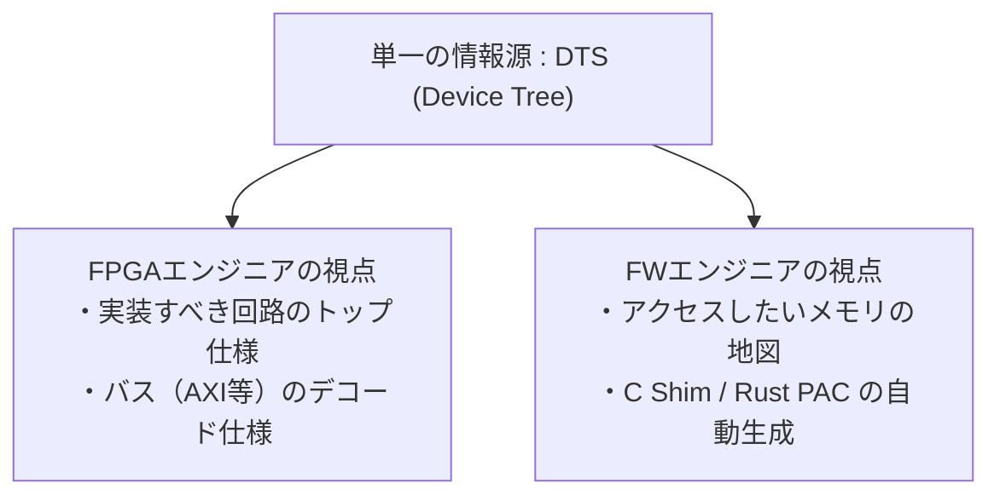
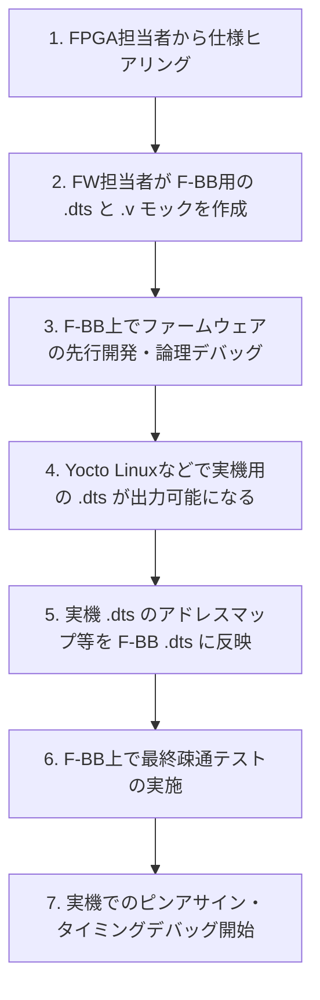

# FPGA-BoardlessBench (F-BB)

**Software-only FPGA testing & FPGA Simulation environment / 物理ボード不要のFPGAシミュレーション・Verilogテストベンチ環境**

FPGA-BoardlessBench (F-BB)は、FPGAを搭載した実機や評価ボードが無い環境でも、FPGA上に実装された周辺回路（IPデバイス）を操作するファームウェアの開発を行えるようにするためのソフトウェア完結型テスト環境（Software-only FPGA testing environment）です。Linuxのシステムコールをインターセプトし、エミュレートしたFPGAのデバイスへリダイレクトすることで、あたかも物理的なFPGAを操作しているかのような開発体験ができます。

もし上記の紹介文を読んで、**「SystemVerilogのUVMもRenodeも知らず、AXIバスの複雑さを無視したハリボテ（おもちゃ）だ」** と直感した方は、正しい見解の持ち主です。[こちら](https://github.com/search?q=%22awesome-opensource-hardware%22%20OR%20%22awesome-fpga%22&type=repositories)へどうぞ。

しかし、**「よく分からないが、これでFW開発が劇的に楽になりそうだ」** と直感した方は、ぜひこの先もお読みください。本プロジェクトが、あなたのFPGA/FW開発を強力に支える武器になるかもしれません。

---

## **The "DTS-Driven" Shift: ハードとソフトの『言語の壁』を破壊する**

> **「仕様書のExcelをアップデートしました。各自確認してください」──そんな不毛なコミュニケーションは、もう終わりにしましょう。**

F-BB（FPGA-BoardlessBench）がハードウェア（FPGA）とソフトウェア（FW）の境界線に「DTS（Device Tree）駆動」という唯一の軸を通すことで、エンジニア同士のコミュニケーション構造そのものを変革します。



### 開発のゲームチェンジャーとなるコア・キーワード

* **DTS駆動プロトタイピング**
  DTSを1行書き換えるだけで、C Shim、Verilogスケルトン、Rust PACが裏で一瞬で一新。回路設計の1行目を書く前に、ハードとソフトが「僕たちが一番扱いやすい最強のSoC仕様」を合意・検証。
* **実機透過性100%の共有メモリマッピング**
  ホストPCのネイティブコードでありながら、実機と同じ物理アドレス（ポインタ直叩き）をセグフォを起こさず透過実行。
* **異言語・異環境AMPの「机上デバッグ」**
  Linux（C言語）とベアメタル（Rust）の複数プロセス間通信（OpenAMP）を、ホストPC上で1つのIDEから同時にステップ実行・デバッグ。

---

## F-BBで実現できること（何ができるのか）

F-BB（FPGA-BoardlessBench）は、物理的なFPGA評価ボードや実機ハードウェアがない環境でも、ソフトウェアだけでFPGA制御用ファームウェア（FW）を論理デバッグ・検証できるようにする環境です。主に以下の3つの価値を提供します。

### 1. ファームウェアの「透過性」を維持したままでのホスト開発
ホストPC上で動作するFWアプリケーションは、実機上で動かすコードと**1行も書き換える必要がありません**。
- **Aコア（Linux）アプリケーション**: [LD_PRELOAD](AddInfo_LD_PRELOAD.md) という技術を用いて、`/dev/mem` や UIO デバイスへの `open`/`mmap`/`ioctl` といったハードウェアアクセス用のシステムコールを自動的にインターセプトします。これらをエミュレートされた仮想FPGAレジスタやI2C、UARTバスへと透過的にルーティングします。
- **Mコア（ベアメタル/RTOS）アプリケーション**: 起動時に `libfpgashim.so` のコンストラクタ（`__attribute__((constructor))`）が自動介入し、`mmap` の [MAP_FIXED_NOREPLACE](AddInfo_MAP_FIXED_NOREPLACE.md) フラグ（非サポート時は [MAP_FIXED](AddInfo_MAP_FIXED_NOREPLACE.md#従来の方法ヒントと-map_fixed-との違い) に自動フォールバック）を使用して、F-BBの共有メモリ（仮想FPGAレジスタ空間）を**実機と同じ物理アドレス（例: `0x40001000`）へ強制的にマッピング**します。これにより、実機コードで多用されるポインタ直叩き（例: `*(volatile uint32_t*)(0x40001000) = value`）を、ホストPC上でセグメンテーション違反（セグフォ）を起こさずに100%透過的に実行させることができます（詳細は [BBにおけるRTOS/ベアメタルFWエミュレーション](AddInfo_RTOS.md#24-コード透過性100を実現する自動mmapインジェクション実装済み) を参照）。

### 2. FPGAの完成を待たない「先行並行開発」
FPGA回路（RTL）が完成する前であっても、仕様さえ決まっていればFWの先行開発が可能です。
- FPGAエンジニアからレジスタ名、オフセット、ピンの役割などをヒアリングし、F-BB用の `.dts`（デバイスツリー定義）と、簡単な Verilog モックを作成します。
- F-BBがDTSからシミュレーションに必要なインターフェースを自動生成するため、FWエンジニアは実機なしで即座にアプリケーションロジックをテスト・デバッグできます。

### 3. ヘテロジニアスSoC（AMP）の協調動作デバッグ
最近の複雑なSoC（Zynq, i.MX95等）で見られる、マルチコアでの非対称マルチプロセッシング（AMP）環境をPC上で再現・検証できます。
- Aコア（Linuxアプリケーション）と、Mコア（ベアメタルや、FreeRTOS / Eclipse ThreadX などのRTOS環境）が共有メモリを介してメッセージを受け渡し合う複雑な協調動作をシミュレートします。
- `remoteproc` フレームワークもエミュレートしているため、AコアからMコアのファームウェアをロード・停止・動的差し替え（ホットスワップ）する制御ロジックそのものもホストPC上で透過的にデバッグ可能です。

---

## FPGA-BoardlessBench (F-BB) の位置づけ:一般的な開発手法との比較

FPGA開発において、実機検証（Physical Board）や純正シミュレータ（Vendor Tools）は不可欠ですが、F-BB は「実機への依存」と「低速なシミュレーション」という2つの壁を回避するように設計しています。

| 比較項目 | 既存のプロトタイピング (Aldec, S2C等) | ベンダー純正環境 (Vivado, Quartus等) | F-BB (BoardlessBench) |
| :--- | :--- | :--- | :--- |
| **初期コスト** | 極めて高額 (数百万〜) | 基本無料〜数十万 (ライセンス) | **$0 (Open Source)** |
| **環境構築** | 専用ハードと配線が必要 (数日) | 巨大なIDEのインストールが必要 (数時間) | **数分 (Docker/Git Clone)** |
| **実行速度** | 実機と同等 (高速) | 極めて低速 (サイクル毎の計算) | **高速 (C++コンパイル実行)** |
| **デバッグ性** | 物理的な観測に限界がある | 正確だが1回のシミュ実行が重い | **全信号を瞬時にVCD出力可能** |
| **CI/CD親和性** | 物理デバイスが必要なため困難 | ライセンス制限や実行時間の問題 | **GitHub Actions等で即時実行可能** |

## FPGA-BoardlessBench (F-BB) の利用例：実機デバッグ前の「ロジック蒸留」

実機デバッグで頻繁に問題になるのは、「動かない原因がソフトウェアなのか、ハードウェアなのか、あるいは物理的な接続やタイミングなのか」の切り分けです。F-BB は、実機に臨む前に **「論理的な汚れ」をすべて出し切る「蒸留器」** としての利用も考えられます。

### 1. 「論理バグ」と「物理バグ」の切り分け

- **F-BB（上流）**: ステートマシンの遷移、レジスタアドレス、プロトコル解釈といった「論理的な正しさ」をすべてデバッグし、検証します。
- **実機（下流）**: 残るのはピンアサイン、ハンダ不良、セットアップ/ホールド時間不足といった「物理層のトラブル」だけに絞り込まれます。

### 2. 「不毛な待ち時間」を「考察の時間」へ

F-BB を使ったデバッグと検証を行うことで実機に持っていくコードの品質を最初から高くすることができ、Vivadoでの論理合成を繰り返す回数を減らします。浮いた時間を「なぜこの設計が必要なのか」「エッジケースで破綻しないか」という設計の深掘りに充てることができます。

### 3. FWとFPGAの「責任境界線」の明確化

FWエンジニアは「期待通りの手順でハードが動くこと」を確認済み、FPGAエンジニアは「期待通りのアクセスで回路が動く」を確認済み。この **「共通の正解」** がある状態で実機で動かなければ、疑うべきは「配置配線」か「物理故障」だと即座に断定できます。

### 開発ワークフローの変革：実機を「答え合わせの場」にする

| ステージ | ツール | 役割 | 獲得する価値 |
| :--- | :--- | :--- | :--- |
| **蒸留期** | **F-BB** | `.c` と `.v` を C++ 環境で爆速デバッグ | **「論理的確証」の獲得**。手戻りの最小化。 |
| **実装期** | **Vivado** | 検証済みの `.v` を配置配線 | **「道具」としての利用**。試行錯誤の排除。 |
| **答え合わせ** | **実機** | 最終的な動作確認 | **物理層の問題に集中**。不確実性の排除。 |

### 注意

主要な SoC ペリフェラル（GPIO, I2C, UART）および汎用 UIO アクセスを網羅しており、多くの組み込み Linux アプリケーションの開発・デバッグに対応可能です。さらなる特殊なハードIPのサポート状況については、[ロードマップ](AddInfo_Loadmap.md)を参照してください。

---

## FPGA-BoardlessBench (F-BB) の応用例：テストシナリオに見る3つのポテンシャル

F-BBのテストシナリオの設計思想を深掘りすると、単なる「実機ボードがないときの代用品」を超えた、以下の3つの本質的な応用パターン（ポテンシャル）が見えてきます。

### 1. 意図的な「ハードウェア異常・いじわるテスト」の自動化

通常、実機ボードを使ったファームウェア（FW）テストにおいて、「めったに起きないハードウェア異常系（エラーハンドリング）の検証」は極めて困難です。

* **実機での限界**：
  「I2Cの通信が途中で化けた」「DMA転送中にハードウェアタイマーがタイムアウトした」「特定レジスタのステータスフラグがエラー状態のまま固定された」といった異常状態を、物理基板上で再現するには、高価なパターンテスタを用いるか、基板に針を立ててショートさせるような職人技が必要になります。
* **F-BBだからできること**：
  F-BBはDTSからVerilogモック（RTL）とC Shimを自動生成するため、テストシナリオごとに「10回に1回、意図的にACKを返さないI2Cモック」や「特定のレジスタを叩いたらステータスエラーを吐き続けるVerilogロジック」を、ソフトウェアのコード（シナリオ）として数行書くだけで内包できます。
  これにより、実機では再現不可能な「異常を検知して安全にフォールバックするFWの堅牢性テスト」を、CI/CDで毎日何千回も自動実行することが可能になります。

### 2. 異言語・異環境マルチコア（AMP）の「結合前・机上デバッグ」

F-BBは「Aコア（Linux/C言語）」と「Mコア（ベアメタル/RustまたはC）」が、仮想SoC内部の共有メモリを介して通信し合う複雑なシナリオをサポートしています。

* **実機での限界**：
  異なるOSや言語が混在するSoC（Zynqやi.MX等）の開発では、不具合発生時に「Linux側のドライバ」「Mコア側のRust/Cコードのポインタ操作」「FPGAのインターフェース設計」のどこにバグがあるのかの切り分けが泥沼化します。実機で追うには、JTAGデバッガを複数繋いで同時にブレークさせるような高度な技術が必要です。
* **F-BBだからできること**：
  F-BB上では、これらはすべて「ホストPC上の複数プロセス」として動作します。
  そのため、VS CodeなどのモダンなIDEから、Linux側のCコードとMコア側のRust/Cコードの両方に同時に普通のデバッガ（GDB/LLDB）をアタッチし、1つの画面でステップ実行しながら相互のハンドシェイク挙動を机上で追うことができます。
  実機に焼く前の段階で、異言語間の共有メモリ通信（OpenAMP/RPMsg）の論理的な正しさをPC上だけで完璧に追い込めます。

### 3. オリジナルハードウェアの「仕様策定のためのサンドボックス（砂場）」

一般的に、FPGAエンジニアとFWエンジニアは受け持つ領域や使用する言語が異なるため、仕様策定（Excel等のレジスタマップの受け渡し）において手戻りや意思疎通の難しさ（壁）が発生しがちです。F-BBは「DTS（Device Tree Source）駆動」を軸とすることで、この壁を破壊します。

* **なぜDTSが2人を繋ぐ「共通言語」になるのか**：
  DTSはハードウェア構造をテキストで抽象化した「中間言語」の役割を果たします。
  ```
  // DTSという共通の「土俵」
  my_hardware_timer@40001000 {
      compatible = "fbb,hardware-timer";
      reg = <0x40001000 0x1000>;      // FPGA: アドレスデコード仕様 / FW: ポインタのベースアドレス
      interrupts = <5>;               // FPGA: 割り込みピンの結線 / FW: ISRのベクタ番号
      reg-names = "CONTROL", "DATA";  // FPGA: レジスタ選択論理 / FW: 構造体のメンバ名（自動生成）
  };
  ```
  * **FWエンジニア視点**：DTSは「アクセスしたいメモリの地図」であり、これを書くだけでC ShimやRust PAC（構造体）が自動生成されるため、RTL（Verilog）の詳細を知らなくてもコードを書くことができます。
  * **FPGAエンジニア視点**：DTSは「実装すべき回路の外枠（トップエンベロープ）の設計図」であり、バス仕様（AXI等）の接続情報をそのまま表しているため、FWの動作詳細を知らなくても回路を実装できます。

* **DTS駆動がもたらす開発プロセスの変革**：
  「タイマーのレジスタ配置を変えてチャンネルを増やしたい」と思ったら、**DTSを1行書き換えるだけ**です。自動生成エンジン（`gen_vfpga.py`）が一瞬でC Shim、Verilogスケルトン、Rust PACを再生成します。
  これにより、FPGAの回路設計（RTL実装）を始める前に、両エンジニアがDTSを囲んで「一番扱いやすい最強のSoCレジスタ仕様」を1日でプロトタイピングして合意するような、超高速な仕様策定サンドボックスとしてF-BBを活用できます。

  > **対話のイメージ**：
  > - **FW**：「タイマーの制御、コントロールレジスタ1個だとビットが足りないから、DTS側で `CONFIG` と `STATUS` の2個に分けて再定義していい？」
  > - **FPGA**：「いいよ。DTS書き換えて。…あ、でもその分け方だとアドレスデコーダが少し複雑になるから、DTSのオフセットを `0x00`/`0x04` ではなく `0x00`/`0x10` に離してくれれば回路がスリムにできるよ」
  > - **FW**：「了解、DTS直した！F-BB回してShimもPACも再生成されたから、このアドレスで叩くコード書けたよ。シミュレータ動かすから、FPGA側も生成されたVerilogスケルトンにロジック流し込んでみて！」

---

## Zynq実稼働FW開発への適用性とQEMUに対する優位性 / 使い分け

F-BB（FPGA-BoardlessBench）が「Zynqを想定した実働FW（ファームウェア）開発に耐えうるものか」、そして「QEMUに対する決定的な優位性は何か」や使い分けの詳細については、以下の追加情報を参照してください。

- [Zynq実稼働FW開発への適用性とQEMUに対する優位性 (AddInfo_vs_QEMU.md)](AddInfo_vs_QEMU.md)

---

## 前提条件

動作には以下のツールが必要です：

- GCC / G++ (C++17対応推奨)
- CMake 3.12+
- Make
- Python 3.10+
- Node.js 20+ (Dashboard)
- Verilator
- (推奨) [GTKWave](https://gtkwave.sourceforge.net/) (波形デバッグ用)
- (推奨) VS Code + [Dev Containers](https://marketplace.visualstudio.com/items?itemName=ms-vscode-remote.remote-containers) 拡張機能

## クイックスタート

### 1. 全テストの一括実行

環境が正しくセットアップされているか、すべてのシナリオを自動で一括テストします：

```bash
./tests/run_tests.sh
```

### 2. 個別のテストシナリオで学ぶ（推奨）

特定の機能（UIO, I2C, UART等）や実践的なデモに集中して取り組むには、各シナリオディレクトリに移動して個別に実行します。

* **基本ペリフェラルテストの例（`01_standard_uio`）:**
  ```bash
  cd tests/scenarios/01_standard_uio
  ./run.sh
  ```

* **実践的な車載アラウンドビュー合成デモ（`P01_frdmIMX`）:**
  OpenGL ES を使用した4カメラ歪み補正とアラウンドビュー（バードアイ）合成のリアルタイムエミュレーションを行います。
  ```bash
  cd tests/scenarios/P01_frdmIMX
  # i.MX95 または i.MX8MP ターゲットを指定して実行
  ./run.sh imx95
  ```

* **複数UART双方向通信テスト（`08_multi_uart`）:**
  同時に複数のシリアルポート（`ttyPS0`, `ttyPS1`）を開き、`select()`による多重I/Oで双方のエコーバックを行う対話型デモです。
  ```bash
  cd tests/scenarios/08_multi_uart
  ./run.sh
  ```

* **remoteproc 動的ホットスワップテスト（`09_remoteproc_amp`）:**
  `remoteproc` の仮想 Sysfs インターフェースを介した Mコアプロセスの起動・停止ライフサイクル制御、および稼働中の動的ファームウェア差し替え（ホットスワップ）とレースコンディションを防止する状態同期シーケンスの検証デモです。
  ```bash
  cd tests/scenarios/09_remoteproc_amp
  ./run.sh
  ```

* **FreeRTOS マルチタスク協調動作テスト（`10_amp_mcore_freertos`）:**
  Mコア側で FreeRTOS を動作させ、マルチタスク（周辺監視タスクと演算処理タスク）間でキューを用いたデータ受け渡しを行い、Aコア（Linuxアプリ）からの要求に非同期に応答する AMP 協調検証デモです。
  ```bash
  cd tests/scenarios/10_amp_mcore_freertos
  ./run.sh
  ```

* **ThreadX マルチタスク協調動作テスト（`11_amp_mcore_threadx`）:**
  Mコア側で Eclipse ThreadX を動作させ、マルチスレッド（周辺監視スレッドと演算処理スレッド）間でメッセージキューを用いたデータ受け渡しを行い、Aコア（Linuxアプリ）からの要求に非同期に応答する AMP 協調検証デモです。
  ```bash
  cd tests/scenarios/11_amp_mcore_threadx
  ./run.sh
  ```

* **Rust ベアメタル Mコア協調動作テスト（`16_amp_mcore_Rust_baremetal`）:**
  Mコア側ファームウェアを Rust（`no_std` ベアメタル）で記述し、リンク時多態を用いてホスト環境と実機環境でのコード同一性を担保しつつ、Aコア（Linuxアプリ）とレジスタを介して双方向通信を行うデモです。
  ```bash
  cd tests/scenarios/16_amp_mcore_Rust_baremetal
  ./run.sh
  ```
 
  各シナリオのディレクトリ内には、**図解入りの詳細な `README.md`** が用意されており、ハードウェアの構造からソフトウェアの実装方法までをステップバイステップで学ぶことができます。

### 3. 対話モードとダッシュボードの利用

シミュレーションを維持し、Webダッシュボードで状態を確認しながらデバッグを行う場合：

```bash
# 特定のシナリオで対話モードを起動（例：01_standard_uio）
cd tests/scenarios/01_standard_uio
./run.sh  # 実行後にバックグラウンドで環境が維持されます
```

実行後、以下の方法でシミュレーション環境にアクセスできます：

- **Webダッシュボード**: ブラウザで `http://localhost:8080` にアクセスしてください。
- **UARTコンソール**: ポート `2000` で待ち受けています（`telnet localhost 2000` 等で接続）。

### 4. クリーンアップ

ビルド成果物やログを削除して環境をリセットします：

```bash
./tests/run_tests.sh --clean  # 全体の一括クリーン
# または各フォルダで
./run.sh --clean
```

## Dockerでの実行

Dockerを使用して動作確認を行うには、以下の2つの方法があります。

### 方法1：使い捨てコンテナで個別のテストを実行する（推奨）
テストを実行するたびに新しく一時的なコンテナを起動する方法です。実行終了後にコンテナが自動削除されます。

```bash
docker compose run --rm --service-ports lab ./start_lab.sh tests/scenarios/01_standard_uio/
```
※ `01_standard_uio/` の部分を実行したいテストシナリオのディレクトリパスに置き換えてください。
※ `--service-ports` オプションにより、Webダッシュボード用のポート（`8080`）および外部UARTクライアント接続用のポート（`3000`（UART1用）, `3001`（UART2用））がホストに転送されます。これにより、ホストPC側のTera Termや `nc` コマンド等から `localhost:3000` や `localhost:3001` に接続して、エミュレートされたファームウェアと直接通信できます。
※ **（注意）初回実行時は、ダッシュボードの自動ビルド（npmパッケージのインストールとビルド）が走るため、起動までに少し時間がかかります。**

### 方法2：常駐コンテナに入ってテストを実行する
コンテナを常に起動しておき、コンテナ内に入って任意のテストスクリプトを繰り返し実行する方法です。

#### 1. 環境の起動
プロジェクトのルートディレクトリで以下のコマンドを実行します。コンテナはバックグラウンドで起動し続けます。これにより、自動的にポート `8080`, `3000`, `3001` がホストにマッピングされます。

```bash
docker compose up -d
```

#### 2. コンテナ内でのコマンド実行
コンテナ内に入り、任意のテストシナリオを実行します。

```bash
docker compose exec lab bash
# コンテナ内で実行（例：S01_cpp_lfsr_sequencer）
./start_lab.sh tests/scenarios/S01_cpp_lfsr_sequencer/
```

#### 3. ダッシュボードへのアクセス
ブラウザで `http://127.0.0.1:8080` にアクセスしてください。

#### 4. 終了
以下のコマンドを実行してコンテナを停止・削除します。

```bash
docker compose down
```

### 外部UARTクライアント（Tera Term等）からの接続方法

Node.jsプロキシ経由で外部の端末エミュレータ（Tera Termなど）からコンテナ内のファームウェアと直接通信することができます。

#### 1. ポート転送の準備
* **Docker コマンド（`docker compose up` / `docker compose run`）で起動した場合**:
  自動的にポート `3000`（UART1用）および `3001`（UART2用）がホストPCにマッピングされます。
* **VS Code Dev Containers 内で直接 `./start_lab.sh` を起動した場合**:
  VS Code 画面下部の「Ports (ポート)」タブを開き、「Forward a Port (ポートを転送)」をクリックして手動でポート `3000` と `3001` を登録してください。

#### 2. Tera Term での接続設定
Tera Term を起動し、「新規接続 (New Connection)」ダイアログで以下のように設定します。

* **TCP/IP を選択**
* **Host**: `localhost` (※ `localhost:3000` のようにコロンやポート番号を含めないでください)
* **TCP port#**: **`3000`** (UART1用) または **`3001`** (UART2用)
* **Service**: **`Other`** (※ `SSH` や `Telnet` ではなく、Raw TCPデータを受け付ける `Other` を選択します)

設定後、「OK」をクリックして接続すると、これまでのUARTログが瞬時にリプレイされ、Webダッシュボード側と完全に画面同期された状態で双方向に対話通信が可能になります。

## 提供されているテストシナリオ一覧
F-BB環境には、基本的なペリフェラル操作から高度なマルチコアRTOS協調動作まで、実際の開発に役立つ様々な検証シナリオが標準で用意されています。各シナリオディレクトリには詳細なドキュメントも含まれています。

| シナリオフォルダ | 概要 | 検証対象技術 |
| :--- | :--- | :--- |
| [01_standard_uio](tests/scenarios/01_standard_uio/) | 標準 UIO を介した基本レジスタ R/W とシミュレータ同期の検証 | UIO, `mmap`, Verilator 同期 |
| [02_multi_i2c](tests/scenarios/02_multi_i2c/) | 複数 I2C バスへのアクセスと個別デバイスの識別 | I2C バスエミュレーション, `ioctl` |
| [02b_multi_spi](tests/scenarios/02b_multi_spi/) | 同一 SPI バス上に NOR Flash と ADC を混在させたマルチデバイス検証。ダッシュボードからのスライダー操作と仮想 FPGA レジスタへの自動流し込みによる Register State Tracer 連携。 | SPI バスエミュレーション, 全二重 `ioctl`, マルチスレーブ, UIOレジスタマップ, Register State Tracer 連動 |
| [03_uart_console](tests/scenarios/03_uart_console/) | `/dev/ttyPS2` を用いた対話型シリアル通信とエコーバック | UART PTY リダイレクト, termios |
| [04_dev_mem_legacy](tests/scenarios/04_dev_mem_legacy/) | レガシーな `/dev/mem` とマクロ/ポインタを用いた物理メモリ直接アクセス | `/dev/mem` エミュレーション, レガシーコード互換 |
| [05_multi_v_files](tests/scenarios/05_multi_v_files/) | 複数ファイルの Verilog モジュールを結合した回路シミュレーション | 複数 Verilog リンク, サブモジュール同期 |
| [06_gpio](tests/scenarios/06_gpio/) | AXI GPIO 互換レジスタによる多チャンネル・双方向の入出力制御 | GPIO エミュレーション, チャンネル切替 |
| [07_minimum_template](tests/scenarios/07_minimum_template/) | 波形ファイル（vfpga.vcd）出力確認用の最小構成テンプレート | 最軽量シミュレータ設定, VCD 出力 |
| [08_multi_uart](tests/scenarios/08_multi_uart/) | 同時に複数UARTポートを開く `select()` 制御の対話型デモ | 多重 I/O, UART PTY ブリッジ |
| [09_remoteproc_amp](tests/scenarios/09_remoteproc_amp/) | Aコア（Linux）からMコアの起動/停止と FW 動的ロード（ホットスワップ） | `remoteproc`, ホットスワップ, 状態同期 |
| [10_amp_mcore_freertos](tests/scenarios/10_amp_mcore_freertos/) | Mコア側で FreeRTOS を動作させ、タスク間キューによるデータ同期 | FreeRTOS, AMP 協調動作, 共有メモリ |
| [11_amp_mcore_threadx](tests/scenarios/11_amp_mcore_threadx/) | Mコア側で Eclipse ThreadX を動作させ、スレッド間メッセージキュー同期 | ThreadX, AMP 協調動作, 共有メモリ |
| [12_amp_mcore_cmsis-rtos2-freertos](tests/scenarios/12_amp_mcore_cmsis-rtos2-freertos/) | Mコア側で CMSIS-RTOS2 (FreeRTOS実装) を用いた協調デモ | CMSIS-RTOS2, FreeRTOS, AMP |
| [13_amp_mcore_cmsis-rtos2-threadx](tests/scenarios/13_amp_mcore_cmsis-rtos2-threadx/) | Mコア側で CMSIS-RTOS2 (ThreadX実装) を用いた協調デモ | CMSIS-RTOS2, ThreadX, AMP |
| [14_amp_mcore_OpenAMP_baremetal](tests/scenarios/14_amp_mcore_OpenAMP_baremetal/) | ベアメタルでのOpenAMPおよびRPMsg協調動作の検証 | OpenAMP, RPMsg, `libmetal`, 共有メモリ, 仮想IPI |
| [15_amp_mcore_OpenAMP_freertos](tests/scenarios/15_amp_mcore_OpenAMP_freertos/) | Mコア側で FreeRTOS を動作させ、タスク管理下で OpenAMP (RPMsg) を駆動し非同期応答する検証 | FreeRTOS, OpenAMP, RPMsg, `libmetal`, 共有メモリ |
| [16_amp_mcore_Rust_baremetal](tests/scenarios/16_amp_mcore_Rust_baremetal/) | Rustを用いたベアメタルMコアとAコア（Linux）間のレジスタベースAMP協調動作の検証 | Rust (`no_std`), リンク時多態, 共有メモリ, AMP |
| [17_amp_mcore_Rust_embassy](tests/scenarios/17_amp_mcore_Rust_embassy/) | Rust を用いた Embassy 非同期駆動型OSエミュレーションと RTL タイマーポーリングの検証 | Embassy, Rust, `async/await`, RTLタイマー |
| [18_amp_mcore_Rust_rtic](tests/scenarios/18_amp_mcore_Rust_rtic/) | Rust を用いた RTIC リアルタイム割り込み駆動タスクディスパッチの検証（対称設計） | RTIC, Rust, 仮想割り込み (SIGUSR1), 対称設計 |
| [P01_frdmIMX](tests/scenarios/P01_frdmIMX/) | i.MX95/8MP HAL C++ を使用したOpenGL ES 4カメラ入力 | OpenGL ES, HDMIエミュレーション, C++ HAL |
| [S01_cpp_lfsr_sequencer](tests/scenarios/S01_cpp_lfsr_sequencer/) | CLI シェルと Web ダッシュボードを統合したショーケースデモ | 統合 Web UI, Dockview, Recharts, CLI |

---

## テストの追加方法

基本的な考え方や各ファイルの役割については、[tests/README.md](tests/README.md) を参照してください。

新しい機能をテストしたい場合は、`tests/scenarios/` 内に新しいディレクトリを作成し、`config.dts` と `main.c`（必要に応じて `vfpga_top.v`）を配置してください。`./tests/run_tests.sh` を実行すると、新しいシナリオが自動的に検出・実行されます。

## F-BBにおけるデバイスツリー（.dts）の立ち位置と開発フロー

### F-BBにおける `.dts` の立ち位置（Linux/YoctoのDTSとの違い）
F-BBが使用する `.dts` は、**FWをシミュレータ上で論理デバッグするために構築するエミュレータ専用の定義ファイル**です。
- **Linux標準の `.dts` を置き換えるものではありません。**
- F-BB上でレジスタ単位のシミュレーションとエミュレーション（自動コード生成やアドレスルーティング）を実現するため、標準のデバイスツリー定義には存在しない `registers` 属性（例：`registers = "RST @ 0x10, EN @ 0x14"`）などの独自拡張を取り入れた「DTSの新しいファミリー（独自サブセット）」という位置づけになります。

### F-BBを活用した推奨開発フロー

F-BBを導入することで、FPGAとファームウェアの設計を密結合にしつつ、実機検証に向けた平行開発を効率化することができます。



1. **仕様定義とヒアリング (ステップ1〜2)**:
   開発初期段階で、FPGA担当者からアドレスマップやレジスタ配置をヒアリングし、FW担当者がF-BB用の `.dts` と簡単な `.v` (Verilog) モックを作成します。
2. **FWの先行論理デバッグ (ステップ3)**:
   このモックをF-BBに読み込ませ、FPGAの実機や論理合成完了を待つことなく、ホストPC上でFWアプリケーションの先行開発および状態遷移・論理デバッグを進めます。
3. **実機DTSの統合と疎通テスト (ステップ4〜6)**:
   FPGA開発が進み、Yocto Linuxなどから実機用の `.dts` が生成できるようになった段階で、その内容（ベースアドレスや割り込み構成など）をF-BBの `.dts` に取り込み、F-BB上でFWの最終疎通テストを行います。
4. **実機への移行 (ステップ7)**:
   F-BB上で論理的なバグ（アドレス指定ミスや状態遷移エラー）を100%排除した状態で、実機での検証に移行します。これにより、実機デバッグで発生した問題を「物理層（タイミング、ピンアサイン、ハンダ付けなど）」に100%絞り込むことができ、手戻りを最小限に抑えられます。

## 主な機能（技術コンポーネント）

- **DTS駆動の自動生成**: Device Tree Source (`.dts`) をソースとして、Shim（インターセプト層）、RTLスケルトン、コンフィグレーションヘッダを自動生成します。
- **物理アドレスベースの動的ルーティング（Aコア）**: `/dev/mem` や UIO へのアクセスを `LD_PRELOAD` で検知し、DTSで定義された仮想デバイス空間へ動的にルーティングします。
- **実物理アドレスの強制マッピング（Mコア/MAP_FIXED_NOREPLACE）**: ベアメタルやRTOSファームウェアで用いられる直接のポインタ操作（物理アドレス直書き）に対し、`libfpgashim.so` の起動コンストラクタが `mmap(MAP_FIXED_NOREPLACE)`（および `MAP_FIXED` への自動フォールバック）を実行することで、ホストLinuxのプロセス仮想空間上に実機と同じアドレスマップを安全に構築し、セグメンテーション違反や他マッピングの意図しない上書きを防止しつつ仮想FPGAへルーティングします。
- **マルチデバイス・マルチバス対応**: 複数のI2Cバスの個別識別や、UART通信のPTYリダイレクト（TCPブリッジ経由でのコンソール対話）、SoC規模（最大118チャネル）の双方向GPIOエミュレーションをサポートします。
- **RTL統合シミュレーション**: [Verilator](AddInfo_verilator.md) を用いた高速なRTLシミュレーションをサポートし、共有メモリ経由でレジスタ値を同期します。
- **Webダッシュボード**: Webベースのインターフェース（ポート 8080）を介して、レジスタやGPIOの入出力状態をリアルタイムで監視・操作できます。また、レジスタの変化履歴を記録し、波形として可視化する **Register State Tracer** を備えています。
  * **標準レジスタ/GPIO監視画面 (例: `S01_cpp_lfsr_sequencer` シナリオ)**
    
- **HDMI プレビュー出力エミュレーション**: DRM/KMS 経由での物理モニターへの出力と、ダンプファイル（`/tmp/hdmi_output.bmp`）を介したダッシュボード上へのリアルタイムプレビューに対応しています。ホスト環境と実機評価ボード環境を同一コードで透過的にサポートし、ダッシュボード上でピクセル等倍〜1600%のズーム・スクロール操作が可能です。
- **波形デバッグサポート**: シミュレーション中の全信号を VCD 形式で出力。GTKWave 等の波形ビューアを用いて、ハードウェア内部のタイミング詳細をデバッグ可能です。
  

## プロジェクト構成

- `src/shim/`: システムコールインターセプト層（自動生成）
- `src/rtl/`: Verilogソースファイル（スケルトンは自動生成）
- `src/sim/`: Verilator用C++シミュレーションラッパー
- `src/controller/`: Pythonバックエンド管理（共有メモリ初期化、RTL同期、UARTブリッジ制御）
- `dashboard/`: Webダッシュボードサーバー (Node.js)
- `tests/scenarios/`: 各プロジェクト（シナリオ）ごとのテスト一式
  - `config.dts`: デバイスツリー定義
  - `vfpga_top.v`: 回路実装（任意。ない場合は自動生成スケルトンを使用）
  - `main.c` / `main.cpp`: テスト用ファームウェア (C/C++両対応)
- `scripts/`: 生成スクリプトおよびユーティリティ
  - `gen_vfpga.py`: コード自動生成 CLI エントリポイント
  - `vfpga/`: 生成エンジンコアパッケージ（データモデル、DTSパーサー、各種ジェネレータ、Cテンプレート）

## 言語統計とフルスタック構造

F-BBは、ハードウェア記述言語（RTL）から、低レイヤーのシステムコール割り込み（Shim/C言語）、シミュレータコア（C++）、制御ロジック（Python）、最上層のWebダッシュボード（JavaScript/React）、そしてMコア向けの組み込み言語（C言語/Rust）にいたるまで、極めて広範なレイヤーを網羅した「フルスタック」な設計となっています。

### 言語別統計（コード量とファイル数）

ビルド時の一時ファイル（`obj_dir` や生成された Shim コード）、外部パッケージ（`node_modules`）、ビルド成果物（`dist`）を除外した静的なソースコード統計です。

| 言語分類 | 拡張子 | ファイル数 | 総行数 | 主な構成要素と役割 |
| :--- | :---: | :---: | :---: | :--- |
| **C/C++** | `.cpp` / `.hpp` / `.c` / `.h` / `.template` | 50 | **8,667行** | システムコール横取り（C Shimテンプレート含む）のランタイム、周辺デバイス抽象クラス・エミュレータ、およびファームウェアテストコード |
| **Python** | `.py` | 11 | **1,606行** | DTSパース・コード自動生成エンジン（`vfpga` パッケージ）、およびバックエンド制御・通信管理スクリプト |
| **JavaScript / React** | `.jsx` / `.js` / `.css` / `.html` | 15 | **1,900行** | Webダッシュボードサーバー（Express）、Vite + React 19 のフロントエンド UI（Dockview レイアウト、Recharts グラフ描画、HDMI出力プレビュー） |
| **Verilog** | `.v` | 19 | **932行** | シミュレーション対象の FPGA ハードウェア記述（RTLモックやシナリオ固有のロジック） |
| **Device Tree (DTS)** | `.dts` | 23 | **540行** | 仮想デバイス仕様の定義（アドレスマップ、レジスタ名、ペリフェラル構成） |
| **Shell Script** | `.sh` | 24 | **956行** | テスト一括実行ランナー（`run_tests.sh`）、およびラボ起動ランナー（`start_lab.sh`） |
| **Rust** | `.rs` | 8 | **336行** | Mコア用ベアメタル・リアルタイムOSファームウェア（Rust対応シナリオ） |
| **合計 (Total)** | **-** | **150** | **14,937行** | **F-BB プラットフォーム全体の静的ソースコード総数** |

> **前回（2026-06-27時点）との比較と増減**
> 前回の統計と比較して、今回の「周辺デバイスのC++オブジェクト指向抽象化」および「SPIマルチデバイス（Flash&ADC）統合テストシナリオ」実装により、プロジェクト全体のコードバランスが以下のように変化しました：
> - **C/C++**: +11ファイル / **+1,464行** （周辺デバイスの C++ 抽象基底クラス `I2cSlave` / `UartDevice` / `SpiSlave` の新設、SPI NOR Flash および ADC デーモンの追加、および `libfpgashim.c.template` への SPI 横取りロジック追加による増加）
> - **Python**: +7ファイル / **-149行** （ジェネレータのモジュール分割リファクタリング、およびモデル・パースエンジンへの SPI 検出・シリアライズサポート追加による調整）
> - **JavaScript / React**: +1ファイル / **+145行** （ダッシュボードへの SPI ADC 制御用スライダーUI、WebSocket API連携、およびレジスタ追跡機能の追加による増加）
> - **Verilog**: 0ファイル / **0行** （変更なし）
> - **Device Tree (DTS)**: +1ファイル / **+35行** （新規 SPI マルチデバイスシナリオ `02b_multi_spi/config.dts` の追加による増加）
> - **Shell Script**: +1ファイル / **+15行** （新規 SPI 実行スクリプト `02b_multi_spi/run.sh` の追加による増加）
> - **Rust**: 0ファイル / **0行** （変更なし）

> **コード生成エンジンによる動的コード**
> F-BBの設計上、上記の静的コードに加えて、DTSを読み込んだ際に Python スクリプトが、外部テンプレート `libfpgashim.c.template` を基にして **C言語 Shim (`libfpgashim.c` / 約680行)** を生成するほか、**C++ シミュレーションラッパー (`sim_main.cpp` / 約100行)**、**Verilog スケルトン (`vfpga_top.v` / 約40行)**、**Rust PAC (`fbb_pac.rs` / 約80行)** などをビルド時に自動生成します。

### アーキテクチャにおける各言語の役割
- **Verilog (RTL)**: テスト対象となるFPGA内の回路ロジック。
- **C/C++**: `LD_PRELOAD` によるシステムコールの横取り（`open`/`mmap`/`ioctl`等のリダイレクト）、および Verilator シミュレーション実行エンジン（`sim_main.cpp`）。
- **Python**: DTS仕様を読み取ってShimやRTLスケルトンを自動出力するコード生成器、および共有メモリ初期化やシリアル（UART PTY）中継を担うバックエンドコントローラ。
- **JavaScript (Node.js & React 19)**: 共有メモリのデータをWebSocketでリアルタイム受信・配信するダッシュボードサーバー、およびVS Codeライクなドラッグ分割レイアウト（Dockview）と時系列グラフ（Recharts）による可視化UI。

## Antigravity IDE とローカル Ollama の連携 (任意)

本プロジェクトの開発において、AIコーディングアシスタント **Antigravity IDE** を使用する場合、ホストPC側のローカルで実行している **Ollama** を MCP (Model Context Protocol) サーバー経由で呼び出すように設定し、APIクォータを大幅に節約することができます。

この機能はオプトイン（任意）であり、実際のローカル設定ファイルは Git 管理から除外されています。利用したい開発者は、以下の手順でローカル環境を設定してください。

### 設定手順

1. **Ollama にモデルをプルする**  
   ホストPC（Dockerコンテナの外）のターミナル等で、利用したいモデル（例: `qwen2.5-coder:7b` など）をあらかじめダウンロードしておきます。
   ```bash
   ollama pull qwen2.5-coder:7b
   ```

2. **設定ファイルをコピーして適用する**  
   プロジェクトルートのテンプレートファイルから設定ファイルを作成し、IDEのグローバル設定ディレクトリにコピーします。
   ```bash
   cp .antigravity/mcp_config.json.template .antigravity/mcp_config.json
   mkdir -p /root/.gemini/config && cp .antigravity/mcp_config.json /root/.gemini/config/mcp_config.json
   ```
   ※ この設定ファイルでは、コンテナ内からホストPC側の Ollama に接続するため、エンドポイントが `http://host.docker.internal:11434` に設定されています。

3. **Ollama CLI をコンテナ内にインストールする**  
   コンテナ内のMCPサーバーが正しく Ollama を操作できるよう、コンテナ（Devcontainer）側にも Ollama CLI をインストールします（インストーラの展開に `zstd` が必要なため、あわせてインストールします）。
   ```bash
   sudo apt-get update && sudo apt-get install -y zstd
   curl -fsSL https://ollama.com/install.sh | sh
   ```

4. **優先ルールを有効化する (任意)**  
   要約やコード整形、翻訳などを Ollama へ優先的にルーティングするルールを有効化したい場合は、テンプレートからルールファイルを作成します。
   ```bash
   cp .agents/AGENTS.md.template .agents/AGENTS.md
   ```

5. **IDEを再読み込み / 再起動する**  
   Antigravity IDE をリロードまたは再起動することで、MCPサーバーが自動認識されます。

## 詳細ドキュメント

プロジェクトの設計思想や技術仕様の詳細については、以下のドキュメントを参照してください。

- **[技術仕様書 (spec.md)](spec.md)**: 各コンポーネントの機能詳細とインターフェース定義。
- **[アーキテクチャ・マニフェスト](ARCHITECTURE_MANIFEST.md)**: プロジェクトの設計原則と主要な決定事項の記録。

## ライセンス

本プロジェクトは、[LICENSE](LICENSE) ファイルに記載された条件の下でライセンスされています。

依存ツールとの整合性や商用利用に関する詳細は、[ライセンス・コンプライアンス報告書](AddInfo_LicenseComplianceReport.md) を参照してください。

## Attribution

This project was created with the assistance of
[`CIP`](https://github.com/sirosiro/cip) (Core-Intent Prompting Framework),
a CC BY 4.0 licensed prompt framework for generative AI.