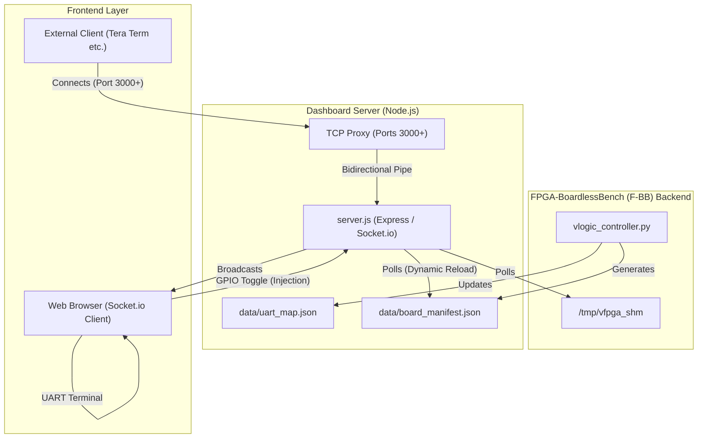

# dashboard/ - 仮想 FPGA 診断ダッシュボード

このディレクトリには、仮想 FPGA の内部レジスタ状態をリアルタイムに監視し、UART コンソールへのアクセスを提供する Web ベースの診断インターフェースが収められています。

## 役割 (Role)

- **リアルタイム監視**: 共有メモリ (SHM) を監視し、RTL シミュレータ上のレジスタ値をダッシュボードへブロードキャストします。
- **レジスタ履歴 (Tracer)**: レジスタの変化を時系列で記録し、正規化された波形として表示します。
- **GPIO インジェクション**: ダッシュボード上のトグルスイッチを操作することで、シミュレーション中の GPIO 入力状態をリアルタイムに変更できます。
- **UART ブリッジ統合**: 複数の UART デバイス（PTY/TCP ブリッジ）を集約し、ブラウザ上のターミナルから操作可能にします。
- **自動化 (Macros)**: `login:` 等の特定の文字列を検知して自動的にレスポンスを返すマクロ機能を備えています。

## アーキテクチャ図



## 主要なファイル

- **`server.js`**: ダッシュボードのバックエンドエンジン。
    - ポート 8080 で待機。
    - マニフェストと共有メモリを読み取り、WebSocket (`socket.io`) でフロントエンドに配信。
    - UART ブリッジ（TCP ポート 2000〜）との中継、および外部端末（TeraTerm等）接続用のTCPプロキシサーバー（ポート 3000〜）の起動と相互転送を担当。
- **`client/`**: フロントエンド（React）のソースコード。Dockview を用いた VS Code 風のドラッグ分割レイアウトをサポート。
- **`data/`**: 動的に生成されるマニフェストや UART マップファイルの格納場所。

## 外部UART接続プロキシ機能 (TCP Proxy)

ダッシュボードは、シミュレータ内のUARTデバイスとブラウザ上のコンソールの通信を仲介するだけでなく、ホストPC上の外部ターミナルエミュレータ（Tera Termなど）がコンテナ内のファームウェアと直接通信するためのTCPプロキシ機能を内蔵しています。

### アーキテクチャとポート対応
- **シミュレータ側（Pythonブリッジ）**: ポート `2000` (UART1), `2001` (UART2) などでリッスンします。
- **ダッシュボードプロキシ（Node.js）**: ポート `3000` (UART1), `3001` (UART2) など（Pythonポート + 1000番）でリッスンし、外部クライアントからの接続を受け付けます。

### 特徴
1. **リアルタイム・スニッフィング**: Tera Term 等から送信・受信されたすべての通信データはダッシュボード側にも WebSocket 経由で即時ミラーリングされ、ブラウザと外部クライアントの両方で同時に通信を監視できます。
2. **ログ再生 (Replay)**: 外部クライアントが新しく TCP 接続した際、それまでにファームウェアが出力した過去のログバッファ（最大5000文字）を自動的に再送（リプレイ）し、接続前のやり取りも復元します。
3. **入力同期 (Echo)**: Webダッシュボード上の入力フォームから送信したデータも、外部クライアント側の画面にエコーバック（画面同期）され、操作ログが一貫して表示されます。

## 使用方法

通常、`start_lab.sh` によって自動的に起動されますが、手動で起動する場合は以下の手順に従います。

```bash
cd dashboard
npm install
cd client && npm install && npm run build && cd ..
node server.js
```

ブラウザで **`http://localhost:8080`** を開くとダッシュボードにアクセスできます。

## API エンドポイント

- `GET /api/manifest`: 現在ロードされているボード構成情報を返します。
- `GET /api/uart/logs`: 全ての UART の直近のログを取得します。

## 設計上の配慮 (Design Philosophy)

1. **Backend Decoupling**: Python 側の制御ロジックと Node.js 側の可視化ロジックを分離することで、UI 側の操作がシミュレーションのリアルタイム性に影響を与えないように設計されています。
2. **Auto-Discovery**: `data/board_manifest.json` を監視し、新しいデバイスが追加されるとダッシュボードへ自動的に反映されます。
3. **Interactive Splitting**: フロントエンドに `Dockview` を採用し、ユーザーが複数の UART ペインをドラッグ＆ドロップで自在に分割配置して同時監視できるようにしています。
