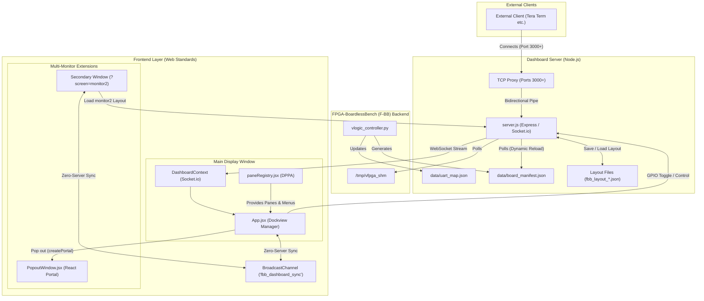

# dashboard/ - 仮想 FPGA 診断ダッシュボード

このディレクトリには、仮想 FPGA の内部レジスタ状態をリアルタイムに監視し、UART コンソールへのアクセスを提供する Web ベースの診断インターフェースが収められています。

## 役割 (Role)

- **リアルタイム監視**: 共有メモリ (SHM) を監視し、RTL シミュレータ上のレジスタ値をダッシュボードへブロードキャストします。
- **レジスタ履歴 (Tracer)**: レジスタの変化を時系列で記録し、正規化された波形として表示します。
- **GPIO インジェクション**: ダッシュボード上のトグルスイッチを操作することで、シミュレーション中の GPIO 入力状態をリアルタイムに変更できます（他レジスタを巻き込まない 4 バイト局所アトミック書き込みによる非侵襲設計）。
- **UART ブリッジ統合**: 複数の UART デバイス（PTY/TCP ブリッジ）を集約し、ブラウザ上のターミナルから操作可能にします。64KB 歴史バッファにより起動時の初期メニューやログの取りこぼしを防止します。
- **カオス・障害注入 ＆ マルチコア・ライフサイクル制御**: 実行中コア（Aコア/Mコア）の個別選択再起動、シード指定（Off/Random/Fixed）による決定論的障害注入（I2C/SPI/UIO/CAN/CDMA）、および障害発生ログのリアルタイム通知を行います。
- **自動化 (Macros)**: `login:` 等の特定の文字列を検知して自動的にレスポンスを返すマクロ機能を備えています。
- **ハイブリッド・マルチスクリーン & ペイン切り離し (Pop-out)**: 各ペインのタブから別ウィンドウへのワンクリック切り離し（Pop-out）、およびサブモニタ用のスクリーン別レイアウト管理（`?screen=monitor2`）に対応。
- **DPPA (Dashboard Pane Plugin Architecture)**: 宣言的ペインレジストリ（`paneRegistry.jsx`）により、ペインの実装・定義とウィンドウマネージャーを完全疎結合化。

## アーキテクチャ図


```mermaid
graph TD
    subgraph "FPGA-BoardlessBench (F-BB) Backend"
        VLogic["vlogic_controller.py"]
        SHM["/tmp/vfpga_shm"]
    end

    subgraph "Dashboard Server (Node.js)"
        Srv["server.js (Express / Socket.io)"]
        Map["data/uart_map.json"]
        Manifest["data/board_manifest.json"]
        Proxy["TCP Proxy (Ports 3000+)"]
        LayoutStore["Layout Files (fbb_layout_*.json)"]
    end

    subgraph "Frontend Layer (Web Standards)"
        subgraph "Main Display Window"
            Client["App.jsx (Dockview Manager)"]
            Registry["paneRegistry.jsx (DPPA)"]
            Ctx["DashboardContext (Socket.io)"]
        end

        subgraph "Multi-Monitor Extensions"
            Popout["PopoutWindow.jsx (React Portal)"]
            SubClient["Secondary Window (?screen=monitor2)"]
        end
        
        BC["BroadcastChannel ('fbb_dashboard_sync')"]
    end

    subgraph "External Clients"
        ExtClient["External Client (Tera Term etc.)"]
    end

    VLogic -->|"Generates"| Manifest
    VLogic -->|"Updates"| Map
    Srv -->|"Polls (Dynamic Reload)"| Manifest
    Srv -->|"Polls"| SHM
    Srv -->|"WebSocket Stream"| Ctx
    Srv <-->|"Save / Load Layout"| LayoutStore
    Ctx --> Client
    Registry -->|"Provides Panes & Menus"| Client
    Client -->|"Pop out (createPortal)"| Popout
    Client <-->|"Zero-Server Sync"| BC
    SubClient <-->|"Zero-Server Sync"| BC
    SubClient -->|"Load monitor2 Layout"| Srv
    Client -->|"GPIO Toggle / Control"| Srv
    
    ExtClient -->|"Connects (Port 3000+)"| Proxy
    Proxy -->|"Bidirectional Pipe"| Srv
```

## 主要なファイル

- **`server.js`**: ダッシュボードのバックエンドエンジン。
    - ポート 8080 で待機。
    - マニフェストと共有メモリを読み取り、WebSocket (`socket.io`) でフロントエンドに配信。
    - UART ブリッジ（TCP ポート 2000〜）との中継、および外部端末（TeraTerm等）接続用のTCPプロキシサーバー（ポート 3000〜）の起動と相互転送を担当。
    - スクリーン別レイアウト永続化 API (`GET/POST /api/layout?screen=...`) を提供。
- **`client/`**: フロントエンド（React 19）のソースコード。
    - **`src/panes/paneRegistry.jsx`**: DPPA (Dashboard Pane Plugin Architecture) の中核。全ペインのメタデータ、コンポーネント、Lucide アイコン、動的メニュー分類を一元管理。
    - **`src/components/PopoutWindow.jsx`**: React 19 `createPortal` を利用したペイン切り離し（子ウィンドウ化）マネージャー。スタイルシートの完全同期と自動リドックを提供。
    - **`src/components/DockHeaderActions.jsx`**: Dockview タブヘッダー拡張。各ペインのタブ右上にポップアウト切り離しボタンを配置。
    - **`src/components/DashboardContext.jsx`**: WebSocket 受信状態および `BroadcastChannel` による画面間ステート同期プロバイダー。
    - **`src/App.jsx`**: ペインの詳細から切り離された純粋な Dockview ウィンドウマネージャー。
- **`data/`**: 動的に生成されるマニフェストや UART マップファイルの格納場所。

## ハイブリッド・マルチスクリーン & ペイン切り離し機能 (Hybrid Multi-Screen & Pop-out)

複数モニタを持つ開発者のために、ダッシュボードの表示領域を物理的な別ディスプレイへ拡張する 3 つの柔軟なアプローチを提供します。

### 1. ワンクリック・ポップアウト（Pop-out to separate window）
- 各 Dockview タブの右上にある **「External Link」アイコン** をクリックすると、そのペインが新しいブラウザウィンドウとしてポップアップします。
- **React 19 `createPortal`** を利用しているため、WebSocket 接続やコンポーネントの React ステートはメインウィンドウと完全に共有されます。
- ポップアウトウィンドウ上部の **「Re-dock to Main Window」** ボタンを押すか、子ウィンドウを閉じるだけで、メイン画面の元のドック位置へ瞬時に復元されます。

### 2. モニタ別コックピット化 (`?screen=<id>`)
- サブモニタのブラウザで URL に `?screen=...` を付与して開きます（例: `http://localhost:8080/?screen=monitor2`）。
- 画面上部ヘッダーに `SCREEN: monitor2` バッジが表示され、レイアウトの保存・読み込みがモニタ専用ファイル（`fbb_layout_monitor2.json`）として独立して行われます。メインモニタとサブモニタでそれぞれ異なるペイン配置を保存・自動復元可能です。

### 3. 単体ペイン全画面モード (`?pane=<id>`)
- 特定のペインだけを画面いっぱいに表示したい場合（例: プロジェクター投影や専用ディスプレイ表示）、URL に `?pane=...` を付与します（例: `http://localhost:8080/?pane=peripheral_ssd1306` や `http://localhost:8080/?pane=uart_1`）。
- Dockview ヘッダーや外枠を排した 100% 全画面表示となります。

### 4. 画面間ゼロオーバーヘッド同期 (`BroadcastChannel`)
- 複数画面を開いた際、サーバーへの通信負荷をかけずに、ブラウザ標準の `BroadcastChannel('fbb_dashboard_sync')` を介して UI 状態（Tracer で非表示にしたレジスタキー等）がリアルタイムに相互同期されます。

## 外部UART接続プロキシ機能 (TCP Proxy)

ダッシュボードは、シミュレータ内のUARTデバイスとブラウザ上のコンソールの通信を仲介するだけでなく、ホストPC上の外部ターミナルエミュレータ（Tera Termなど）がコンテナ内のファームウェアと直接通信するためのTCPプロキシ機能を内蔵しています。

### アーキテクチャとポート対応
- **シミュレータ側（Pythonブリッジ）**: ポート `2000` (UART1), `2001` (UART2) などでリッスンします。
- **ダッシュボードプロキシ（Node.js）**: ポート `3000` (UART1), `3001` (UART2) など（Pythonポート + 1000番）でリッスンし、外部クライアントからの接続を受け付けます。

### 特徴
1. **リアルタイム・スニッフィング**: Tera Term 等から送信・受信されたすべての通信データはダッシュボード側にも WebSocket 経由で即時ミラーリングされ、ブラウザと外部クライアントの両方で同時に通信を監視できます。
2. **ログ再生 (Replay)**: 外部クライアントが新しく TCP 接続した際、それまでにファームウェアが出力した過去のログバッファ（最大5000文字）を自動的に再送（リプレイ）し、接続前のやり取りも復元します。
3. **入力同期 (Echo)**: Webダッシュボード上の入力フォームから送信したデータも、外部クライアント側の画面にエコーバック（画面同期）され、操作ログが一貫して表示されます。

## 使用方法

通常、`start_lab.sh` によって自動的に起動されますが、フロントエンドのビルドおよびパッケージインストールを含めてダッシュボードをリビルド・手動起動する場合は、以下の手順に従います。

### リビルド方法 (Rebuild)
```bash
./dashboard/rebuild_dashboard.sh
```

### 手動での起動方法 (Manual Start)
```bash
cd dashboard
node server.js
```

ブラウザで **`http://localhost:8080`** を開くとダッシュボードにアクセスできます。

## API エンドポイント

- `GET /api/manifest`: 現在ロードされているボード構成情報（`board_manifest.json`）を返します。
- `GET /api/layout`: 現在アクティブなシナリオのフォルダから UI レイアウト情報（`fbb_layout.json`、または `?screen=<id>` 指定時は `fbb_layout_<screen>.json`）を読み込みます。
- `POST /api/layout`: 現在アクティブなシナリオのフォルダへ UI レイアウト情報（`fbb_layout.json`、または `?screen=<id>` 指定時は `fbb_layout_<screen>.json`）を保存します。
- `GET /api/scenario/cores`: 実行中のシナリオ内の各コアプロセス（Aコア/Mコア等）の PID および稼働状態を取得します。
- `POST /api/scenario/stop`: 実行中のシナリオ（または指定された個別コア）を停止します。
- `POST /api/scenario/restart`: シナリオ（または指定された個別コア）を停止し、指定されたカオス設定を適用して再起動します。
- `POST /api/chaos/config`: カオス障害注入設定（有効/無効、シード値、障害率、ターゲット）を更新・配信します。
- `GET /api/dts/tree`: 32-bit物理アドレス空間のメモリマップ割り当て、デバイス間/High/Low未割り当て空間（Unmapped Gap）サイズ、および重なり検知ステータスとDTSソースを取得します。
- `POST /api/dts/diagnose`: DTSエラーメッセージをローカルLLM (Ollama/qwen3.6) へ投入し、AIによる自然言語解説と推奨Fix Diffを取得します。
- `GET /api/sdcard/status`: 仮想 SD カードの現在のマウント・エミュレーションステータスを取得します。
- `GET /api/sdcard/list`: 仮想 SD カードイメージ内のファイル一覧を取得します。
- `GET /api/sdcard/dump`: 仮想 SD カードイメージから指定したファイルをダウンロードします。

## 設計上の配慮 (Design Philosophy)

1. **Backend Decoupling**: Python 側の制御ロジックと Node.js 側の可視化ロジックを分離することで、UI 側の操作がシミュレーションのリアルタイム性に影響を与えないように設計されています。
2. **Auto-Discovery**: `data/board_manifest.json` を監視し、新しいデバイスが追加されるとダッシュボードへ自動的に反映されます。
3. **Interactive Splitting**: フロントエンドに `Dockview` を採用し、ユーザーが複数の UART ペインをドラッグ＆ドロップで自在に分割配置して同時監視できるようにしています。
4. **Non-Invasive SHM Access (非侵襲共有メモリアクセス)**: 200ms ごとの状態監視ループは完全なリードオンリー（Read-Only）とし、不要なディスク書き込みを排除。UI からの GPIO トグルや仮想ペリフェラル操作時のみ、該当レジスタの特定オフセットへ最小限の局所バイナリ書き込み（pwrite）を行うことで、並行実行されるファームウェアやシミュレータのレジスタ更新との競合・データ破壊を防止しています。
5. **DPPA & Hybrid Multi-Screen (疎結合ペインプラグインとマルチモニタ拡張)**: バックエンドの PPA (ADR #005) と同期した設計思想により、ペインの定義・アイコン・メニュー分類をレジストリ（`paneRegistry.jsx`）へ完全分離（開閉原則 OCP 準拠）。さらに、Electron などのヘビーな外部ネイティブアプリに頼らず、Web 標準技術（React 19 `createPortal`、`BroadcastChannel`）のみでゼロ・インストール＆ゼロ・オーバーヘッドなマルチモニタ環境を実現しています。
