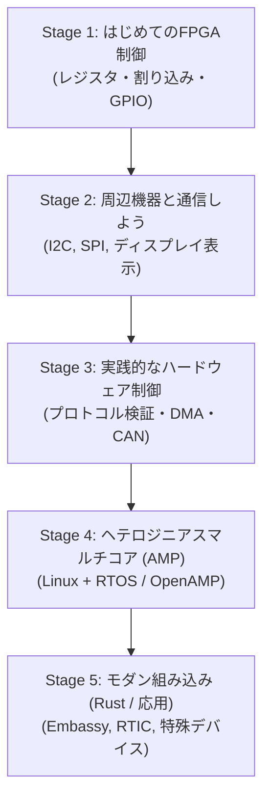

# FPGA & 組み込みLinux ステップアップ学習プラン

本ドキュメントは、FPGA-BoardlessBench（F-BB）に収録されているテストシナリオを活用し、初学者が無理なく段階的にステップアップして学習を進められるように体系化したロードマップです。

「まずは動かして楽しむ（基礎）」→「周辺機器を繋ぐ（シリアル通信）」→「高速転送と実践制御（DMA/CAN）」→「マルチコアとRTOS（AMP）」という自然な流れで進められるように設計しています。

---

## Stage 1: はじめてのFPGA制御（レジスタと入出力の基本）
**目標**: CPU（C言語）からFPGA回路を直接コントロールする基礎を身につける。

| 順番 | シナリオ名 | 学ぶこと | なぜこの順番か |
| :--- | :--- | :--- | :--- |
| **1-1** | [01_standard_uio](../../tests/scenarios/01_standard_uio/README.md) | レジスタ読み書き (MMIO) | **【現在地・スタート】** すべての基本となる共有メモリ（レジスタ）の概念を理解する。 |
| **1-2** | [01b_uio_irq_interrupt](../../tests/scenarios/01b_uio_irq_interrupt/README.md) | 割り込み通知 (IRQ) | `sleep` で待つのではなく、FPGAから「終わったよ」と合図をもらう方法を学ぶ。 |
| **1-3** | [06_gpio](../../tests/scenarios/06_gpio/README.md) | 入出力ピン (GPIO) | LEDの点灯やスイッチ入力など、1ビット単位の信号をやり取りする感覚を掴む。 |
| **1-4** | [05_multi_v_files](../../tests/scenarios/05_multi_v_files/README.md) | Verilogのモジュール分割 | 回路が少し複雑になったときに、ファイルを分割して綺麗に設計する方法を知る。 |

---

## Stage 2: 周辺機器と通信しよう（シリアル通信 & ディスプレイ）
**目標**: センサーや画面などの外部デバイスと会話する標準プロトコル（I2C / SPI / UART）を体験する。

| 順番 | シナリオ名 | 学ぶこと | なぜこの順番か |
| :--- | :--- | :--- | :--- |
| **2-1** | [02_multi_i2c](../../tests/scenarios/02_multi_i2c/README.md) | I2C通信の基本 | 2本の線だけで複数のデバイスと通信する組み込みの超定番プロトコルを学ぶ。 |
| **2-2** | [02e_ht16k33_7seg_i2c](../../tests/scenarios/02e_ht16k33_7seg_i2c/README.md) [02d_oled_i2c](../../tests/scenarios/02d_oled_i2c/README.md) | ディスプレイ制御 | I2Cを使って実際に7セグメントLEDやOLED画面に文字・数値を出す（Webダッシュボードで視覚的に確認できて達成感が大きい）。 |
| **2-3** | [02b_multi_spi](../../tests/scenarios/02b_multi_spi/README.md) | SPI通信の基本 | I2Cより高速なSPI通信の仕組みを学ぶ。 |
| **2-4** | [03_uart_console](../../tests/scenarios/03_uart_console/README.md) | シリアルコンソール (UART) | デバッグログの出力やコマンド受信で最もよく使われるUARTを理解する。 |
| *(選択)* | [06b_hub75_matrix_64x64](../../tests/scenarios/06b_hub75_matrix_64x64/README.md) | LEDマトリクス表示 | ハードウェアの高速リフレッシュで画像を描画する応用体験。 |

---

## Stage 3: 高速転送と実践制御（DMA / 車載通信）
**目標**: CPUに負担をかけずに大量データをやり取りする技術や、業界標準の通信を学ぶ。

| 順番 | シナリオ名 | 学ぶこと | なぜこの順番か |
| :--- | :--- | :--- | :--- |
| **3-1** | [01c_protocol_assertion](../../tests/scenarios/01c_protocol_assertion/README.md) | ハードウェアの自動検証 | 回路がプロトコル違反（おかしな動き）をしていないかを自動で検知するテスト手法。 |
| **3-2** | [20_dma_cdma](../../tests/scenarios/20_dma_cdma/README.md) | DMA転送 (AXI CDMA) | CPUが1個ずつコピーするのではなく、専用ハードウェア（DMA）にメモリ間転送を丸投げする超高速化技術を学ぶ。 |
| **3-3** | [21_can_socketcan_ecu](../../tests/scenarios/21_can_socketcan_ecu/README.md) | 車載CAN通信 & OBD-II | 自動車や産業機械の標準ネットワーク（CAN）と、LinuxのSocketCANスタックを体験する。 |

---

## Stage 4: ヘテロジニアスマルチコア & リアルタイムOS（AMP）
**目標**: メインのLinux（Aコア）と、リアルタイム制御用のマイコン（Mコア）を同時並行で動かす。

| 順番 | シナリオ名 | 学ぶこと | なぜこの順番か |
| :--- | :--- | :--- | :--- |
| **4-1** | [09_remoteproc_amp](../../tests/scenarios/09_remoteproc_amp/README.md) | リモートコア起動 | LinuxからMコアのファームウェアをロードして起動する仕組み（remoteproc）。 |
| **4-2** | [10_amp_mcore_freertos](../../tests/scenarios/10_amp_mcore_freertos/README.md) または [11_amp_mcore_threadx](../../tests/scenarios/11_amp_mcore_threadx/README.md) | RTOSの基礎 | Mコア側でリアルタイムOS（タスク切り替えやタイマー）を動かす。 |
| **4-3** | [14_amp_mcore_OpenAMP_baremetal](../../tests/scenarios/14_amp_mcore_OpenAMP_baremetal/README.md) [15_amp_mcore_OpenAMP_freertos](../../tests/scenarios/15_amp_mcore_OpenAMP_freertos/README.md) | コア間通信 (OpenAMP / RPMsg) | Linuxとマイコンコアの間で共有メモリを使って安全にメッセージをやり取りする標準フレームワーク。 |
| **4-4** | [20b_mcore_cdma](../../tests/scenarios/20b_mcore_cdma/README.md) | MコアからのDMA制御 | マイコンコア主導でFPGAのDMAを駆動する応用。 |

---

## Stage 5: モダン組み込み & 発展技術（Rust / C++）
**目標**: C言語だけでなく、安全性・生産性の高い最新技術を試してみる。

| 順番 | シナリオ名 | 学ぶこと |
| :--- | :--- | :--- |
| **5-1** | [16_amp_mcore_Rust_baremetal](../../tests/scenarios/16_amp_mcore_Rust_baremetal/README.md) | MコアをRustでプログラミング |
| **5-2** | [17_amp_mcore_Rust_embassy](../../tests/scenarios/17_amp_mcore_Rust_embassy/README.md) | 非同期Rust（Embassy）による省電力・高効率な制御 |
| **5-3** | [18_amp_mcore_Rust_rtic](../../tests/scenarios/18_amp_mcore_Rust_rtic/README.md) | リアルタイムRustフレームワーク（RTIC） |
| **5-4** | [S01_cpp_lfsr_sequencer](../../tests/scenarios/S01_cpp_lfsr_sequencer/README.md) | C++によるシミュレーション検証 |

---

## 補足：スキップまたは後回しでよいシナリオ

- **`04_dev_mem_legacy` / `04b_dev_mem_violation_legacy`**:
  古いLinux開発で使われていた `/dev/mem` 直接アクセスです。現在は非推奨・セキュリティ上禁止されることが多いため、歴史的背景を知りたい場合以外はスキップして問題ありません。
- **`07_minimum_template`**:
  新しいシナリオを自分で自作するためのひな型（テンプレート）です。学習が一通り終わって「自分で新しい回路シナリオを作りたい」となったときに使います。
