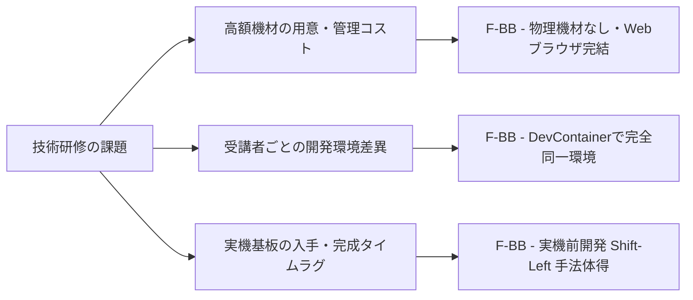

# F-BB 組み込み・FPGA技術研修ソリューション提案書
> **〜 実機基板なしで、製品レベルの組み込みLinux・RTOS・FPGA協調設計技術を修得できる完全ソフトウェア環境 〜**

---

## 1. エグゼクティブ・サマリー (Executive Summary)

組込み・FPGA開発を担う企業やエンジニアリング現場において、技術研修の最大の障壁となるのが **「高価な評価ボードや測定器の用意・管理の手間」** と **「受講者ごとのPC環境差異による演習の躓き」** です。 **FPGA-BoardlessBench (F-BB)** は、物理的な基板やハードウェア機器を一切使用することなく、 **DevContainer と Web ブラウザだけ** で、実際の産業用 SoC（Zynq等）・組み込み Linux・RTOS・FPGA 協調設計の実務研修を、どのようなPC環境からでも即座に受講できる **技術研修プラットフォームとして利用** できます。

---

## 2. 組み込み・FPGA研修における「3 大課題」と F-BB による解決



### 課題 1: 高額な評価ボード・測定器の準備と管理リスク
- **現場のリアル** : 研修のために高価な SoC ボード、オシロスコープ、JTAGデバッガを人数分揃えたり持ち運んだりするのは、購入コスト・梱包設定の手間・破損失念リスクが大きい。
- **F-BB の解決策** : **物理機材コスト 0 円** 。全環境が Docker / DevContainer にカプセル化されているため、受講者のブラウザや VS Code 上で即座に仮想基板とデバッグ環境が立ち上がります。

### 課題 2: 受講者間での「PC環境差異（動かない問題）」の発生
- **現場のリアル** : 受講者ごとにOSバージョン、PCスペック、インストールされているツールの差異があり、「マニュアル通りに動かない」「ネットワークセキュリティ制約でJTAGやシリアル通信が通らない」といった環境トラブルが発生しやすい。
- **F-BB の解決策** : **100% 完全同一の動作環境** 。コンパイラ、シミュレータ、Webダッシュボードがコンテナ内で閉じているため、受講者の環境に依存せず、常に再現性高く演習が進行します。

### 課題 3: 実機試作基板の完成・入手待ちによるタイムラグ
- **現場のリアル** : 開発・試作されるハードウェア基板は台数が限られ、手元に届くまでにタイムラグが発生するため、エンジニアの技術習得や先行開発が遅れる。
- **F-BB の解決策** : **実機が手元に届く前から実務コードを開発・テストできる（Shift-Left手法）** 。F-BB は実機Linux（`/dev/uio0`, `/dev/spidev`等）と 100% 同一のシステムコール構造を持つため、実機が手元に届く前に仮想基板上で製品レベルのファームウェアやデバイスドライバの技術を完全修得できます。

---

## 3. 技術研修における 3 大導入メリット (Business Value)

### ① 統一された高い技術水準（ナレッジの標準化）を達成
- ばらつきがちだった組込みLinux・デバイスドライバ・SoC開発のスキルセットを、F-BBの統一された 30 以上の標準シナリオにより、 **エンジニア全体で同一の高い技術水準** へ引き上げることができます。

### ② 予備機材購入費・管理費の完全カット
- 受講者ごとの評価ボード購入費や、精密機器の保管・管理コストが **完全 0 円** になります。

### ③ Webダッシュボードによる直感的でリアルタイムなハードウェア可視化
- 1:1 実基板ベクター描画 (`[PCB Board]` モード) や、50%〜400% 拡大パンニング、レジスタ波形描画 (`RegisterTracer`) により、物理基板がなくても実物の基板を目の前で操作している感覚で、波形や信号の変化をリアルタイムに体感学習できます。

---

## 4. 技術研修の運用イメージ (Operation Model)

```text
【技術管理・研修配信部門】
  ├─ 研修カリキュラム・F-BBシナリオの統一定義
  └─ 共通開発環境・テストシミュレータの一元配信
       │
       │ (DevContainer / Git リポジトリ経由で受講者へ即時配信)
       ▼
【受講者環境 (VS Code / Webブラウザ)】
  ├─ 基礎コース: 生産ライン制御向け Linux UIO & SPI センサ研修
  ├─ 応用コース: SoC 異種マルチコア (AMP) & RTOS 通信研修
  └─ 先進コース: FPGA RTL IP & DMA 高速転送研修
```

---

## 5. ステップ別実践研修カリキュラム案

### 5.1 F-BBで修得できるスキルと実機確認が必要な項目 (Scope & Boundaries)

研修の導入にあたり、ソフトウェアシミュレーション（F-BB）上で事前修得・検証を完了できる範囲と、実機試作基板の完成後に現場で最終確認を行うべき項目を以下のように明確に区別します。

| 区分 | 評価・学習項目 | F-BB上でのシミュレーション・修得範囲 | 実機環境での最終確認が必要な項目 |
| :--- | :--- | :--- | :--- |
| **ソフトウェア / FW** | - C/C++ / Rust ファームウェア<br>- Linux デバイスドライバ (UIO/SPI/I2C)<br>- POSIX システムコール & タスク同期 | **100% 仮想環境上で修得・動作検証可能**<br>実機と完全同一のシステムコール・ドライバコードを作成・ビルド・テスト。 | 実装したアプリケーションの長期連続稼働・耐久試験。 |
| **ハードウェア / RTL** | - AXI バスインターフェース<br>- カスタム Verilog RTL IP 動作<br>- DMA メモリ間高速転送 | **Verilator を通じて 100% 同時シミュレーション可能**<br>バス転送タイミング、レジスタ書き換え、オーバーラン/アンダーランの事前検出。 | 物理層 (PHY) 電気規格コンプライアンス試験、クロックジッタ、熱設計、電源投入シーケンス (Power Sequencing)。 |
| **システム / デバッグ** | - 異種マルチコア (AMP) 通信<br>- RTOS (FreeRTOS/ThreadX) 協調<br>- レジスタ状態・波形可視化 | **Web UI と連携し 100% 視覚的トレース可能**<br>共有メモリ排他制御、レジスタ変化グラフ (`RegisterTracer`) による先手デバッグ。 | 物理ボタンスイッチの機械的チャタリング (Bouncing)、実際のモーター・アクチュエータ等の物理的応答遅延。 |

---

### 5.2 カリキュラムステップ一覧

| フェーズ | 研修テーマ | 具体的な演習内容 (F-BBシナリオ) | 習得できる実務スキル |
| :--- | :--- | :--- | :--- |
| **Phase 1<br>(基礎編)** | **組み込みLinux・レジスタ制御 & メモリ安全デバッグ** | - `01_standard_uio` (GPIO / LED / スイッチ)<br>- `02b_multi_spi` (SPI ADC センサ値注入)<br>- **AddressSanitizer (ASan) & Guard Page デバッグ** (`AddInfo_ASan.md`, `AddInfo_GuardPage.md`) | C言語 MMIO、Linux UIOドライバ構造、SPI/I2Cレジスタアクセス、**ASan によるバッファオーバーフロー検知・Guard Page (`mprotect`) による不正アクセス遮断デバッグ** |
| **Phase 2<br>(応用編)** | **HW/SW 協調設計・RTL IP 結合 & AXI DMA レジスタ解析** | - `06b_hub75_matrix` (ディスプレイ制御)<br>- `07_verilator_custom_ip` (RTLモック結合)<br>- `20_dma_cdma` (Zynq AXI CDMA 高速転送・エラー解析) | Verilator による RTL 共同シミュレーション、**AXI CDMA 制御/ステータスレジスタ (`CDMACR`, `CDMASR`) 設定、アライメントエラー (`DMADecErr`)・アンダーラン・オーバーランのエラー状態解析**、先手デバッグ手法 |
| **Phase 3<br>(先進編)** | **異種マルチコア (AMP) & RTOS 実装** | - `10_amp_mcore_freertos` (FreeRTOS 協調)<br>- `11_amp_mcore_threadx` (ThreadX 共有メモリ)<br>- `16_amp_mcore_Rust_baremetal` (Rust FW) | Linux(Aコア) ＋ RTOS(Mコア) の異種多重処理、共有メモリ排他制御、Rust 組み込み開発 |

---

## 6. 経営・技術幹部へのキラーフレーズ集

- **「高価な基板を用意する必要はありません。ブラウザ1つで、誰でも実機と同等の環境で学べます」**
- **「『PC環境が違って動かない』トラブルを完全排除。開発コンテナで100%同一の演習環境を提供します」**
- **「実機基板が届くタイムラグを解消。届く前から仮想基板で製品レベルのコードを開発・修得させます」**
- **「社内研修にとどまらず、将来的な大学・高専等との産学連携や採用候補者向け体験教材としても有効活用できる高い汎用性を備えています」**