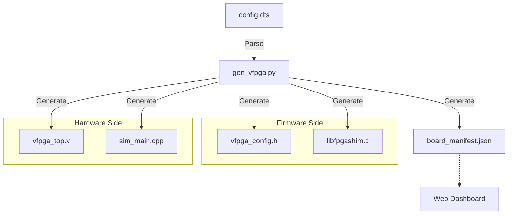

# /scripts - FPGA-BoardlessBench (F-BB) 司令塔（オートメーション層）

このディレクトリには、Device Tree (DTS) からシミュレーション環境を自動構築するためのコア・スクリプトが収められています。

## 1. gen_vfpga.py (The Generator)

FPGA-BoardlessBench (F-BB) の中心的なエンジンです。**DTSファイルを唯一の情報源 (Single Source of Truth)** とし、ハードウェア・ソフトウェアの境界（Shim層、RTL、シミュレータ）を自動生成します。

### 特徴
- **モジュール設計**: パーサー、データモデル、言語別ジェネレータが分離されており、容易に拡張可能です。
- **シナリオ非依存**: 特定のテスト回路（`pattern_engine` 等）に依存しない純粋なスケルトンを生成し、回路実装とジェネレータの責務を完全に分離しています。
- **118ピン標準インターフェース**: RTL トップの IO を 118 ピン (`l_pins_i/o/t`) に標準化。SoC 規模の複雑なデザインまで透過的にサポートします。
- **ステートフル同期**: ソフトウェアと RTL 間のレジスタ通信において、不整合（レースコンディション）を発生させない高度な同期プロトコルを実装しています。
- **環境適応性**: `/tmp` ベースの共有メモリ通信を採用しており、Docker/DevContainer などの隔離された名前空間内でも安定して動作します。

### 生成されるファイルと役割
- **`src/include/vfpga_config.h`**: レジスタマップ、ビット幅、共有メモリパスを含むCヘッダー。
- **`src/shim/libfpgashim.c`**: UIO, I2C, UART, `/dev/mem` 等のアクセスをフックし、シミュレータへリダイレクトする Shim ライブラリ。仮想 `remoteproc` の API 制御パス (`/sys/class/remoteproc/...`) や、ファームウェア配置パス (`/lib/firmware/...`) の `/tmp/fbb` へのリダイレクトも自動生成されます。
- **`src/rtl/vfpga_top.v`**: DTSの定義に基づいた **118ピン標準インターフェース** を備えた Verilog のトップモジュール・スケルトン。
- **`src/sim/sim_main.cpp`**: Verilator 用の C++ ラッパー。共有メモリと RTL 信号の同期を司るブリッジエンジン。
- **`dashboard/data/board_manifest.json`**: ダッシュボードがデバイス構成やレジスタ一覧、およびHDMIプレビュー用出力パス（`hdmi_output_path`）を把握するためのメタデータファイル。

### 内部構造
詳細なクラス構造や設計原則については、[ARCHITECTURE_MANIFEST.md](../ARCHITECTURE_MANIFEST.md) もあわせて参照してください。

自動生成エンジンは、保守性と可読性を向上させるため、`vfpga/` Python パッケージとしてモジュール分割されています。

```text
scripts/
  ├── gen_vfpga.py                    # メイン CLI エントリポイント & Facade
  └── vfpga/                          # コア・ロジック・パッケージ
        ├── __init__.py               # パッケージ初期化ファイル
        ├── models.py                 # データモデルの定義 (Device, Register, BoardModel 等)
        ├── parser.py                 # DTS Parser (DTSファイルから BoardModel を構築)
        ├── generator_base.py         # ジェネレータの基底クラス (BaseGenerator, ConfigGenerator)
        ├── generator_rtl.py          # RTL関連コードのジェネレータ群 (Rtl, Sim, Manifest, PAC)
        ├── generator_shim.py         # C Shimコードのジェネレータ (ShimGenerator)
        └── templates/                # コード生成用の各種テンプレート
              └── libfpgashim.c.template # C Shim の長大なC言語コード・テンプレート
```

#### 各モジュールの詳細説明
* **`gen_vfpga.py`**: F-BB のテストランナー（`scenario_runner.sh` 等）から呼び出される CLI の共通インターフェースです。内部ロジックは `vfpga/` パッケージに処理を委譲していますが、Facade（窓口）パターンを採用し、元のクラスやジェネレータを再公開することで、単体テストスクリプト（`test_gen_vfpga.py`）等の外部モジュールに対する**完全な後方互換性**を保証しています。
* **`vfpga/models.py`**: パースされたハードウェア構成をメモリ上で管理するためのデータ構造（抽象構文ツリー）です。
  * **`Device`**: 各デバイスノード（uio, i2c, uart 等）の属性情報（ベースアドレス、サイズ、レジスタ群など）を保持。
  * **`Register`**: メモリマップドレジスタの名前、オフセット、方向、論理名などを定義。
  * **`I2CSlave`**: I2Cバス上にネスト定義されたスレーブデバイス（EEPROM等）のエミュレーション属性を保持。
  * **`BoardModel`**: ボード全体のデバイスリストとメタデータを包括する最上位モデル。
* **`vfpga/parser.py`**: DTS ファイルを読み込んで構文解析を行い、`BoardModel` を動的に構築する解析器です。ルートノードのパース、ネストされた子ノード（I2Cスレーブ）の再帰的パース、プロパティのマスク処理（親プロパティの上書き防止）などのパーサー論理がここに集中しています。
* **`vfpga/generator_base.py`**: すべてのコード生成クラスの基底となる `BaseGenerator` と、共有メモリの最適サイズ計算および構成ヘッダー（`vfpga_config.h`）の生成を担当する `ConfigGenerator` が定義されています。
* **`vfpga/generator_rtl.py`**: ハードウェア設計・検証に密接に関連するコード生成器群です。
  * **`RTLGenerator`**: DTSからレジスタ読み書きロジック（`case`文など）を備えた Verilog の最上位スケルトン（`vfpga_top.v`）を生成します。
  * **`SimulatorGenerator`**: Verilator モデルを実行し、共有メモリとRTLレジスタ間で双方向同期を行うC++シミュレータメインコード（`sim_main.cpp`）を生成します。
  * **`ManifestGenerator`**: ダッシュボード UI が動的にデバイス構成やレジスタ情報をリロードして描画するために必要な JSON マニフェスト（`board_manifest.json`）を生成します。
  * **`RustPACGenerator`**: Embedded Rust で検証を行うシナリオ向けに、DTS定義と同期した安全なアクセスライブラリ（`fbb_pac.rs`）を自動生成します。
* **`vfpga/generator_shim.py` & `templates/libfpgashim.c.template`**: Aコアアプリケーション（ファームウェア）のシステムコール（`open`, `mmap`, `ioctl` 等）をインターセプトし、仮想的なデバイスファイルへのアクセスを共有メモリや UNIX ソケットへ安全にルーティングする C Shim（`libfpgashim.c`）の生成を行います。C言語としての約700行に及ぶ複雑なロジック記述は、`templates/libfpgashim.c.template` として外出しされているため、**C言語のシンタックスハイライト、コード補完、フォーマッタが有効な状態で安全に Shim の開発や拡張が行える**設計になっています。

### データフロー図


## 2. ユニットテスト

生成エンジンの信頼性を担保するため、Python コード自体のユニットテストを用意しています。

```bash
# ユニットテストの実行
python3 scripts/test_gen_vfpga.py
```

## 3. uart_bridge.py (The Bridge)

UART（シリアル通信）のエミュレーションを担当するスタンドアロン・スクリプトです。

- **役割**: Shim が作成した PTY (Pseudo Terminal) デバイスを監視し、その入出力を TCP ポート（標準: 2000）へブリッジします。
- **備考**: **現在、この機能は `vlogic_controller.py` の中に統合されており**、システム起動時に自動的に検出・ブリッジ処理が並行実行されます。そのため、本スクリプトを手動で起動する必要はありません（個別のデバッグ用途などのために残されています）。
- **意義**: これにより、ホストPCから Tera Term や telnet を使って、仮想FPGA上のコンソールへリアルタイムにアクセス可能になります。
