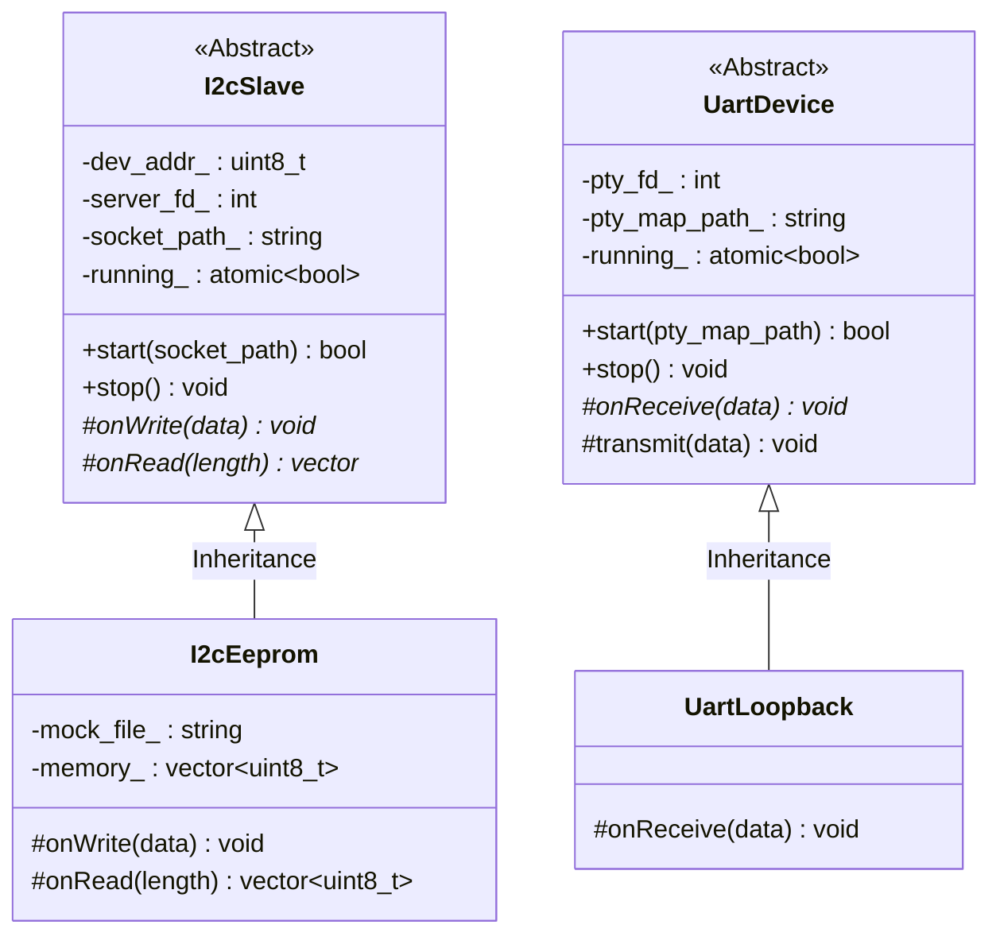

# F-BB 共有ペリフェラル・ライブラリ (F-BB Peripheral Library)

本ディレクトリは、FPGA-BoardlessBench (F-BB) において、仮想システム（Aコア/Mコアなど）と連動する仮想周辺デバイス（I2CスレーブデバイスやUART対向デバイス等）のエミュレーションプログラムを配置する共通ディレクトリです。

C++17 オブジェクト指向による抽象設計を導入し、ボイラープレートな通信コードを基底クラスに隠蔽することで、新しい仮想デバイスの追加やメンテナンスが容易に行えるようになっています。

---

## 1. クラス設計とアーキテクチャ

通信相手となるソケット制御やヘッダー解析、ポーリングなどの低レベル処理は、以下の基底クラスがカプセル化（RAII）しています。

### 1.1. `I2cSlave` クラス
* **役割**: `ioctl(I2C_RDWR)` 通信プロトコルヘッダー（`addr`, `flags`, `len`）の送受信・同期中継を行います。
* **抽象インターフェース**:
  * `virtual void onWrite(const std::vector<uint8_t>& data) = 0`
  * `virtual std::vector<uint8_t> onRead(size_t length) = 0`

### 1.2. `UartDevice` クラス
* **役割**: コントローラが生成した PTY スレーブパスのポーリング読み出し、オープン、およびブロッキングデータ受信ループと、`transmit` によるデータ送信を行います。
* **抽象インターフェース**:
  * `virtual void onReceive(const std::vector<uint8_t>& data) = 0`
  * `void transmit(const std::vector<uint8_t>& data)` (送信実行用API)

---

## 2. コマンドライン引数仕様

各エミュレータデーモンのコマンドライン起動引数は以下の通りです。

### 2.1. 仮想I2C EEPROMエミュレータ (`fbb_i2c_eeprom`)

* **実機エミュレーション仕様**:
  本エミュレータは、実在する代表的な I2C EEPROM デバイスである **[Microchip AT24C02C](https://www.microchip.com/en-us/product/AT24C02C)** の仕様（スレーブアドレス `0x50`、容量 256 バイト、アドレスポインタ指定、およびオートインクリメントによる読み書きシーケンスなど）をベースに実装されています。

| 引数オプション | 必須 / 任意 | 既定値 | 説明 |
| :--- | :--- | :--- | :--- |
| `--socket <path>` | **必須** | - | 中継ソケットをバインドする UNIX ドメインソケットパス（例：`/tmp/fbb_i2c_b1_a50`） |
| `--file <path>` | 任意 | - | EEPROMメモリの状態を永続化する不揮発ファイルのパス（起動時にロードされ、書き込み発生時に自動保存されます） |
| `--init-val <val>` | 任意 | `0x10` | ファイルが存在しない場合の、メモリセル全体の初期既定値（10進数、または `0x` から始まる16進数） |

### 2.2. 仮想UARTループバックエミュレータ (`fbb_uart_loopback`)

| 引数オプション | 必須 / 任意 | 既定値 | 説明 |
| :--- | :--- | :--- | :--- |
| `--pts-file <path>` | **必須** | - | コントローラが作成した PTY スレーブデバイスのパス（`/dev/pts/X`）が記載されている一時ファイルのパス |

---

## 3. 新しいペリフェラルを追加する手順

C++ オブジェクト指向により、新しいデバイスを最小限のコードで追加できます。

1. **基底クラスの選択と継承**:
   * I2Cデバイスを模倣する場合は `I2cSlave` を、UART/シリアル対向デバイスを模倣する場合は `UartDevice` を継承したクラスを新規作成します。
2. **イベントハンドラの実装**:
   * `I2cSlave` なら `onWrite`/`onRead`、`UartDevice` なら `onReceive` の中で、デバイス固有のレジスタ挙動や応答データ生成論理を実装します。
3. **CMake への登録**:
   * [CMakeLists.txt](file:///workspaces/FPGA-BoardlessBench/src/peripherals/CMakeLists.txt) に `add_executable` としてターゲットを追加し、`common/i2c_slave.cpp` または `common/uart_device.cpp` を一緒にリンクします。
4. **コントローラへの組み込み**:
   * コントローラ (`vlogic_controller.py`) のデバイススキャナに対応する `compatible` 名の起動ルーチンを紐付けます。
