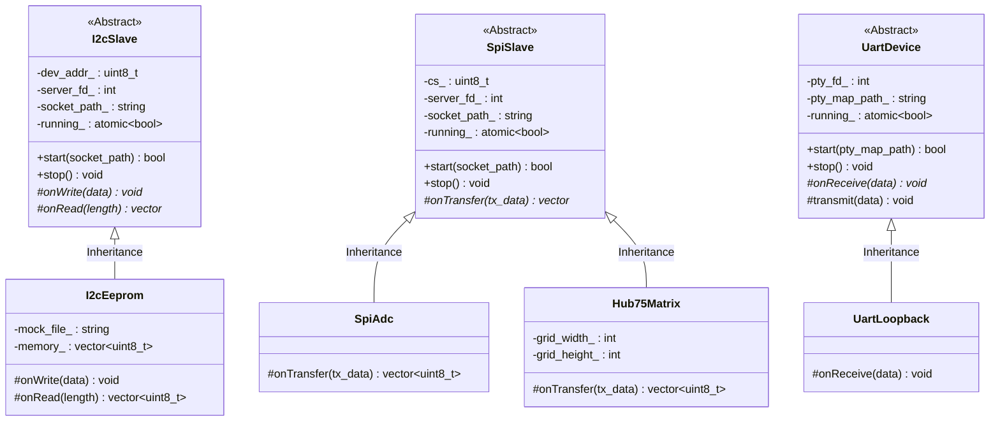

# F-BB 共有ペリフェラル・ライブラリ (F-BB Peripheral Library)

本ディレクトリは、FPGA-BoardlessBench (F-BB) において、仮想システム（Aコア/Mコアなど）と連動する仮想周辺デバイス（I2Cスレーブデバイス、SPIスレーブデバイス、HUB75マトリクスLED、UART対向デバイス等）のエミュレーションプログラムを配置する共通ディレクトリです。

C++17 オブジェクト指向による抽象設計を導入し、ボイラープレートな通信コードを基底クラスに隠蔽することで、新しい仮想デバイスの追加やメンテナンスが容易に行えるようになっています。

---

## 1. クラス設計とアーキテクチャ

通信相手となるソケット制御やヘッダー解析、ポーリングなどの低レベル処理は、以下の基底クラスがカプセル化（RAII）しています。


```mermaid
classDiagram
    class I2cSlave {
        <<Abstract>>
        -dev_addr_ : uint8_t
        -server_fd_ : int
        -socket_path_ : string
        -running_ : atomic~bool~
        +start(socket_path) bool
        +stop() void
        #onWrite(data) void*
        #onRead(length) vector*
    }
    class SpiSlave {
        <<Abstract>>
        -cs_ : uint8_t
        -server_fd_ : int
        -socket_path_ : string
        -running_ : atomic~bool~
        +start(socket_path) bool
        +stop() void
        #onTransfer(tx_data) vector*
    }
    class UartDevice {
        <<Abstract>>
        -pty_fd_ : int
        -pty_map_path_ : string
        -running_ : atomic~bool~
        +start(pty_map_path) bool
        +stop() void
        #onReceive(data) void*
        #transmit(data) void
    }
    class I2cEeprom {
        -mock_file_ : string
        -memory_ : vector~uint8_t~
        #onWrite(data) void
        #onRead(length) vector~uint8_t~
    }
    class SpiAdc {
        #onTransfer(tx_data) vector~uint8_t~
    }
    class Hub75Matrix {
        -grid_width_ : int
        -grid_height_ : int
        #onTransfer(tx_data) vector~uint8_t~
    }
    class UartLoopback {
        #onReceive(data) void
    }

    I2cSlave <|-- I2cEeprom : Inheritance
    SpiSlave <|-- SpiAdc : Inheritance
    SpiSlave <|-- Hub75Matrix : Inheritance
    UartDevice <|-- UartLoopback : Inheritance
```

### 1.1. `I2cSlave` クラス
* **役割**: `ioctl(I2C_RDWR)` 通信プロトコルヘッダー（`addr`, `flags`, `len`）の送受信・同期中継を行います。
* **抽象インターフェース**:
  * `virtual void onWrite(const std::vector<uint8_t>& data) = 0`
  * `virtual std::vector<uint8_t> onRead(size_t length) = 0`

### 1.2. `SpiSlave` クラス
* **役割**: UNIXドメインソケットを介した全二重 SPI トランザクション（マスターからの `tx_data` 受信と同時にスレーブからの `rx_data` 返送）の同期中継を行います。
* **抽象インターフェース**:
  * `virtual std::vector<uint8_t> onTransfer(const std::vector<uint8_t>& tx_data) = 0`

### 1.3. `UartDevice` クラス
* **役割**: コントローラが生成した PTY スレーブパスのポーリング読み出し、オープン、およびブロッキングデータ受信ループと、`transmit` によるデータ送信を行います。
* **抽象インターフェース**:
  * `virtual void onReceive(const std::vector<uint8_t>& data) = 0`
  * `void transmit(const std::vector<uint8_t>& data)` (送信実行用API)

---

## 2. コマンドライン引数仕様

各公式エミュレータデーモンのコマンドライン起動引数は以下の通りです。

### 2.1. 仮想I2C EEPROMエミュレータ (`fbb_i2c_eeprom`)

* **実機エミュレーション仕様**: **[Microchip AT24C02C](https://www.microchip.com/en-us/product/AT24C02C)** (スレーブアドレス `0x50`、容量 256 バイト、不揮発性ファイル永続化対応)

| 引数オプション | 必須 / 任意 | 既定値 | 説明 |
| :--- | :--- | :--- | :--- |
| `--socket <path>` | **必須** | - | 中継ソケットパス（例：`/tmp/fbb_i2c_b1_a50`） |
| `--file <path>` | 任意 | - | メモリ状態の永続化ファイルパス |
| `--init-val <val>` | 任意 | `0x10` | ファイル不在時の全セル初期値 |

### 2.2. 仮想SSD1306 OLEDディスプレイエミュレータ (`fbb_i2c_oled`)

* **実機エミュレーション仕様**: **[Solomon Systech SSD1306](https://www.solomon-systech.com/product/ssd1306/)** (128x64 モノクロ OLED、I2C/SPI メモリマップ・共有メモリ `/dev/shm` 描画)

| 引数オプション | 必須 / 任意 | 既定値 | 説明 |
| :--- | :--- | :--- | :--- |
| `--socket <path>` | **必須** | - | 中継ソケットパス |
| `--shm <name>` | 任意 | `fbb_oled_0` | フレームバッファ共有メモリ名 |

### 2.3. 仮想HT16K33 7セグメントLEDエミュレータ (`fbb_i2c_ht16k33`)

* **実機エミュレーション仕様**: **[Adafruit / Holtek HT16K33](https://www.holtek.com/productdetail/-/vg/HT16K33)** (4桁 7セグメント LED ディスプレイコントローラ)

| 引数オプション | 必須 / 任意 | 既定値 | 説明 |
| :--- | :--- | :--- | :--- |
| `--socket <path>` | **必須** | - | 中継ソケットパス |
| `--shm <name>` | 任意 | `fbb_display_7seg_0` | 7セグメントレジスタ共有メモリ名 |

### 2.4. 仮想MCP3208 12-bit SPI ADCエミュレータ (`fbb_spi_adc`)

* **実機エミュレーション仕様**: **[Microchip MCP3208](https://www.microchip.com/en-us/product/MCP3208)** (8チャンネル 12-bit SPI ADC)

| 引数オプション | 必須 / 任意 | 既定値 | 説明 |
| :--- | :--- | :--- | :--- |
| `--socket <path>` | **必須** | - | 中継ソケットパス |
| `--cs <num>` | 任意 | `0` | チップセレクト番号 |

### 2.5. 仮想W25Q128 SPI NOR Flashエミュレータ (`fbb_spi_flash`)

* **実機エミュレーション仕様**: **[Winbond W25Q128](https://www.winbond.com/hq/product/code-storage-flash-memory/serial-nor-flash/?__locale=en&line=/product/code-storage-flash-memory/serial-nor-flash/index.html)** (16MB SPI NOR Flash)

| 引数オプション | 必須 / 任意 | 既定値 | 説明 |
| :--- | :--- | :--- | :--- |
| `--socket <path>` | **必須** | - | 中継ソケットパス |
| `--file <path>` | 任意 | - | Flash メモリ状態の永続化ファイルパス |

### 2.6. 仮想HUB75 RGB LEDマトリクスエミュレータ (`fbb_hub75_matrix`)

* **実機エミュレーション仕様**: **汎用 HUB75 64x64 / 128x64(デイジーチェーン) RGB LED パネル** (24-bit RGB カラー)

| 引数オプション | 必須 / 任意 | 既定値 | 説明 |
| :--- | :--- | :--- | :--- |
| `--socket <path>` | **必須** | - | 中継ソケットパス |
| `--shm <name>` | 任意 | `fbb_hub75_0` | RGB24 フレームバッファ共有メモリ名 |
| `--grid <width> <height>` | 任意 | `64 64` | LED マトリクス格子解像度（例: `128 64`） |

### 2.7. 仮想UARTループバックエミュレータ (`fbb_uart_loopback`)

| 引数オプション | 必須 / 任意 | 既定値 | 説明 |
| :--- | :--- | :--- | :--- |
| `--pts-file <path>` | **必須** | - | PTY スレーブデバイスパス記載ファイルのパス |

---

## 3. 新しいペリフェラル（公式/サードパーティ・プラグイン）を追加する手順 (Zero-Touch Standard)

C++ オブジェクト指向およびプラグインマニフェスト（`fbb-plugin.json`）の採用により、サードパーティ・ベンダーは F-BB コア（`server.js`, `vlogic_controller.py`, `generator_rtl.py`, Web UI コード）を 1 行も修正することなく（Zero-Touch / 非侵襲）、ディレクトリ単位で完結させて新しい仮想デバイスを追加できます。

### 3.1. プラグインの標準ディレクトリ構成（準備するファイル一覧）

新しいペリフェラルを作成する場合、プラグインフォルダ（例: `src/peripherals/official_plugins/adafruit_ht16k33/`）の中に以下の **4 つのファイル** を準備します：

```text
src/peripherals/official_plugins/<vendor_model>/
├── fbb-plugin.json      # [必須] プラグイン定義、compatible名、起動コマンド、UIレイアウト・色
├── board.svg            # [推奨] 実機同様の基板ベクター画像 (ダッシュボード背景オーバーレイ)
├── <model>.dtsi         # [必須] バス中立な標準デバイスツリーインクルード定義
└── <emulator>.cpp       # [必須] 基底クラス (I2cSlave / UartDevice / SpiSlave) を継承した C++ 実装
```

---

### 3.2. 各構成ファイルの具体的な記述役割

1. **`fbb-plugin.json` (マニフェスト定義)**:
   * プラグイン名、ベンダー情報、対象 `compatible` 名、起動バイナリ名、起動引数テンプレート（`{socket_path}` や `{init_val}`）、および `ui_widget` (基板 `board_svg` 名、`color_map`、コントロール定義) を記述します。
2. **`board.svg` (実基板ベクター画像 - 【推奨】)**:
   * ペリフェラル基板外形、ネジ穴、ICチップ、シルク印刷のベクター画像。500% 以上の拡大でも一切劣化せずダッシュボード上に自動オーバーレイ描画されます。
3. **`<model>.dtsi` (デバイスツリーインクルード定義)**:
   * バス中立（Bus-Neutral）な定義を記述します。特定のバス名（`&i2c1` 等）をハードコードせず、`#ifndef FBB_I2C_BUS #define FBB_I2C_BUS i2c0 #endif` のようにマクロオーバーライド可能に記述することで、シナリオ側の任意のバス（`i2c0`, `i2c1`, `i2c2` 等）へ安全にアタッチできます。
4. **`<emulator>.cpp` (C++ エミュレータソースコード)**:
   * `I2cSlave`, `UartDevice`, `SpiSlave` などの基底クラスを継承し、`onWrite`/`onRead`, `onTransfer`, `onReceive` などのイベントハンドラ内でデバイス固有のレジスタ挙動や応答データ生成論理を実装します。

---

### 3.3. Zero-Touch CMake 自動発見 ＆ 画面自動連動

* [CMakeLists.txt](file:///workspaces/FPGA-BoardlessBench/src/peripherals/CMakeLists.txt) に PPA 4.0 動的自動発見エンジンが統合されているため、プラグインフォルダを配置するだけで、CMake がターゲットバイナリと基底クラス (`common/i2c_slave.cpp`, `common/spi_slave.cpp` 等) を自動検知・ビルドし、ダッシュボード UI も宣言的スキーマに従って自動マウント・レンダリングします。（手動での CMakeLists.txt や server.js 追記は一切不要です）。

---

## 4. プラグイン設計思想：DTS による物理配線アサインの設計意図 (Why)

F-BB では、ペリフェラルモデル側やシミュレーション基盤側に「特定のピン番号」をハードコードせず、ユーザー（テストシナリオ作成者）がデバイスツリー（DTS）上で GPIO ピンや Bus アサインの接続関係（ブレッドボードジャンパー接続）を定義するアーキテクチャを採用しています。

### なぜ DTS による配線定義が必要なのか？（4つのシステム的効果）

1. **ピン番号の動的マッピングと衝突防止 (Dynamic Pin Remapping)**
   ペリフェラル側がピン番号を特定値（例：GPIO 14）に固執しないため、シナリオごとに異なる GPIO ピンへのアサインや複数ペリフェラルの組み合わせ時のピン衝突を C++ コードの再コンパイルなしで柔軟に回避・再利用できます。
2. **物理割り込み (IRQ) シグナルの因果関係再現 (Event-Driven Interrupt Routing)**
   ペリフェラルモデル側から発火した「データ受領・状態変化イベント」が、DTS の `interrupts = <15 1>` 等の記述に基づいて CPU 側の GPIO ピンへリアルタイムにエッジ信号として注入されます。これにより、Linux の `request_irq` や Sysfs `edge` 監視が実機と全く同じ因果関係で正しくトリガーされます。
3. **100% のソースコード透過性の維持 (Zero-Hardcoding Transparency)**
   ファームウェア（C言語）側にもペリフェラルモデル側にも `#ifdef SIMULATION` 等のハードコード分岐を一切持たせずに済みます。評価ボードの SoC や基板アサインが変更されても、DTS の配線情報を変更するだけでシミュレーションが完結します。
4. **ダッシュボード上でのトポロジー自動ラベル表示 (Auto-Topology Visualization)**
   ダッシュボードは DTS の結線情報を解析し、ピンパネル上に `GPIO 14 [Reset -> BME280]` や `GPIO 15 [INT <- BME280]` といった動的配線ラベルを自動生成・可視化し、デバッグ性を飛躍的に向上させます。

---

## 5. プラグインの自動発見・検索パスと各ロード場所の目的 (Plugin Discovery Paths & Purpose)

F-BB コントローラは起動時、DTS 内の `compatible` 名に一致するペリフェラル・プラグインを以下の優先順位に従って自動検索・動的ロードします。複数のロード場所を設けている理由は、**「開発時」「チーム共有時」「個人共通利用時」「CI/CDシステム時」の運用ニーズを明確に分離するため**です。

| 検索順位 | 検索パス | 設置の目的 (Why) |
| :--- | :--- | :--- |
| **1. シナリオローカル** | `<scenario_dir>/plugins/` | **シナリオ限定モックの分離**: 当該シナリオ専用に作成した特殊なカスタムペリフェラルや実験用デバッグモックの置き場。他のシナリオに影響を与えずに安全にテスト可能。 |
| **2. プロジェクトローカル** | `<project_root>/.fbb/plugins/`<br>`src/peripherals/official_plugins/` | **チーム/プロジェクト公式共有**: Gitリポジトリで管理し、プロジェクトメンバー全員で共有・実行する公式およびプロジェクト共通ペリフェラルプラグインの置き場。 |
| **3. ユーザーホーム** | `~/.fbb/plugins/` | **個人開発環境での汎用再利用**: 各開発者の PC 上でダウンロード・ビルドしたメーカー製プラグインを、複数プロジェクト横断で使い回すための開発者個人の標準ライブラリ置き場。 |
| **4. システム共通** | `/usr/local/share/fbb/plugins/` | **OS全体のシステムワイド導入**: Docker コンテナイメージ内やシステム全体にパッケージ（Debian / RPM パッケージ等）として標準インストールされる公式プラグインの置き場。 |
| **5. 環境変数** | `$FBB_PLUGIN_PATH` | **CI/CD環境やカスタムパスの柔軟指定**: 自動テスト（CI/CD パイプライン）や任意の外部ディレクトリに配置されたサードパーティ製プラグインを柔軟に読み込ませるためのエスケープハッチ。 |
