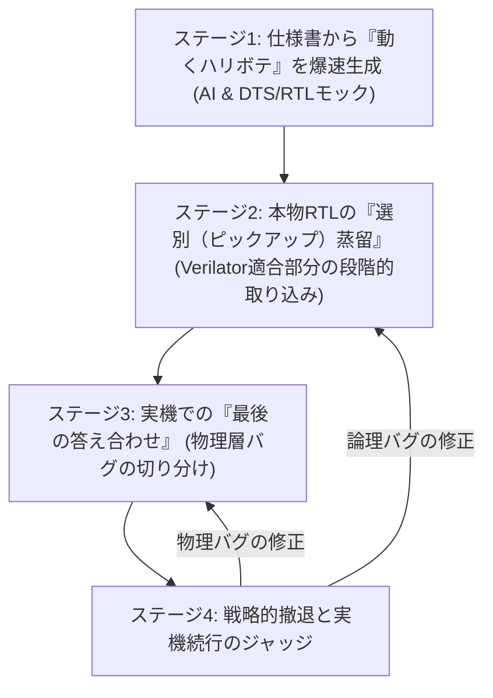

# F-BB × AI 活用黄金ワークフロー (F-BB & AI Parallel Development Workflow)

物理ボードや完成したRTLがない開発初期段階において、FWエンジニアが主体となり、F-BB（FPGA-BoardlessBench）とAI（LLM）の恩恵を120%活かしてHW/FWを並行開発するためのベストプラクティス（黄金ワークフロー）を解説します。

このワークフローは、FPGAエンジニアに余計な開発環境の構築負担をかけることなく、FWエンジニアの手元だけで先行開発を進め、実機テストの効率を最大化することを目的としています。

## ワークフローの全体像

F-BBを用いた開発は、以下の4つのステージを巡るライフサイクルとして定義されます。

---

## 各ステージの詳細

### 【ステージ1】仕様書から「動くハリボテ」を爆速生成

**[プロセス]**
FPGAエンジニアから最初に提示されるレジスタ仕様書（Excel）や機能概要テキストをAI（LLM）に読み込ませ、F-BB用の `config.dts`（デバイスツリー定義）と `vfpga_top.v`（Verilogの簡易レジスタモック）を自動生成させます。そこから即座にFW開発をスタートします。

* **なぜこれが最適なのか？**
    FPGAエンジニアに「F-BB用のシミュレータ環境を作ってほしい」と依頼する必要はありません。彼らが日常的に出力する仕様書をソースとし、FWエンジニアの手元だけで最初のモック環境を完結させます。これにより、実機や本物のRTLの完成を1ミリも待つことなく、開発初日から「本物のC言語」でレジスタを叩くFW開発を開始できます。

---

### 【ステージ2】Verilatorで通るものだけの「選別（ピックアップ）蒸留」

**[プロセス]**
FPGAエンジニアによって徐々に実装されていく本物のVerilogコードのうち、**Verilatorで問題なくコンパイルできる論理回路（データ処理ブロックやステートマシンなど）だけを選別（ピックアップ）してF-BBのラッパーに取り込み**、FW側の制御ロジックを磨き上げ（蒸留）ていきます。

* **なぜこれが最適なのか？**
    FPGAプロジェクト全体の巨大なRTL（Vivadoの独自IPやベンダー依存ブロックを含む全体）をそのままVerilatorにかけようとすると、構文エラーや解析不能によりシミュレータの構築が破綻しがちです。
    そうではなく、アルゴリズムやシーケンスの核心となる「純粋なロジック部分」だけを中継ラッパー（`vfpga_top.v`）内でインスタンス化して中身を差し替えていきます。これにより、FWエンジニアは「本物のロジック」を相手に、安全かつ超高速にソフトウェアのバグを出し切ることができます。

---

### 【ステージ3】実機を「最後の答え合わせ」にする

**[プロセス]**
FPGAの実装とFWの実装が一通り完了した時点で、実機（物理ボード）でのデバッグを開始します。動かない問題が発生した場合、即座に原因の切り分けを行います。

* **なぜこれが最適なのか？**
    事前にF-BB上で論理的なシーケンスやデータの整合性を限界までテスト（蒸留）しているため、「アドレスのタイポ」や「ステートの遷移順間違い」といった初歩的なバグはすでに全滅しています。
    実機で動かなかった場合、検証すべき容疑者は「Vivado上の配置配線」「ピンアサインミス」「タイミングエラー」「物理的な接触不良やリセットタイミング」といった**物理層のトラブルだけにほぼ絞り込まれます**。暗闇をあてもなく彷徨うような不毛な実機デバッグを排除できます。

---

### 【ステージ4】F-BBへの「戦略的撤退」と「実機続行」のジャッジ

**[プロセス]**
検出された問題点に応じて、自席のF-BB環境に戻って再蒸留を行うか、そのまま実機でのデバッグを続行するかを即座に判断します。

#### F-BB（シミュレータ）に戻るべきケース

* **判断基準**: 「FWのシーケンス（叩く順番やウェイト）の考慮漏れ」「特定のデータパターン時のステートマシンのハング」など、**論理（ロジック）バグ**であることが判明した場合。
* **アプローチ**: 実機を占有し続けるのをやめ、自席のF-BBに戻ってAIと共にロジックを修正・再テスト（蒸留）します。この方が解決までのスピードが圧倒的に早くなります。

#### 実機デバッグを続行すべきケース

* **判断基準**: 「クロックの同期ズレ」「リセットのタイミング」「ノイズ」「非同期のメタスタビリティ」など、**物理・タイミング（ハードウェア特有のディレイ）に起因するバグ**であることが判明した場合。
* **アプローチ**: これらはF-BBの丸められた仮想バスでは追えません。大人しく実機を占有し、Vivado ILA（ロジックアナライザ）やオシロスコープなどを使って実機上で仕留めます。

---

## 結論：ソフトとハードの境界線をAIでハンドリングする

この「F-BB × AI 黄金ワークフロー」を採用することで、ドメインごとの最適な職務分担が実現します。

* **FPGAエンジニア**: 自身のVivado環境や使い慣れた開発フローを一切乱されることなく、本番RTLと物理検証に集中できる（負担・不満ゼロ）。
* **FWエンジニア**: 実機待ちの空き時間をゼロにし、AIの力を借りて「論理的に100%完璧なFW」を事前に構築・作り込める。

本プロジェクトは、FPGAの物理的な検証を肩代わりするものではありません。**「論理的なバグを実機に持ち込む前に全て蒸留し、実機検証を単なる『最後の答え合わせの場』に変革する」** ための、現代的で最もインテリジェンスな開発アプローチを提供します。
