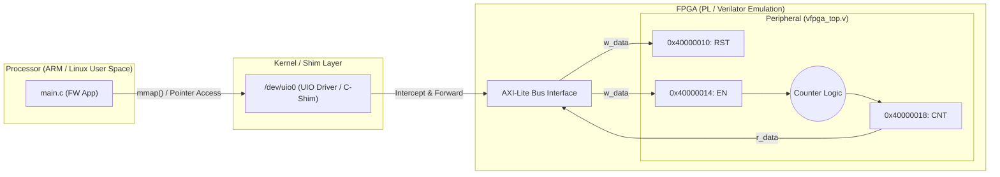

# Scenario 01: Standard UIO - 詳細設計 & アーキテクチャ解説

本ドキュメントは、FPGA-BoardlessBench (F-BB) における最も基礎的な Userspace I/O（UIO）およびメモリマップドI/O（MMIO）制御の詳細アーキテクチャ仕様書です。

---

## 1. アーキテクチャ詳細図 (PS-PL MMIO Interface)



---

## 2. ハードウェア信号線インターフェース仕様 (`vfpga_top.v`)

| 信号名 | 方向 | ビット幅 | 機能説明 |
| :--- | :--- | :--- | :--- |
| `clk` | Input | 1 | システムクロック (立ち上がりエッジ同期) |
| `rst_n` | Input | 1 | 非同期リセット (負論理: Active Low) |
| `addr` | Input | 32 | アドレスバス (DTSで定義された物理アドレス `0x400000XX` が供給) |
| `w_data` | Input | 32 | 書き込みデータバス |
| `w_en` | Input | 1 | 書き込み有効信号 (1 の時に対象レジスタへ書き込み) |
| `r_data` | Output | 32 | 読み出しデータバス (アドレスに応じたレジスタ値を出力) |

---

## 3. レジスタマップ仕様 (`config.dts`)

```text
ベースアドレス : 0x40000000 (サイズ: 4KB)
デバイスノード : /dev/uio0
ドライバ       : generic-uio
```

| オフセット | レジスタ名 | 属性 | 機能説明 |
| :--- | :--- | :--- | :--- |
| `0x10` | `RST` | R/W | カウンターリセットレジスタ (`0x1` で CNT を 0 に初期化) |
| `0x14` | `EN` | R/W | カウンター有効化レジスタ (`bit 0` が 1 の間カウントアップ) |
| `0x18` | `CNT` | R | 32-bit カウンタ値レジスタ |

---

## 4. 実機ポーティング時の考慮事項

1. **volatile 修飾子の必須性**:
   ハードウェアレジスタは CPU の命令実行外で非同期に値が変化するため、`volatile uint32_t *` によるメモリアクセスが必須です。
2. **DTS（デバイスツリー）定義**:
   実機 Linux（Zynq-7000 / UltraScale+ 等）では、FPGA 上の AXI-Lite スレーブ IP に対して以下のように DTS を記述します：
   ```dts
   vfpga_reg@40000000 {
       compatible = "generic-uio";
       reg = <0x40000000 0x1000>;
   };
   ```
