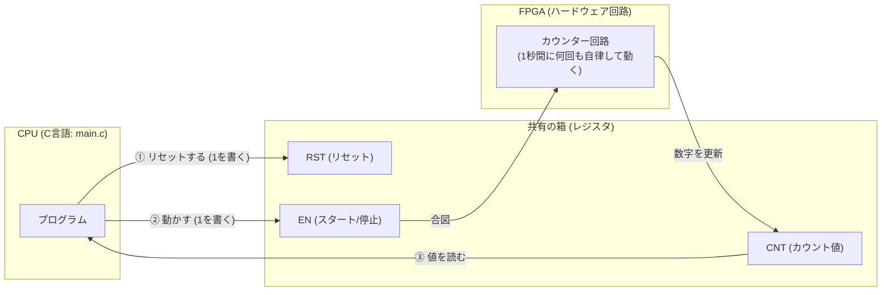

# 01_standard_uio: はじめてのFPGAレジスタ制御

このシナリオは、FPGAと組み込みLinuxを連携させる最初の一歩です。
「C言語のプログラムからFPGAの回路を動かす」という一番シンプルな仕組みを体験してみましょう！

---

## このシナリオのゴール
**「C言語のプログラムから、FPGAで作った『カウンター回路』をスタートさせ、数えた値を読み取る」**

---

## 直感イメージ：CPUとFPGAのやり取り
CPU（C言語）とFPGA（ハードウェア）は、**「レジスタ」と呼ばれる共有の箱** を通して会話します。



---

## 3つの基本ステップ（コードの読み方）

[main.c](main.c) で行っていることは、実はたったの3ステップです。

1. **箱（レジスタ）を使えるようにする (`open` & `mmap`)**
   - Linuxの仕組み（UIO）を使って、FPGAのレジスタを自分のプログラムの配列（`regs`）として直接読み書きできるように準備します。
2. **スイッチを入れる（書き込み: Write）**
   - `regs[5] = 1;` と書くだけで、FPGAの `EN`（イネーブル）レジスタに「1」が届き、回路が動き始めます。
3. **結果を受け取る（読み出し: Read）**
   - `val = regs[6];` と書くと、FPGAが自律的にカウントアップした `CNT` レジスタの値を取り出せます。

> **コラム：なぜ `regs[4]` や `regs[5]` なの？**  
> レジスタは4バイト（32ビット）ごとに並んでいるため、アドレスのオフセット（バイト数）を 4 で割った番号（インデックス）でアクセスします。
> - `0x10` (16バイト目) $\div 4 =$ `regs[4]` (RSTレジスタ)
> - `0x14` (20バイト目) $\div 4 =$ `regs[5]` (ENレジスタ)
> - `0x18` (24バイト目) $\div 4 =$ `regs[6]` (CNTレジスタ)

---

## 1. まずは動かしてみよう！

ターミナルで以下のコマンドを実行します。ビルドから実行まで自動で行われます。

```bash
./run.sh
```

**期待される出力例：**
```text
--- Standard UIO and Verilator Sync Test Start ---
[App] Opening /dev/uio0...
[App] デバイスメモリのマッピング中...
[App] SUCCESS: Basic register R/W verified (EN).
[App] 0x10(RST) 経由でカウンターをリセットします...
[App] 0x14(EN) 経由でカウンターを有効化します...
[App] カウンターの増加を待機中 (Verilator/FPGA側で処理)...
[App] Counter value 1: 1000, Value 2: 2000
[App] SUCCESS: Verilator logic (counter) is running and synced!
```
C言語側が `sleep(1)` で待っている間に、FPGA側の回路が自律的に数字を増やしていることが確認できます！

> **Webダッシュボードで見てみたい場合**  
> プロジェクトルートから `./start_lab.sh tests/scenarios/01_standard_uio/` を実行すると、ブラウザ（http://localhost:8080）でレジスタの値がリアルタイムに変化する様子を視覚的に観察できます。

---

## 2. ちょこっと改造チャレンジ！

理解を深めるために、ハードウェアのコードを1箇所だけ変えて動かしてみましょう。

- **実験:** [vfpga_top.v](vfpga_top.v#L65) の 65行目付近を見てみてください。
  ```verilog
  CNT <= CNT + 1;
  ```
  これを `CNT <= CNT + 10;` に書き換えて、もう一度 `./run.sh` を実行してみてください。  
  カウンターの増えるスピードが10倍になるはずです！

---

## 次のステップへ
これで「レジスタを読み書きしてハードウェアを動かす」基本が身につきました！

- **今の課題**: C言語側が `sleep` でテキトーに待っているため、ハードウェアが処理を終えた正確なタイミングが分かりません。
- **次のシナリオ [01b_uio_irq_interrupt](../01b_uio_irq_interrupt/README.md)**:  
  ハードウェアから「計算が終わったよ！」とCPUに合図を送る**「割り込み（Interrupt）」**を学びましょう。

---
---

## 【プラスアルファ】もっと深く知りたい人のための豆知識コラム
*(※ここから先は読まなくても次のシナリオへ進めます。興味が湧いたときに読んでみてください！)*

<details>
<summary><b>コラム1: ハードウェア回路（Verilog）の中はどう配線されている？</b></summary>

[vfpga_top.v](vfpga_top.v) の冒頭にある信号線は、C言語からのアクセスを電気信号として受け取るためのインターフェースです。

- **`clk` (クロック):** ハードウェアの心臓の鼓動です。この信号が「0から1（立ち上がりエッジ）」に変化する瞬間に合わせて、すべてのレジスタが一斉に値を更新します。
- **`rst_n` (リセット):** 回路全体を初期状態に戻す信号です。末尾の `_n` は負論理（Active Low）を意味し、「0」のときにリセットがかかります。
- **`addr[31:0]` (アドレスバス):** C言語がアクセスしようとしているレジスタの番地（32ビット）です。
- **`w_data[31:0]` & `w_en` (書き込みデータと有効信号):** C言語が値を書き込む瞬間だけ `w_en` が「1」になり、`w_data` の値がレジスタに保存されます。
- **`r_data[31:0]` (読み出しデータバス):** C言語が値を読み出すとき、指定されたアドレスのレジスタの値をCPUへ送り返します。
- **`l_pins_i / l_pins_o / l_pins_t` (GPIOピン):** SoC全体の外部入出力ピンを模擬する拡張用の信号線です（本シナリオでは未使用）。
</details>

<details>
<summary><b>コラム2: なぜ C言語で <code>volatile</code> を付けるのか？（賢すぎるコンパイラの罠）</b></summary>

[main.c](main.c) では `volatile uint32_t *regs` と宣言されています。

普通のメモリ（RAM）なら、自分が書き込まない限り勝手に値が変わることはありません。そのため、最適化コンパイラは「さっき読んだ値と同じだから、もう一度メモリを読みに行くのはサボってCPUのレジスタの値を再利用しよう」と処理を省いてしまいます。

しかし、**相手は自律して動いているFPGA（ハードウェア）** です。C言語が何もしなくても、FPGAが毎クロック値を更新しています。
`volatile` を付けることで、「この変数は外から勝手に書き換わるから、毎回必ずサボらずに実機を見に行きなさい！」とコンパイラに指示しています。
</details>

<details>
<summary><b>コラム3: メモリマップドI/O（MMIO）とUIOの仕組み</b></summary>

- **メモリマップドI/O (MMIO):**  
  ハードウェアのレジスタに「メモリ番地（物理アドレス：例 `0x40000010`）」を割り当て、通常のメモリアクセス（ポインタ代入や参照）と同じ命令でハードウェアを制御する手法です。
- **UIO (Userspace I/O):**  
  本来、物理アドレスへのアクセスはLinuxカーネル空間でしか行えません。UIOドライバは、その物理アドレス領域をユーザー空間のアプリケーションに安全に `mmap()` させるための軽量な仕組みです。これにより、面倒な専用カーネルドライバを書かずにC言語アプリから直接FPGAを制御できます。
</details>

---

## さらに詳しく知りたい方へ
AXI-Lite MMIOインターフェース詳細や実機Linuxへの移植手順などの詳細仕様は、**[ADVANCED.md](ADVANCED.md)** を参照してください。
