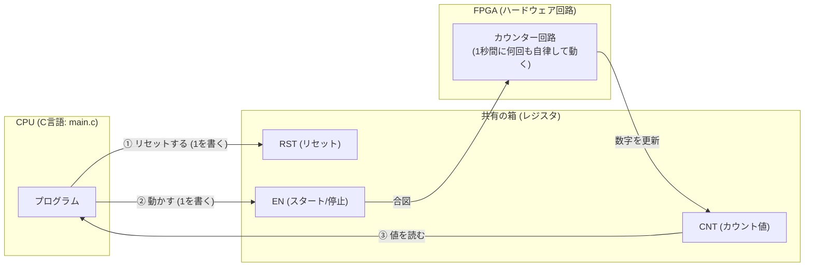

# 01_standard_uio: はじめてのFPGAレジスタ制御

このシナリオは、FPGAと組み込みLinuxを連携させる最初の一歩です。
「C言語のプログラムからFPGAの回路を動かす」という一番シンプルな仕組みを体験してみましょう！

---

## このシナリオのゴール
**「C言語のプログラムから、FPGAで作った『カウンター回路』をスタートさせ、数えた値を読み取る」**

---

## 直感イメージ：CPUとFPGAのやり取り
CPU（C言語）とFPGA（ハードウェア）は、**「レジスタ」と呼ばれる共有の箱** を通して会話します。


```mermaid
flowchart LR
    subgraph CPU ["CPU (C言語: main.c)"]
        C_App["プログラム"]
    end

    subgraph Registers ["共有の箱 (レジスタ)"]
        RST["RST (リセット)"]
        EN["EN (スタート/停止)"]
        CNT["CNT (カウント値)"]
    end

    subgraph FPGA ["FPGA (ハードウェア回路)"]
        Counter["カウンター回路\n(1秒間に何回も自律して動く)"]
    end

    C_App -->|"① リセットする (1を書く)"| RST
    C_App -->|"② 動かす (1を書く)"| EN
    EN -->|"合図"| Counter
    Counter -->|"数字を更新"| CNT
    CNT -->|"③ 値を読む"| C_App
```

---

## 3つの基本ステップ（コードの読み方）

[main.c](main.c) で行っていることは、実はたったの3ステップです。

1. **箱（レジスタ）を使えるようにする (`open` & `mmap`)**
   - Linuxの仕組み（UIO）を使って、FPGAのレジスタを自分のプログラムの配列（`regs`）として直接読み書きできるように準備します。
2. **スイッチを入れる（書き込み: Write）**
   - `regs[5] = 1;` と書くだけで、FPGAの `EN`（イネーブル）レジスタに「1」が届き、回路が動き始めます。
3. **結果を受け取る（読み出し: Read）**
   - `val = regs[6];` と書くと、FPGAが自律的にカウントアップした `CNT` レジスタの値を取り出せます。

> **コラム：なぜ `regs[4]` や `regs[5]` なの？**  
> レジスタは4バイト（32ビット）ごとに並んでいるため、アドレスのオフセット（バイト数）を 4 で割った番号（インデックス）でアクセスします。
> - `0x10` (16バイト目) $\div 4 =$ `regs[4]` (RSTレジスタ)
> - `0x14` (20バイト目) $\div 4 =$ `regs[5]` (ENレジスタ)
> - `0x18` (24バイト目) $\div 4 =$ `regs[6]` (CNTレジスタ)
> 
> *(※「なぜ32bit CPUなのに1バイト刻みでアドレスが付くのか？」の歴史的背景やアーキテクチャの違いは、末尾の「コラム4」で詳しく解説しています！)*

---

## 1. まずは動かしてみよう！

ターミナルで以下のコマンドを実行します。ビルドから実行まで自動で行われます。

```bash
./run.sh
```

**期待される出力例：**
```text
--- Standard UIO and Verilator Sync Test Start ---
[App] Opening /dev/uio0...
[App] デバイスメモリのマッピング中...
[App] SUCCESS: Basic register R/W verified (EN).
[App] 0x10(RST) 経由でカウンターをリセットします...
[App] 0x14(EN) 経由でカウンターを有効化します...
[App] カウンターの増加を待機中 (Verilator/FPGA側で処理)...
[App] Counter value 1: 1000, Value 2: 2000
[App] SUCCESS: Verilator logic (counter) is running and synced!
```
C言語側が `sleep(1)` で待っている間に、FPGA側の回路が自律的に数字を増やしていることが確認できます！

> **Webダッシュボードで見てみたい場合**  
> プロジェクトルートから `./start_lab.sh tests/scenarios/01_standard_uio/` を実行すると、ブラウザ（http://localhost:8080）でレジスタの値がリアルタイムに変化する様子を視覚的に観察できます。

---

## 2. ちょこっと改造チャレンジ！

理解を深めるために、ハードウェア（Verilog）とソフトウェア（C言語）のコードをちょこっと変えて動かしてみましょう。

- **チャレンジ1（ハードウェア編: Verilog）:**  
  [vfpga_top.v](vfpga_top.v#L65) の 65行目付近を見てみてください。
  ```verilog
  CNT <= CNT + 1;
  ```
  これを `CNT <= CNT + 10;` に書き換えて、もう一度 `./run.sh` を実行してみてください。  
  カウンターの増えるスピードが10倍になるはずです！

- **チャレンジ2（ソフトウェア編: C言語）:**  
  [main.c](main.c#L60-L64) の 62行目付近を見てみてください。
  ```c
  printf("[App] 0x10(RST) 経由でカウンターをリセットします...\n");
  regs[4] = 1; // リセットON
  sleep(1);    // 1秒待機
  regs[4] = 0; // リセットOFF
  ```
  ハードウェアをリセットするのに 1秒（`sleep(1)`）も待つのはもったいないですよね。  
  これを、**「FPGAのカウンター値（`regs[6]`）が 0 になったことを確認して即座に抜けるコード」** に書き換えてみましょう：
  ```c
  printf("[App] 0x10(RST) 経由でカウンターをリセットします...\n");
  regs[4] = 1;
  while (regs[6] != 0); // カウンター(CNT: 0x18)が0にクリアされるのを待つ
  regs[4] = 0;
  ```
  書き換えたら、もう一度 `./run.sh` を実行してみてください。  
  1秒の無駄な待機時間が消え、一瞬でリセットを完了して次の処理へ進むはずです！  
  このように「ハードウェアの状態（レジスタ値）をソフトウェア側で読み取って次の動作へ進む」仕組みを**ハンドシェイク**と呼び、組み込み開発の超重要テクニックです。

---

## 次のステップへ
これで「レジスタを読み書きしてハードウェアを動かす」基本が身につきました！

- **今の課題**: C言語側が `sleep` でテキトーに待っているため、ハードウェアが処理を終えた正確なタイミングが分かりません。
- **次のシナリオ [01b_uio_irq_interrupt](../01b_uio_irq_interrupt/README.md)**:  
  ハードウェアから「計算が終わったよ！」とCPUに合図を送る **「割り込み（Interrupt）」** を学びましょう。

---
---

## 【プラスアルファ】もっと深く知りたい人のための豆知識コラム
*(※ここから先は読まなくても次のシナリオへ進めます。興味が湧いたときに読んでみてください！)*

<details>
<summary><b>コラム1: ハードウェア回路（Verilog）の中はどう配線されている？</b></summary>

[vfpga_top.v](vfpga_top.v) の冒頭にある信号線は、C言語からのアクセスを電気信号として受け取るためのインターフェースです。

- **`clk` (クロック):** ハードウェアの心臓の鼓動です。この信号が「0から1（立ち上がりエッジ）」に変化する瞬間に合わせて、すべてのレジスタが一斉に値を更新します。
- **`rst_n` (リセット):** 回路全体を初期状態に戻す信号です。末尾の `_n` は負論理（Active Low）を意味し、「0」のときにリセットがかかります。
- **`addr[31:0]` (アドレスバス):** C言語がアクセスしようとしているレジスタの番地（32ビット）です。
- **`w_data[31:0]` & `w_en` (書き込みデータと有効信号):** C言語が値を書き込む瞬間だけ `w_en` が「1」になり、`w_data` の値がレジスタに保存されます。
- **`r_data[31:0]` (読み出しデータバス):** C言語が値を読み出すとき、指定されたアドレスのレジスタの値をCPUへ送り返します。
- **`l_pins_i / l_pins_o / l_pins_t` (GPIOピン):** SoC全体の外部入出力ピンを模擬する拡張用の信号線です（本シナリオでは未使用）。
</details>

<details>
<summary><b>コラム2: なぜ C言語で <code>volatile</code> を付けるのか？（賢すぎるコンパイラの罠）</b></summary>

[main.c](main.c) では `volatile uint32_t *regs` と宣言されています。

普通のメモリ（RAM）なら、自分が書き込まない限り勝手に値が変わることはありません。そのため、最適化コンパイラは「さっき読んだ値と同じだから、もう一度メモリを読みに行くのはサボってCPUのレジスタの値を再利用しよう」と処理を省いてしまいます。

しかし、**相手は自律して動いているFPGA（ハードウェア）** です。C言語が何もしなくても、FPGAが毎クロック値を更新しています。
`volatile` を付けることで、「この変数は外から勝手に書き換わるから、毎回必ずサボらずに実機を見に行きなさい！」とコンパイラに指示しています。
</details>

<details>
<summary><b>コラム3: メモリマップドI/O（MMIO）とUIOの仕組み</b></summary>

- **メモリマップドI/O (MMIO):**  
  ハードウェアのレジスタに「メモリ番地（物理アドレス：例 `0x40000010`）」を割り当て、通常のメモリアクセス（ポインタ代入や参照）と同じ命令でハードウェアを制御する手法です。
- **UIO (Userspace I/O):**  
  本来、物理アドレスへのアクセスはLinuxカーネル空間でしか行えません。UIOドライバは、その物理アドレス領域をユーザー空間のアプリケーションに安全に `mmap()` させるための軽量な仕組みです。これにより、面倒な専用カーネルドライバを書かずにC言語アプリから直接FPGAを制御できます。
</details>

<details>
<summary><b>コラム4: そもそも「アドレスが1増える＝1バイト（8bit）」なのはなぜ？（バイトアドレッシングとCPUビット幅の違い）</b></summary>

結論から言うと、**現代普及している主要なCPUは基本的に「アドレスが1増えると1バイト（8bit）」で共通**ですが、**アーキテクチャの定義として全CPUがそう決まっているわけではありません**。

「〇〇bit CPU」という表現と「メモリアドレッシングの単位」は別の概念です。

---

#### 1. 「〇〇bit CPU」が表しているもの

一般に「8bit / 16bit / 32bit / 64bit CPU」と言う場合、それはメモリの最小管理単位ではなく、以下のような**内部演算の処理幅**を指します。

* **汎用レジスタのビット幅**（例: 32bit CPUならレジスタ1本で $0 \sim 2^{32}-1$ を保持）
* **ALU（演算器）の処理単位**（1回の命令で一括演算できる整数幅）
* **内部データバスの幅**

アドレス空間を指してビット数を言うこともありますが、基本的には「内部で一度に処理できるデータの塊のサイズ」です。

---

#### 2. なぜ「アドレスが1増える＝1バイト（8bit）」が多いのか

これをバイトアドレッシング（Byte Addressing）と呼びます。

* **文字コード文化の定着**  
  ASCIIコードをはじめとする初期の文字表現が7〜8bit単位だったため、文字列を1文字単位（1バイト単位）でポインタ操作・走査できる設計が圧倒的に扱いやすかったという歴史的背景があります。
* **業界のデファクトスタンダード化**  
  IBM System/360（1964年）が「8bit＝1バイト、アドレス付与の最小単位＝1バイト」を採用して大成功を収め、その後のx86、MC68000、ARM、MIPS、RISC-Vなど主要な汎用プロセッサがすべてバイトアドレッシングを踏襲しました。

そのため、32bit CPUや64bit CPUでも「番地」自体は1バイトごとに割り振られています。例えば32bit（4バイト）の値をメモリから読み出す場合、ハードウェア内部では「アドレスを4つ分まとめて」読み出しを行っています。

---

#### 3. バイト単位ではないCPU（例外的な存在）

8bit単位ではないアドレッシングを採用したCPUも歴史上・用途別に多数存在します。

| アドレッシング方式 | アドレスが1増える幅 | 代表例・用途 |
| --- | --- | --- |
| **ワードアドレッシング** | 16bit または 32bit | **DSP（デジタルシグナルプロセッサ）**<br>TI TMS320C54x/C55xなど。音声や波形サンプリングデータ（16bit）を高速に連続処理するため、最小番地単位を16bitワードに固定しているものがある。 |
| **独自ワードマシン** | 12bit / 18bit / 36bit / 60bit | **初期のメインフレーム・ミニコン**<br>PDP-8（12bit単位）、PDP-10（36bit単位）、CDC 6600（60bit単位）など。1バイト＝8bitという標準が固まる前の設計。 |
| **ビットアドレッシング** | 1bit | **シーケンサ・PLC向けプロセッサ、特殊画像処理器**<br>TMS34010（TIのグラフィックスプロセッサ）など。画素やビットマップを直接1bit単位のアドレスで指定可能。 |

C言語などの処理系において、規格上 `sizeof(char) == 1` と定義されているものの、`CHAR_BIT`（1文字あたりのビット数）が8とは限らず「16」や「32」になり得る（ワードアドレッシングのDSP用コンパイラなど）のは、まさにこの仕組みの違いによるものです。

現代のPC、スマートフォン、一般的なマイコン（AVR、PIC、STM32など）を扱う限りは、**「どれもアドレスが1進むと8bitズレる」と考えて問題ありません**。
</details>

---

## さらに詳しく知りたい方へ
AXI-Lite MMIOインターフェース詳細や実機Linuxへの移植手順などの詳細仕様は、**[ADVANCED.md](ADVANCED.md)** を参照してください。
