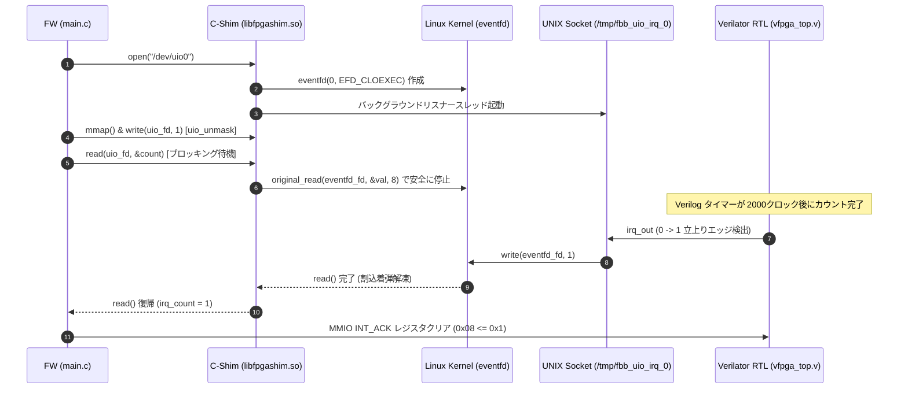

# Scenario 01b: UIO Asynchronous Interrupt (IRQ) - 詳細設計 & アーキテクチャ解説

本ドキュメントは、組み込み Linux における標準的な Userspace I/O（UIO）ドライバの**非同期割り込み制御（IRQ ブロッキング動作）** に関する詳細な内部アーキテクチャ仕様書です。企業研修および中上級者向けの開発リファレンスとして活用できます。

---

## 1. 非同期割り込み IPC アーキテクチャ (Sequence Diagram)

実機ファームウェア（FW）側に条件分岐（`#ifdef`）を一切持ち込むことなく、C-Shim（`libfpgashim.so`）が `/dev/uio0` に対する `read()` システムコールを透過的にフックし、Linux の `eventfd` 機構を用いて割込発生まで FW プロセスを安全かつ高速（ミリ秒以下）にブロック待機させます。



---

## 2. ハードウェア & レジスタマップ仕様 (`config.dts` & `vfpga_top.v`)

```text
ベースアドレス : 0x40000000 (サイズ: 4KB)
デバイスノード : /dev/uio0
割り込み番号   : IRQ 5
```

| オフセット | レジスタ名 | 属性 | 機能説明 |
| :--- | :--- | :--- | :--- |
| `0x00` | `CTRL` | R/W | タイマー制御レジスタ (`bit 0`: タイマー有効化) |
| `0x04` | `STATUS` | R | ステータスレジスタ (`bit 0`: IRQ アサートフラグ) |
| `0x08` | `INT_ACK` | W | 割り込みクリアレジスタ (`0x1` 書き込みで IRQ クリア) |
| `0x0C` | `CNT` | R | 32-bit カウンタレジスタ (クロック同期カウントアップ) |

---

## 3. 実務標準のファームウェアシーケンス (`main.c`)

実際の産業用組込み Linux 開発（Zynq, Cyclone V SoC 等）で使われる UIO 割込制御シーケンスに従って記述されています：

```c
// 1. /dev/uio0 を開き、MMIO レジスタを mmap()
int uio_fd = open("/dev/uio0", O_RDWR);
volatile uint32_t *regs = mmap(NULL, MMIO_SIZE, PROT_READ | PROT_WRITE, MAP_SHARED, uio_fd, 0);

// 2. ハードウェアタイマー有効化 & 割り込み許可 (uio_unmask)
regs[0] = 0x1;
uint32_t unmask = 1;
write(uio_fd, &unmask, sizeof(unmask));

// 3. カーネルからの割込通知を直接ブロック待機 (read)
uint32_t irq_count = 0;
read(uio_fd, &irq_count, sizeof(irq_count)); // C-Shim の eventfd により CPU 負荷ゼロでブロック待機

// 4. 割込解凍後、ステータス取得および INT_ACK クリア
printf("Interrupt Received! Total IRQs: %u\n", irq_count);
regs[REG_INT_ACK_OFFSET / 4] = 0x1;
```

---

## 4. 実機ポーティング時の考慮事項

1. **DTS（デバイスツリー）の記述**:
   実機Linuxで動作させる場合、対象IPのノードに `interrupt-parent = <&gic>;` および `interrupts = <0 29 4>;`（GIC SPI 割り込み設定）を記述し、UIOドライバ（`generic-uio` または `uio_pdrv_genirq`）をバインドする必要があります。
2. **割り込みの再許可 (Unmask)**:
   Linux UIO の仕様上、割り込みを1回ハンドリングするごとに `write(uio_fd, &unmask, 4)` を実行してカーネル側に割り込み再許可を通知する必要があります。
