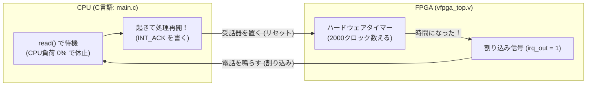

# 01b_uio_irq_interrupt: ハードウェアからの合図「割り込み（IRQ）」

前回の [01_standard_uio](../01_standard_uio/README.md) では、FPGAのカウンターが進むのを `sleep(1)` で適当に待っていました。
しかし実際の製品では、「いつ処理が終わるか分からないのに `sleep` で待つ」のはCPU時間の無駄です。

このシナリオでは、ハードウェアから「終わったよ！」とCPUに合図を送る**「割り込み（Interrupt / IRQ）」**の基本を体験します。

---

## このシナリオのゴール
**「C言語プログラムを無駄に `sleep` させず、FPGAから割り込み通知が届くまでスマートに待機（ブロック）する」**

---

## 直感イメージ：CPUとFPGAのやり取り
割り込みは、**「ハードウェアからCPUへの電話」**のような仕組みです。



---

## 3つの基本ステップ（コードの読み方）

[main.c](main.c) で行っていることは、以下の3ステップです。

1. **タイマーを動かし、割り込み待ち受けをONにする**
   - `regs[0] = 0x1;` でタイマーをスタートします。
   - `write(fd, &unmask, 4);` でLinuxに「このデバイスからの割り込み通知を受け取る準備ができたよ」と伝えます。
2. **割り込みが来るまで眠って待つ (`read`)**
   - `read(fd, &irq_count, sizeof(irq_count));` を呼ぶと、FPGAから合図が届くまでプログラムが一時停止（休止）します。CPUを1%も無駄遣いしません。
3. **合図を受け取ったら了解の返事をする (`INT_ACK`)**
   - FPGAが割り込みを発生させると、`read` がパッと解除されて処理が再開します。
   - `regs[REG_INT_ACK_OFFSET / 4] = 0x1;` と書いて、「通知を受け取ったから合図（フラグ）を消していいよ」とFPGAに伝えます。

---

## 1. まずは動かしてみよう！

ターミナルで以下のコマンドを実行します。

```bash
./run.sh
```

**期待される出力例：**
```text
=== Scenario 01b: UIO Asynchronous Interrupt (IRQ) Test ===
[FW Main] Successfully mapped UIO MMIO registers.
[FW Main] Hardware Timer Enabled (CTRL = 1).
[FW Main] UIO Interrupt Unmasked. Waiting for IRQ via read()...
[FW IRQ Handler] Interrupt Received! Accumulated IRQs: 1
[FW IRQ Handler] STATUS reg: 0x00000001, CNT reg: 1
[FW IRQ Handler] INT_ACK written. IRQ successfully handled.
=== Scenario 01b Test Result: SUCCESS ===
```
`read()` の行で待機し、FPGAのタイマーが満了した瞬間に即座に応答していることが確認できます！

---

## 2. ちょこっと改造チャレンジ！

理解を深めるために、ハードウェアのコードを1箇所だけ変えてみましょう。

- **実験:** [vfpga_top.v](vfpga_top.v#L58) の 58行目を見てみてください。
  ```verilog
  if (timer_divider >= 16'd2000) begin
  ```
  この `2000` を `200`（10倍速）や `20000`（10倍遅い）に書き換えて、もう一度 `./run.sh` を実行してみてください。  
  割り込みが届くまでの時間が変化することが実感できます！

---

## 次のステップへ
これで「レジスタの読み書き」に加えて「ハードウェアからの割り込み通知」を受け取れるようになりました！

- **次のシナリオ [06_gpio](../06_gpio/README.md)**:  
  次は、LEDの点灯やスイッチの入力など、1ビット単位で信号をやり取りする**「GPIO（汎用入出力）」**に進みましょう。

---

## さらに詳しく知りたい方へ
C-Shimの内部IPC構造（eventfdやUNIX Socketの挙動）や実機Linuxへの移植手順などの詳細な技術仕様は、**[ADVANCED.md](ADVANCED.md)** を参照してください。
