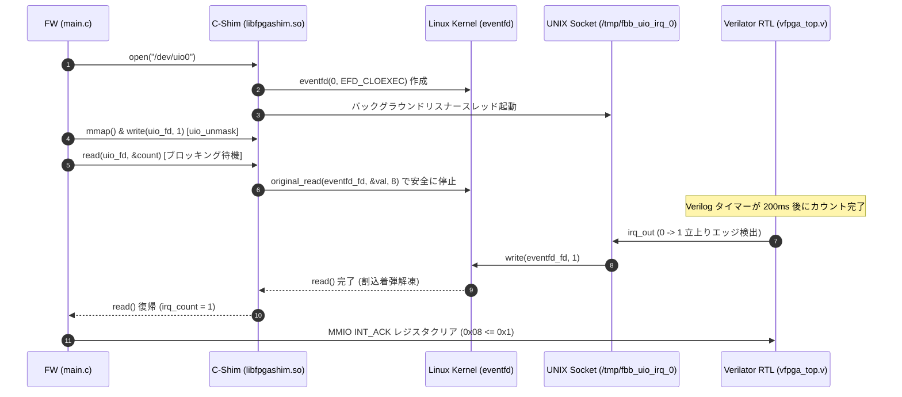

# Scenario 01b: UIO Asynchronous Interrupt (IRQ) Emulation

## 1. 概要 (Overview)

本シナリオは、組み込み Linux における標準的な Userspace I/O（UIO）ドライバの**非同期割り込み制御（IRQ ブロッキング動作）** を検証するためのシナリオです。

実機ファームウェア（FW）側に条件分岐（`#ifdef`）を一切持ち込むことなく、C-Shim（`libfpgashim.so`）が `/dev/uio0` に対する `read()` システムコールを透過的にフックし、Linux の `eventfd` 機構を用いて割込発生まで FW プロセスを安全かつ高速（ミリ秒以下）にブロック待機させます。

---

## 2. 非同期割り込み IPC アーキテクチャ (Sequence Diagram)



---

## 2. ハードウェア & レジスタマップ定義 (`config.dts` & `vfpga_top.v`)

```text
ベースアドレス : 0x40000000 (サイズ: 4KB)
デバイスノード : /dev/uio0
割り込み番号   : IRQ 5
```

| オフセット | レジスタ名 | 属性 | 機能説明 |
| :--- | :--- | :--- | :--- |
| `0x00` | `CTRL` | R/W | タイマー制御レジスタ (`0x1`: タイマー有効化) |
| `0x04` | `STATUS` | R | ステータスレジスタ (`bit 0`: IRQ アサートフラグ) |
| `0x08` | `INT_ACK` | W | 割り込みクリアレジスタ (`0x1` 書き込みで IRQ クリア) |
| `0x0C` | `CNT` | R | 32-bit カウンタレジスタ (クロック同期カウントアップ) |

---

## 3. 実務標準のファームウェアシーケンス (`main.c`)

実際の産業用組込み Linux 開発で使われる UIO 割込制御シーケンスに従って記述されています：

```c
// 1. /dev/uio0 を開き、MMIO レジスタを mmap()
int uio_fd = open("/dev/uio0", O_RDWR);
volatile uint32_t *regs = mmap(..., uio_fd, ...);

// 2. ハードウェアタイマー有効化 & 割り込み許可 (uio_unmask)
regs[0] = 0x1;
uint32_t unmask = 1;
write(uio_fd, &unmask, 4);

// 3. カーネルからの割込通知を直接ブロック待機 (read)
uint32_t irq_count = 0;
read(uio_fd, &irq_count, sizeof(irq_count)); // C-Shim の eventfd によりブロック待機

// 4. 割込解凍後、ステータス取得および INT_ACK クリア
printf("Interrupt Received! Total IRQs: %u\n", irq_count);
regs[REG_INT_ACK_OFFSET / 4] = 0x1;
```

---

## 4. 実行方法 (Execution)

```bash
# シナリオ単体ビルド・実行
./run.sh
```
