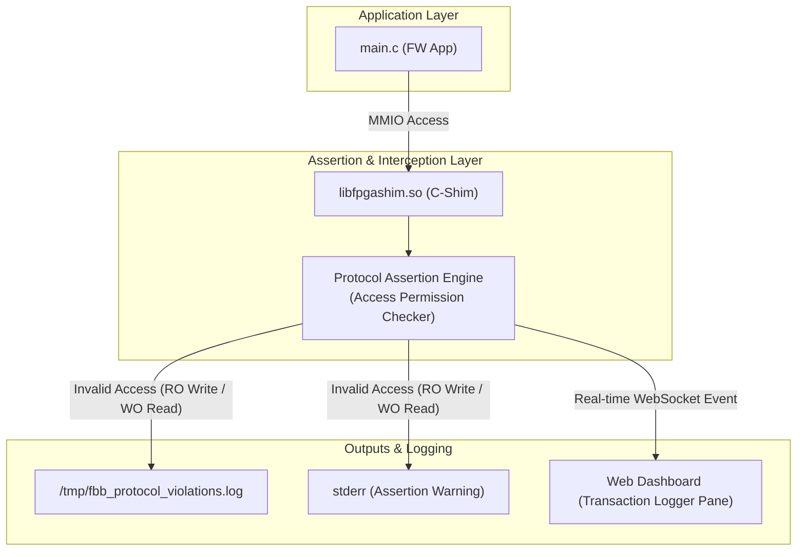

# Scenario 01c: Protocol Assertion Engine - 詳細設計 & アーキテクチャ解説

本ドキュメントは、F-BB トランザクション・ロガー、プロトコル・アサーション・エンジン、および RO/WO アクセス違反リアルタイム検知機構の詳細仕様書です。

---

## 1. プロトコル検証アーキテクチャ



---

## 2. DTS レジスタパーミッション属性定義 (`config.dts`)

```dts
registers = 
    "CTRL   @ 0x00 : RW",
    "STATUS @ 0x04 : RO",
    "TRIG   @ 0x08 : WO",
    "DATA   @ 0x0C : RW";
```

- **`: RO` (Read-Only)**: 読み出しのみ許可。書き込みが発生した場合 `WRITE_TO_RO` 違反をトリガー。
- **`: WO` (Write-Only)**: 書き込みのみ許可。読み出しが発生した場合 `READ_FROM_WO` 違反をトリガー。
- **`: RW` (Read-Write)**: 読み書き両方を許可。
