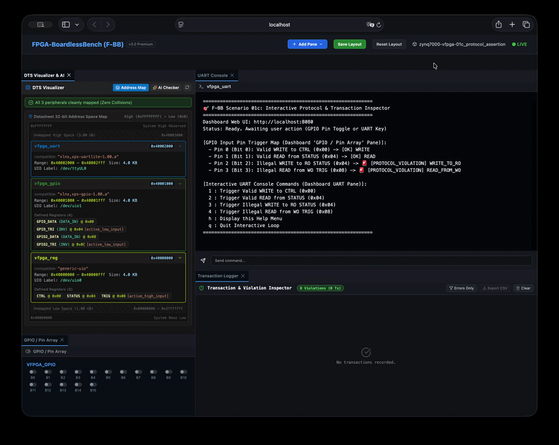
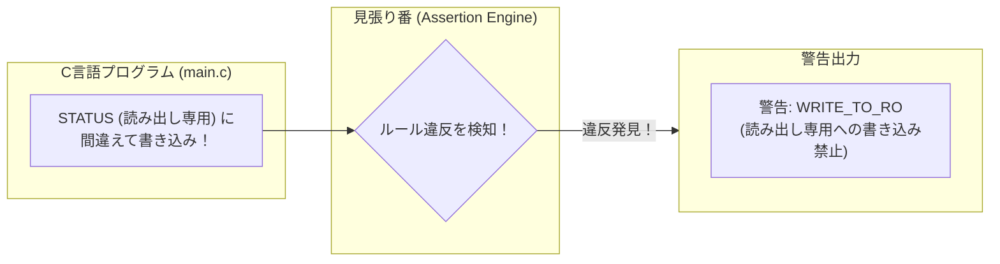

# 01c_protocol_assertion: バグを逃さない「ハードウェア自動検証」

ハードウェア開発で最も恐ろしいのは、「読み出し専用（Read-Only）のレジスタに間違えて書き込んでしまった」などのプログラムのバグが、実機では警告も出ずに静かに回路を壊してしまうことです。

このシナリオでは、ルール違反（プロトコル違反）のアクセスを自動的に検知して警告を出してくれる**「プロトコル・アサーション」**の仕組みを体験します。



---

## このシナリオのゴール
**「読み出し専用（RO）や書き込み専用（WO）のレジスタに対する不正アクセスをシミュレータが自動検知する様子を確認する」**

---

## 直感イメージ：CPUとFPGAのやり取り
シミュレータの「見張り番（アサーションエンジン）」が、プログラムがルール違反の操作をした瞬間に警告を出します。



---

## 3つの基本ステップ（コードの読み方）

[main.c](main.c) で行っていることは、以下の3ステップです。

1. **正しいアクセスを行う**
   - `CTRL`（読み書き可能: RW）に書き込み、`STATUS`（読み出し専用: RO）から読み出します ➔ 正常終了。
2. **わざと間違ったアクセスを行う（テスト）**
   - 読み出し専用の `STATUS` レジスタに `regs[1] = 0x1234;` と書き込んでみます。
3. **アサーション警告を確認する**
   - シミュレータが `[PROTOCOL_VIOLATION] WRITE_TO_RO` という警告を出し、ログに記録します。

---

## 1. まずは動かしてみよう！

ターミナルで以下のコマンドを実行します。

```bash
./run.sh
```

**期待される出力例：**
```text
=== Scenario 01c: Protocol Assertion Test Start ===
[App] Step 1: Performing valid Read/Write... [OK]
[App] Step 2: Intentionally violating protocol (Write to RO register)...
[Assertion] 🚨 [PROTOCOL_VIOLATION] WRITE_TO_RO detected at 0x40000004!
[App] Step 3: Intentionally violating protocol (Read from WO register)...
[Assertion] 🚨 [PROTOCOL_VIOLATION] READ_FROM_WO detected at 0x40000008!
=== Scenario 01c Test Result: SUCCESS ===
```

> **Webダッシュボードで見てみよう！**  
> `./start_lab.sh tests/scenarios/01c_protocol_assertion/` を実行し、ブラウザ（http://localhost:8080）を開くと、画面上の **「Transaction Logger」** ペインに赤い警告アラートがリアルタイムに流れていく様子を確認できます！

---

## 2. ちょこっと改造チャレンジ！

理解を深めるために、コードを1箇所だけ変えてみましょう。

- **実験:** [main.c](main.c) 内で、書き込み専用（WO）の `TRIG` レジスタへの正常な書き込み（`regs[2] = 0x1;`）を追加して `./run.sh` を実行してみてください。  
  ルール通りの操作では警告が出ず、正常にパスすることが確認できます！

---

## 次のステップへ
これで「ハードウェアアクセスの安全検証」の重要性が分かりました！

- **次のシナリオ [20_dma_cdma](../20_dma_cdma/README.md)**:  
  次は、CPUを介さずにメガバイト単位のデータを一瞬で転送する高速化技術**「DMA（Direct Memory Access）」**に進みましょう。

---

## さらに詳しく知りたい方へ
DTSパーミッション属性（RO/WO/RW）の構文仕様やアサーションログの内部パイプラインは、**[ADVANCED.md](ADVANCED.md)** を参照してください。
