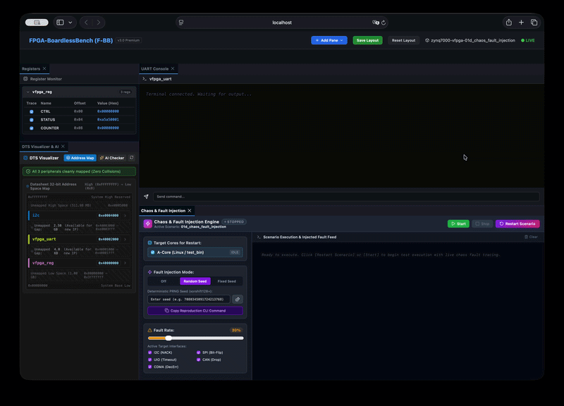

# Scenario 01d: Automated Chaos & Fault Injection Verification

## 概要 (Overview)
本シナリオは、F-BB の**自動カオス・故障注入エンジン（Deterministic Chaos Engine）** の動作検証シナリオです。
ハードウェアバス（I2C/SPI/UIO/CAN等）におけるパケットドロップ、I2C NACK、データビット反転といった実機特有の通信障害をシード値ベース（`xorshift128+` PRNG）で決定論的に再現し、ファームウェアのリトライ・耐障害性ロジックをテストします。



## 特徴
1. **決定論的再現性 (Deterministic Reproduction)**:
   同じ `--seed` を指定すれば、OS やライブラリバージョンに関わらず 100% 同一のタイミング・順序で障害が発生します。
2. **ゼロ・オーバーヘッド (Zero Overhead)**:
   通常実行（`--chaos` 未指定時）は分岐予測最適化（`__builtin_expect`）により完全オーバーヘッドゼロでパスします。
3. **安全な障害注入 (Safe Injection)**:
   メモリポインタの破壊などによる OS/ホストクラッシュを起こさず、実機バス仕様に準拠したプロトコルレベルのエラー（I2C NACK / `ENXIO` 等）のみを注入します。

## 実行方法

### 1. 通常実行（カオス注入なし、100% 成功）
```bash
./run.sh
# または
bin/fbb test 01d
```

### 2. カオスモード実行（ランダムシード）
```bash
./run.sh --chaos
```

### 3. カオスモード実行（特定シード指定による決定論的デバッグ）
```bash
./run.sh --chaos --seed=12345
```
