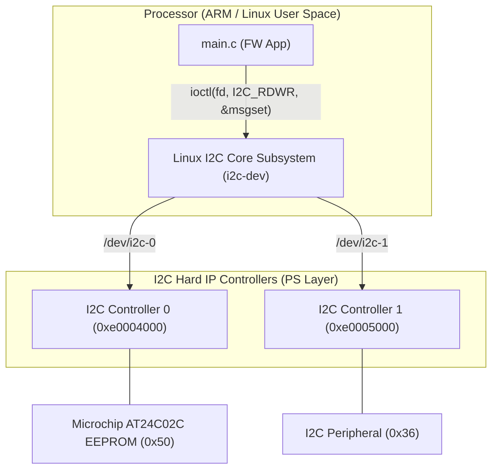

# Scenario 02: Multi-I2C Bus Control - 詳細設計 & アーキテクチャ解説

本ドキュメントは、Linux 標準 I2C サブシステム（`i2c-dev`）、多重 I2C バスコントローラ、およびスレーブ調停メカニズムに関する詳細仕様書です。

---

## 1. アーキテクチャ詳細図 (I2C Subsystem & Controllers)



---

## 2. PS（ハードIP）と PL（ソフトIP）の違い

- **PL側ペリフェラル (01_standard_uio 等)**:
  ユーザーが Verilog RTL で記述し、FPGA ファブリック上に論理合成・配置配線するカスタム IP。
- **PS側ペリフェラル (02_multi_i2c 等)**:
  SoC（Zynq, i.MX 等）のシリコン上に最初から集積されている既製品の「ハード IP」。RTL の記述は不要で、DTS（デバイスツリー）にコントローラのアドレスとバインド情報を記述するだけで Linux カーネルの標準 I2C ドライバから `/dev/i2c-X` として制御可能。

---

## 3. `I2C_RDWR` ioctl によるアトミック通信シーケンス

```c
struct i2c_msg msgs[2];
// 1. スレーブ内のレジスタアドレスを指定 (Write)
msgs[0].addr  = 0x50;
msgs[0].flags = 0; // Write
msgs[0].len   = 1;
msgs[0].buf   = &reg_addr;

// 2. データを連続読み出し (Read with Repeated Start)
msgs[1].addr  = 0x50;
msgs[1].flags = I2C_M_RD;
msgs[1].len   = data_len;
msgs[1].buf   = read_buf;

struct i2c_rdwr_ioctl_data msgset = {
    .msgs  = msgs,
    .nmsgs = 2,
};
ioctl(fd, I2C_RDWR, &msgset);
```
`read()` や `write()` を個別に呼ぶ場合と異なり、`I2C_RDWR` を用いることで **Repeated Start コンディション（バス権を維持したままの読み書き切り替え）** をアトミックに実行できます。

---

## 4. デバイスツリー定義 (`config.dts`)

```dts
i2c0: i2c@e0004000 {
    compatible = "cdns,i2c-r1p10";
    reg = <0xe0004000 0x1000>;
    bus_id = <0>;
    label = "/dev/i2c-0";
};
```
実機 Linux では `cdns,i2c-r1p10`（Cadence I2C コントローラ）等の互換ドライバが自動ロードされ、キャラクタデバイス `/dev/i2c-0` が生成されます。
