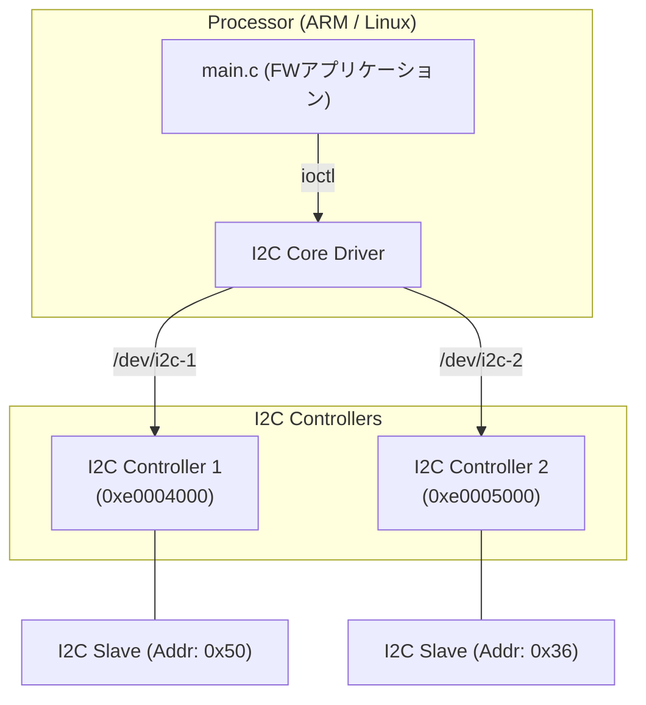

# 02_multi_i2c: 複数I2Cバスの制御と識別

このシナリオでは、Linux標準のI2Cサブシステムを使用して、システムに存在する複数のI2Cバスを制御する方法を学習します。

## アーキテクチャ概念図



## 学習のポイント

1. **デバイスノードによるバスの識別:**
   Linuxでは各I2Cバスは `/dev/i2c-1`, `/dev/i2c-2` のように個別のデバイスファイルとして抽象化されます。アプリケーションはこれらを使い分けることで、物理的に異なるバスに繋がれたデバイスを制御します。
2. **I2C_RDWR ioctl:**
   `read()` や `write()` を直接使う代わりに、`I2C_RDWR` ioctl を使用することで、開始・停止条件を含む複雑なI2Cシーケンスを1回のシステムコールでアトミックに実行できます。
3. **DTSでのバス定義:**
   `config.dts` 内で `bus_id` を定義することにより、エミュレータ上のどのコントローラがどの `/dev/i2c-X` に対応するかを決定しています。

## なぜ Verilog (.v) ファイルがないのか？

このシナリオを `01_standard_uio` と比較すると、Verilogファイルが存在しないことに気づくかもしれません。これにはハードウェア構造上の重要な理由があります。

### 1. ハードIP (PS) と ソフトIP (PL)
*   **01_standard_uio (PL側):** FPGAの回路（Programmable Logic）の中に、ユーザーが自分でロジックを配置した「自作回路」です。そのため、回路の設計図である Verilog が必要でした。
*   **02_multi_i2c (PS側):** ZynqなどのSoCにおいて、ARMプロセッサと同じシリコン上に最初から組み込まれている**「ハードIP（既製品）」**を想定しています。これは **PS (Processing System)** 側に属し、ユーザーが回路を設計・変更することはできません。

### 2. 実機開発での扱い
実際の開発でも、PS内のI2Cコントローラを使う場合は Verilog を書きません。Vivado等のツールで「I2Cを有効にする」という設定を行い、デバイスツリー（DTS）を記述するだけで、Linuxから利用可能になります。

### 3. 本プロジェクトでのシミュレーション
FPGA-BoardlessBench (F-BB)において、ハードIP（既製品）は Verilator による RTL シミュレーションを通さず、Python バックエンド側の **擬似デバイスモデル（モック）** が応答を担当しています。これにより、低負荷かつ高速に標準的なバス動作をエミュレートしています。

## 実行方法

本ディレクトリに移動して、以下のスクリプトを実行してください。シミュレーション環境の立ち上げからアプリケーションのビルド・実行までが自動的に行われます。

```bash
./run.sh          # ビルドと実行
./run.sh --clean  # 成果物とログの削除
```

---

## デバイスツリー (DTS) の読み方と設計の明示化

本シナリオで使用する `config.dts` は、初学者の学習用にハードウェアの物理接続が完全に自己記述（セルフ・ドキュメンティング）されるように設計されています。

### 1. DTS の構成要素の解説

```dts
eeprom_dev1: eeprom@50 {
    compatible = "atmel,24c02";
    reg = <0x50>;
    fbb,mock-data = <0x10>;
};
```

* **`eeprom_dev1:` (ラベル - Label)**:
  DTSの他の場所からこのデバイスノードを簡単に参照（エイリアス）するためのシンボル名です。ソースコードでいう変数名のようなものです。
* **`eeprom@50` (ノード名 @ ユニットアドレス - Node Name & Unit Address)**:
  ハードウェアを表現する「ノード」の正式名称です。`@` の後は通常、そのバス上の物理配置アドレス（I2Cスレーブアドレス `0x50`）を16進数で記述します。
* **`compatible = "atmel,24c02"` (互換性記述 - Compatibility)**:
  Linuxカーネルに対して「どのデバイスドライバをロードすべきか」を教える最も重要な文字列です。実機では、この名前が一致する EEPROM 用ドライバ（`atmel`社の `24c02` ドライバ）が自動的にバインドされます。
* **`reg = <0x50>` (レジスタ/アドレス定義 - Register Property)**:
  このスレーブデバイスの物理的なI2Cアドレスを指定します。
* **`fbb,mock-data = <0x10>` (独自プロパティ - Custom Property)**:
  F-BB (FPGA-BoardlessBench) 独自の拡張定義です。頭に **`fbb,` (F-BB用ベンダープレフィックス)** を付けることで、Linux標準の仕様と衝突させずにシミュレータ用のデータを記述しています。実機（本物のLinux）では、カーネルはこの `fbb,` プレフィックスの属性を安全に無視するため、**「実機透過性 (Hardware Transparency)」** が完全に維持されます。

---

## ソケット中継アーキテクチャ

本プラットフォームのジェネレータは、DTS に上記のスレーブノードを検出すると、デバイスの振る舞い（EEPROMのロジック）をエミュレータ自体にハードコードするのではなく、**UNIX ドメインソケット `/tmp/fbb_i2c_b1_a50` を介した外部プロセス（ペリフェラル・ライブラリ）への中継** に処理を逃がします。

これによって：
1. プラットフォームのコアである `gen_vfpga.py` が肥大化せず、クリーンに保たれます。
2. 他のセンサや独自デバイスを追加したい場合も、`src/peripherals/` 配下に新しいC言語やPythonモジュールを追加するだけで簡単に入れ替えることができ、設計の柔軟性が最大化されます。
