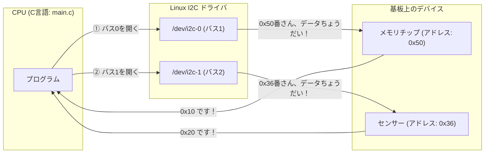

# 02_multi_i2c: 2本の線で会話する「I2C通信」

これまでの Stage 1 では、メモリやピンを直接読み書きしていましたが、実際の電子回路では **「センサー」や「ディスプレイ」** など無数のチップが基板上に並んでいます。
すべてのチップと1本ずつ線を繋ぐと線が何百本にもなってしまうため、わずか **2本の線（クロック線 SCL ＋ データ線 SDA）** だけでたくさんの部品と通信できる規格が使われます。

その代表格が **「I2C（アイ・スクエアド・シー）」** です。

このシナリオでは、Linuxの標準的なI2C機能を使って、基板上のデバイスと通信する基本を体験します。

---

## このシナリオのゴール
**「Linux標準のI2Cインターフェースを使い、アドレスを指定して複数のI2Cデバイスからデータを読み取る」**

---

## 直感イメージ：CPUとFPGAのやり取り
I2Cでは、1本の通信線に複数のデバイスがぶら下がっており、**「電話番号（スレーブアドレス：例 0x50）」** を呼び出すことで特定の相手とだけ会話します。


```mermaid
flowchart LR
    subgraph CPU ["CPU (C言語: main.c)"]
        C_App["プログラム"]
    end

    subgraph Linux ["Linux I2C ドライバ"]
        Bus0["/dev/i2c-0 (バス1)"]
        Bus1["/dev/i2c-1 (バス2)"]
    end

    subgraph Devices ["基板上のデバイス"]
        DevA["メモリチップ (アドレス: 0x50)"]
        DevB["センサー (アドレス: 0x36)"]
    end

    C_App -->|"① バス0を開く"| Bus0
    Bus0 -->|"0x50番さん、データちょうだい！"| DevA
    DevA -->|"0x10 です！"| C_App

    C_App -->|"② バス1を開く"| Bus1
    Bus1 -->|"0x36番さん、データちょうだい！"| DevB
    DevB -->|"0x20 です！"| C_App
```

---

## 3つの基本ステップ（コードの読み方）

[main.c](main.c) で行っていることは、以下の3ステップです。

1. **I2Cバスを開く (`open`)**
   - `open("/dev/i2c-0", O_RDWR);` で通信したいI2Cバスのポートを開きます。
2. **手紙（メッセージ）の宛先と内容を詰める (`struct i2c_msg`)**
   - 相手のアドレス（`0x50`）と、「データを1バイト読みたいよ（`I2C_M_RD`）」という注文書を作成します。
3. **通信を実行して結果を受け取る (`ioctl`)**
   - `ioctl(fd, I2C_RDWR, &msgset);` を呼ぶと、Linuxがハードウェアを通じてI2C通信を自動実行し、相手から返ってきたデータ（`buf[0]`）が手に入ります。

---

## 1. まずは動かしてみよう！

ターミナルで以下のコマンドを実行します。

```bash
./run.sh
```

**期待される出力例：**
```text
--- Multi-I2C Test Start ---
[App] Bus 1 (0x50) returned: 0x10
[App] Bus 2 (0x36) returned: 0x20
[App] SUCCESS: Multiple I2C buses identified correctly!
--- Multi-I2C Test End ---
```
異なる2つのI2Cバスに接続されたデバイスから、それぞれ正しいデータが返ってきたことが確認できます！

---

## 2. ちょこっと改造チャレンジ！

理解を深めるために、コードを1箇所だけ変えてみましょう。

- **実験:** [main.c](main.c#L66) の 66行目を見てみてください。
  ```c
  int val1 = read_from_bus(FBB_DEV_PATH_I2C_0, 0x50);
  ```
  このアドレス `0x50` を、存在しない宛先 `0x77` に書き換えて `./run.sh` を実行してみてください。  
  相手がいないため、通信エラー（`ioctl: ...`）になることが確認できます！

---

## 次のステップへ
これで「I2C通信の基本手順」が分かりました！

- **次のシナリオ [02e_ht16k33_7seg_i2c](../02e_ht16k33_7seg_i2c/README.md)**:  
  次は、I2Cを使って実際に **7セグメントLED** に数字を表示する、視覚的にも楽しいシナリオに進みましょう。

---

## さらに詳しく知りたい方へ
I2Cコントローラの内部アーキテクチャ、PS（ハードIP）とPL（ソフトIP）の違い、アトミック通信（Repeated Start）の詳細仕様は、**[ADVANCED.md](ADVANCED.md)** を参照してください。
