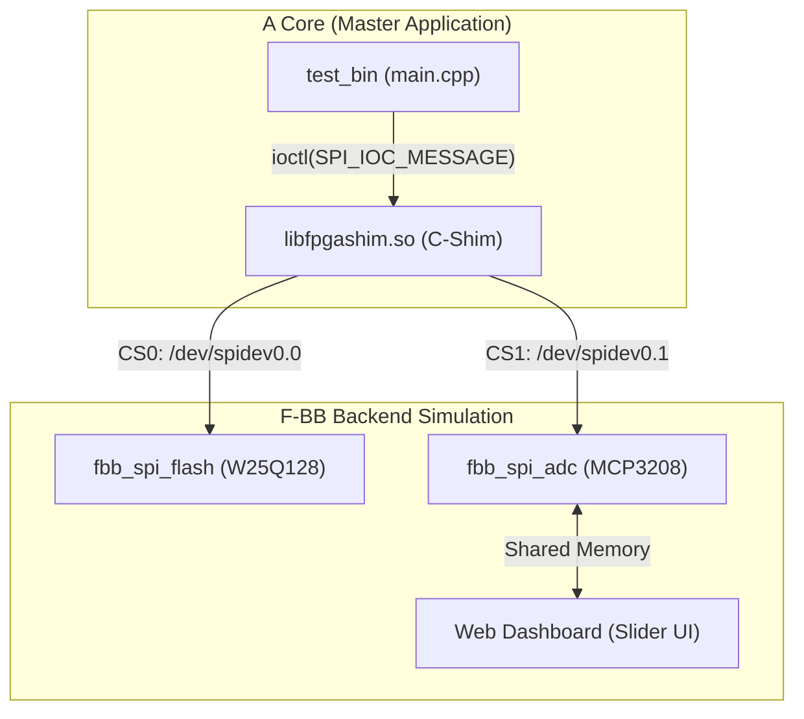

# Scenario 02b: 仮想 SPI マルチデバイス - 詳細設計 & アーキテクチャ解説

本ドキュメントは、Linux `spidev` サブシステム、マルチスレーブ（Chip Select 0/1）全二重通信、および仮想ペリフェラルデーモン連携に関する詳細仕様書です。

---

## 1. SPI 全二重通信アーキテクチャ



---

## 2. 実機デバイス仕様 & データシート

1. **Winbond W25Q128JV (128M-bit NOR Flash)**
   - [W25Q128JV Product Page](https://www.winbond.com/hq/product/code-storage-flash-memory/serial-nor-flash/?__locale=en&partNo=W25Q128JV)
   - [W25Q128JV Datasheet (PDF)](https://www.winbond.com/resource-files/w25q128jv%20revf%2003272018%20plus.pdf)
   - コマンド: JEDEC ID (`0x9F`), Read (`0x03`), Sector Erase (`0x20`), Page Program (`0x02`)
2. **Microchip MCP3208 (12-bit 8ch ADC)**
   - [MCP3208 Product Page](https://www.microchip.com/en-us/product/MCP3208)
   - [MCP3208 Datasheet (PDF)](https://ww1.microchip.com/downloads/en/DeviceDoc/21298e.pdf)
   - 3バイト全二重フレームで 12-bit デジタル変換値を読み出し。

---

## 3. 全二重通信 (`spi_ioc_transfer`) の仕組み

SPI では、送信（MOSI）と受信（MISO）がクロックに同期して **同時に（Full-Duplex）** 行われます。

```c
struct spi_ioc_transfer tr = {
    .tx_buf = (unsigned long)tx,
    .rx_buf = (unsigned long)rx,
    .len = len,
    .speed_hz = 1000000,
    .bits_per_word = 8,
};
ioctl(fd, SPI_IOC_MESSAGE(1), &tr);
```
送信バッファ `tx` から 1 ビット送り出すのと同時に、受信バッファ `rx` に相手からの 1 ビットが吸い込まれます。
