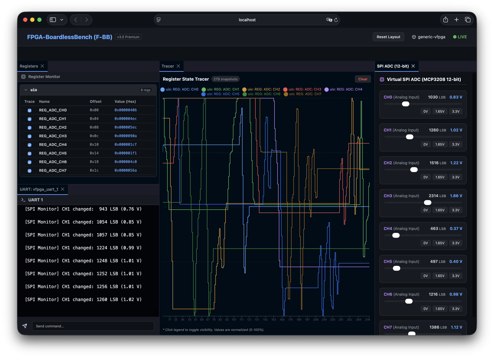
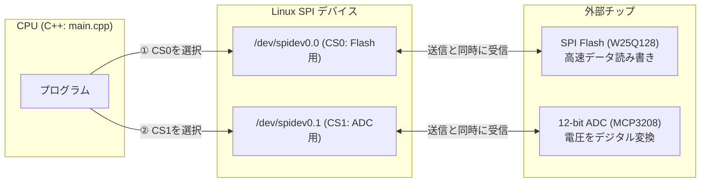

# 02b_multi_spi: 高速・全二重で送受信する「SPI通信」

I2Cは2本の線で手軽に通信できる反面、速度がやや遅く（数十kbps〜数Mbps）、送信と受信を同時に行うことはできませんでした。
そこで、カメラや高速ADC（アナログ・デジタル変換器）、大容量フラッシュメモリなどで使われるのが **「SPI（エス・ピー・アイ）」** です。

SPIは **4本の線（CS, SCLK, MOSI, MISO）** を使い、**「送信しながら同時に受信する（全二重通信）」** という超高速な仕組みを持っています。

このシナリオでは、**「SPIフラッシュメモリ」** と **「SPI電圧センサー（ADC）」** の2つのデバイスを制御します。



---

## このシナリオのゴール
**「Linux標準のSPIインターフェース（spidev）を使い、フラッシュメモリへの読み書きとADCセンサーの電圧読み取りを行う」**

---

## 直感イメージ：CPUとFPGAのやり取り
SPIでは、「チップセレクト（CS）」という線で通信相手を1つだけ選び、クロックに合わせて同時にデータをやり取りします。



---

## 3つの基本ステップ（コードの読み方）

[main.cpp](main.cpp) で行っていることは、以下の3ステップです。

1. **SPIポートを開く (`open`)**
   - `open("/dev/spidev0.0", O_RDWR);` でフラッシュメモリ側を開きます。
2. **送信と受信をセットにして同時に通信する (`ioctl`)**
   - `struct spi_ioc_transfer` に「送りたいデータ（`tx_buf`）」と「受け取る箱（`rx_buf`）」をセットします。
   - `ioctl(fd, SPI_IOC_MESSAGE(1), &tr);` を呼ぶと、送信と受信が1回の操作で同時に完了します。
3. **ADCセンサーから電圧値を読み取る (`/dev/spidev0.1`)**
   - CS1（ADC）に切り替えて3バイト送信すると、アナログ電圧の12ビット値（0〜4095）が受信バッファに返ってきます。

---

## 1. まずは動かしてみよう！

ターミナルで以下のコマンドを実行します。

```bash
./run.sh
```

**期待される出力例：**
```text
=== Scenario 02b: Multi SPI Device Demo Start ===
[App] Step 1: Querying Winbond W25Q128 Flash JEDEC ID on /dev/spidev0.0...
[App] SUCCESS: JEDEC ID matches Winbond W25Q128!
[App] Step 2: Reading ADC Channel 0 on /dev/spidev0.1...
[App] ADC Ch0 Raw: 2048, Scaled Voltage: 1.65 V
=== Scenario 02b Test Result: SUCCESS ===
```

> **Webダッシュボードで電圧を変えてみよう！**  
> プロジェクトルートから `./start_lab.sh tests/scenarios/02b_multi_spi/` を実行し、ブラウザ（http://localhost:8080）を開くと、画面上の **電圧スライダー** を動かすことで、C言語プログラムが読み取るADC電圧値をリアルタイムに変化させることができます！

---

## 2. ちょこっと改造チャレンジ！

理解を深めるために、コードを1箇所だけ変えてみましょう。

- **実験:** [main.cpp](main.cpp#L180) の 180行目付近を見てみてください。
  ```cpp
  int raw_val = read_mcp3208_channel(fd_adc, 0); // チャンネル0を読む
  ```
  このチャンネル番号 `0` を `1` や `2` に変えて、もう一度 `./run.sh` を実行してみてください。  
  異なるADCチャンネルの電圧値を読み取る様子が確認できます！

---

## 次のステップへ
これで「SPI通信の全二重アクセス」が身につきました！

- **次のシナリオ [03_uart_console](../03_uart_console/README.md)**:  
  次は、組み込み開発のデバッグで最も身近な**「UARTシリアル通信コンソール」**に進みましょう。

---

## さらに詳しく知りたい方へ
W25Q128 / MCP3208 のコマンド仕様や `spi_ioc_transfer` の詳細なタイミングチャートは、**[ADVANCED.md](ADVANCED.md)** を参照してください。
