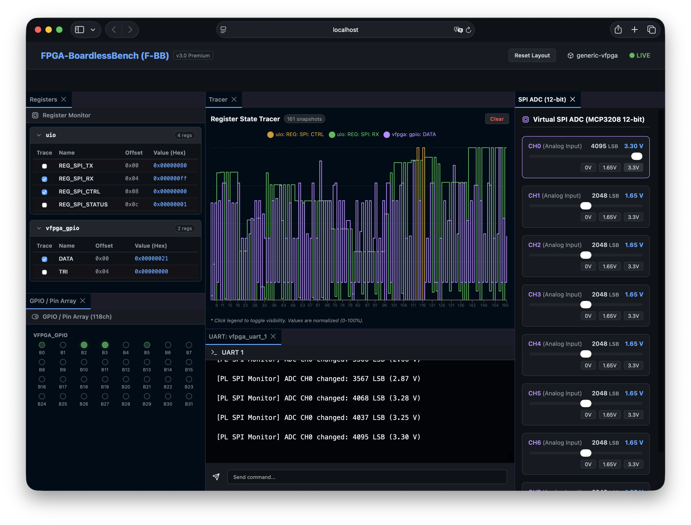
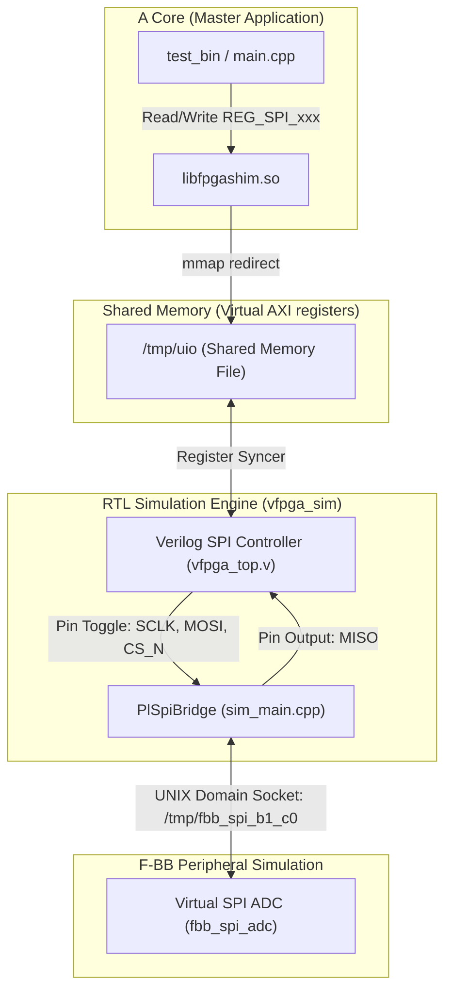

# PL側 AXI SPI Bridge 検証シナリオ (`02c_pl_spi`)

本シナリオは、PL (FPGA) 側に実装された **自作 AXI-Lite SPI マスタコントローラ (Verilog)** の入出力ピンの物理的動作を Verilator シミュレータ上でキャプチャし、F-BB の外部ペリフェラルエミュレータ (**仮想 12-bit ADC MCP3208**) と UNIX ドメインソケットを介して相互ブリッジ同期させる、高度な総合検証テストケースです。



---

## 本シナリオの構成と特徴

実機において「PL（RTL）側に配置した SPI コントローラ IP から外部デバイス（ADC）を制御する」回路を、一切の物理 FPGA ボードなし（Boardless）で検証します。

1. **AXI-Lite 接続のカスタム SPI コントローラ (PL/RTL)**
   - `tests/scenarios/02c_pl_spi/vfpga_top.v` にて記述。
   - アドレス `0x40000000` 付近に `REG_SPI_TX`, `REG_SPI_RX`, `REG_SPI_CTRL`, `REG_SPI_STATUS` レジスタを実装。
   - クロック分周とステートマシンにより、`pl_spi_sclk`, `pl_spi_mosi`, `pl_spi_cs_n`, `pl_spi_miso` ピンを直接ドライブします。
2. **透過的レジスタ同期**
   - ファームウェア (`main.cpp`) は、通常の UIO デバイス `/dev/uio0` をオープンして `mmap` し、直接物理メモリレジスタを叩くようにコーディングされています。
   - `libfpgashim.so` のシステムコールフックと、`vfpga_sim` の同期エンジンにより、メモリへの書き込みが瞬時に Verilator 内の RTL レジスタに反映され、クロックが進みます。
3. **PlSpiBridge によるシリアル物理ピン ➔ UNIXドメインソケット変換**
   - シミュレータ (`vfpga_sim`) 内部の `PlSpiBridge` が、RTL の SPI ピンのトグル（SCLK 立ち上がり/立ち下がり、CSアサート）をピン単位で監視します。
   - 8ビット単位（3バイトパディング形式）で蓄積した全二重シリアルバイトデータを、ソケット `/tmp/fbb_spi_b1_c0` を介して外部プロセス `fbb_spi_adc` と双方向同期通信します。

---

## アーキテクチャ構成



---

## 通信タイミングと遅延設計 (4バイトシーケンス)

シミュレーション環境では、マスタ（RTL）の送信ビットが確定した段階（CS立ち上がり）でソケット同期を行うため、スレーブの応答データが MISO ピンに物理的に現れるのは **1バイト分遅延** します。
この遅延を吸収しつつ MCP3208 の仕様に整合させるため、検証ファームウェアは以下の **4バイト転送シーケンス** で 12-bit ADC 値を回収します。

1. **Byte 1 送信 (`0x01`: Start Bit)**
   - スレーブはコマンド開始を認識。
2. **Byte 2 送信 (`0x80`: SGL/DIFF=1, CH0)**
   - スレーブはチャンネル設定を認識し、ADC値 (`2048` = `0x800`) を応答バッファに準備。
3. **Byte 3 送信 (`0x00`: dummy)**
   - スレーブの応答上位4ビット (`0x08`) を `rx3` で取得。
4. **Byte 4 送信 (`0x00`: dummy)**
   - スレーブの応答下位8ビット (`0x00`) を `rx4` で取得。
5. **デコード**: `adc_val = ((rx3 & 0x0F) << 8) | rx4` ➔ `2048` となり、正しく判定されます。

---

## テストの実行方法

### 自動テストランナーでの実行
以下のスクリプトを呼び出すことで、RTLコードのビルド、コード自動生成、ファームウェアビルド、および検証アサーションが全て自動実行されます。

```bash
./tests/scenario_runner.sh tests/scenarios/02c_pl_spi
```

### 期待される出力ログ (SUCCESS)
```text
[Runner] >>> Starting Scenario: 02c_pl_spi <<<
...
[Runner] Executing application with LD_PRELOAD...
[Shim Debug] open: /dev/tty
[Shim Debug] open: ./run.sh
[FW] PL SPI verification firmware started.
[Shim Debug] open: /dev/uio0
[FW] Received bytes: 0x00, 0x00, 0x08, 0x00
[FW] Decoded ADC Value: 2048 (Expected: 2048)
[FW] PL SPI ADC verification passed successfully.

[Runner] RESULT: SUCCESS
```
