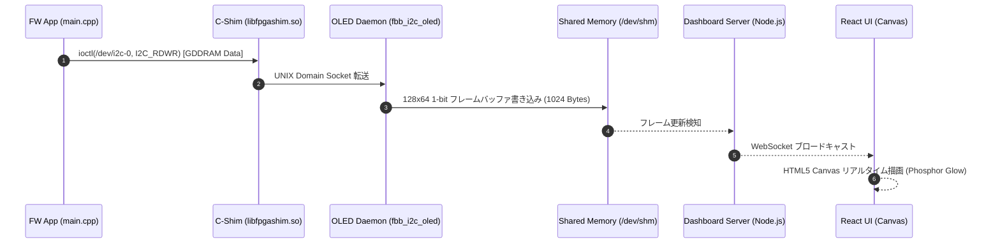

# Scenario 02d: 仮想 I2C OLED ディスプレイ (SSD1306) - 詳細設計 & アーキテクチャ解説

本ドキュメントは、SSD1306 128x64 モノクロ OLED コントローラの仮想化、GDDRAM フレームバッファ展開、および WebSocket によるブラウザ描画同期の詳細仕様書です。

---

## 1. ディスプレイパイプラインアーキテクチャ

---

## 2. SSD1306 コマンド & GDDRAM メモリ構造

SSD1306 は、128x64 ピクセルを 8 つの「Page（Page 0 〜 Page 7）」に分割して管理します。各 Page は 128 列 $\times$ 8 行（1バイト = 縦8ピクセル）で構成されます。

| Page | 行範囲 (Y座標) | バッファサイズ |
| :--- | :--- | :--- |
| Page 0 | Y: 0 〜 7 | 128 Bytes |
| Page 1 | Y: 8 〜 15 | 128 Bytes |
| ... | ... | ... |
| Page 7 | Y: 56 〜 63 | 128 Bytes |
| **合計** | **全 64 行** | **1024 Bytes (1 KB)** |
