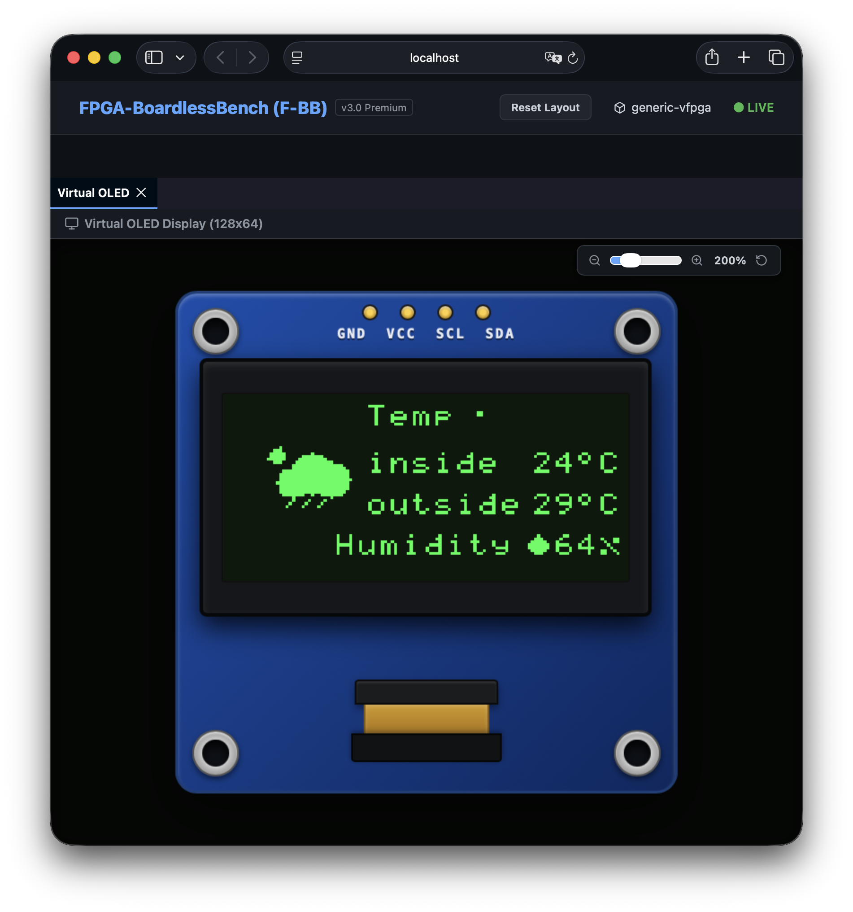

# シナリオ 02d: 仮想 I2C OLED ディスプレイエミュレーション (SSD1306)

本シナリオでは、実業界の組込みシステムやIoTでデファクトスタンダードとして使用される **モノクロ OLED ディスプレイ（SSD1306 コントローラ内蔵）** を、仮想 I2C バス経由でエミュレート・動作検証します。



---

## 1. 使用するデバイス仕様とデータシート

* **デバイス名**: Solomon Systech SSD1306 (128x64ドット モノクロOLEDコントローラ)
* **接続方法**: I2C バス (デフォルトスレーブアドレス: `0x3C`)
* **データシートへのリンク**:
  * [Solomon Systech SSD1306 Datasheet (Adafruit PDF)](https://cdn-shop.adafruit.com/datasheets/SSD1306.pdf)

---

## 2. システム構成

本シナリオを実行すると、以下のコンポーネントが協調して動作します。

1. **テストアプリケーション (`test_bin`)**:
   `/dev/i2c-0` を介して初期化コマンドおよび描画用の GDDRAM データを仮想コントローラに送信します。
2. **システムコールShim (`libfpgashim.so`)**:
   アプリケーションからの I2C システムコールをトラップし、UNIXドメインソケット経由で外部ペリフェラルプロセスにリダイレクトします。
3. **ディスプレイエミュレータ (`fbb_oled_ssd1306`)**:
   ソケットから受け取ったコマンドをパースし、描画データを展開して共有メモリ `/dev/shm/fbb_display_0` へ同期します。
4. **ダッシュボードサーバー (`server.js`)**:
   共有メモリを監視し、描画フレーム（1KB）を WebSocket 経由でブラウザへブロードキャストします。
5. **Webダッシュボード (React UI)**:
   受信したデータをデコードし、レトロなグロー付きキャンバス上に 128x64 ピクセルとしてリアルタイム描画します。

---

## 3. 実行方法

プロジェクトルート、またはこのディレクトリ配下で起動スクリプトを実行します。

```bash
./run.sh
```

実行が完了すると、自動的にシミュレータ環境とダッシュボードサーバーが起動します。ブラウザでダッシュボード（`http://localhost:8080` 等）を開くと、OLED ディスプレイパネルにテストパターン（チェッカーボード、ストライプ、枠線・クロス）が2秒おきに交互に描画されるアニメーションを確認できます。
