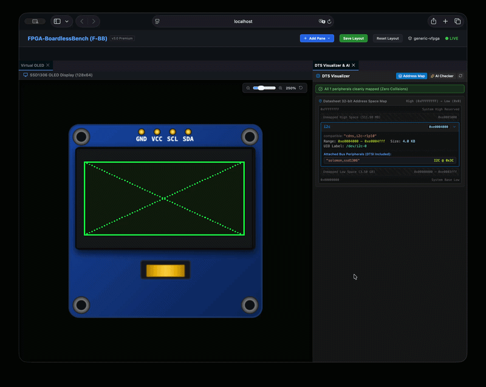
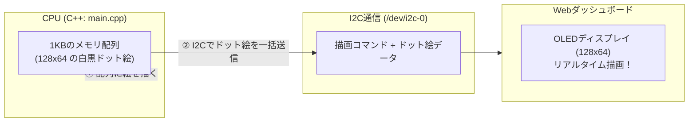

# 02d_oled_i2c: I2Cで絵や文字を描く「OLEDグラフィック」

電子工作やIoT機器で大人気の「128x64ドット モノクロOLEDディスプレイ（SSD1306）」をI2Cで制御します。

Webダッシュボードを開くと、まるで本物の有機ELパネルが光っているかのように、幾何学模様やアニメーションがリアルタイムに描画されます。



---

## このシナリオのゴール
**「I2C通信を使ってOLEDディスプレイ（SSD1306）にグラフィックパターン（枠線や市松模様）を描画する」**

---

## 直感イメージ：CPUとFPGAのやり取り
メモリ上に用意した「画面のドット絵データ（フレームバッファ）」を、I2C経由でディスプレイのメモリに転送します。


```mermaid
flowchart LR
    subgraph CPU ["CPU (C++: main.cpp)"]
        Buffer["1KBのメモリ配列\n(128x64 の白黒ドット絵)"]
    end

    subgraph I2C ["I2C通信 (/dev/i2c-0)"]
        Packet["描画コマンド + ドット絵データ"]
    end

    subgraph Screen ["Webダッシュボード"]
        OLED["OLEDディスプレイ (128x64)\nリアルタイム描画！"]
    end

    CPU -->|"① 配列に絵を描く"| Buffer
    Buffer -->|"② I2Cでドット絵を一括送信"| Packet
    Packet --> Screen
```

---

## 3つの基本ステップ（コードの読み方）

[main.cpp](main.cpp) で行っていることは、以下の3ステップです。

1. **画面の初期化コマンドを送る**
   - コントラスト設定や表示向き（ノーマル/反転）などの初期化コマンド列を `0x3C` 宛てに送信します。
2. **フレームバッファ（128x64バイト配列）に絵を描く**
   - 四角形の枠線やチェッカーボード（市松模様）のドットを計算してメモリ配列に書き込みます。
3. **I2Cで一気に画面へ流し込む**
   - `ioctl(I2C_RDWR)` でメモリ配列の内容をOLEDチップへ転送すると、画面がパッと更新されます。

---

## 1. まずは動かしてみよう！

プロジェクトルートから以下のコマンドを実行します。

```bash
./start_lab.sh tests/scenarios/02d_oled_i2c/
```

ブラウザで **`http://localhost:8080`** を開くと、OLED画面にストライプ模様、チェッカーフラッグ、枠線とクロスがアニメーション表示されます！

*(※CLIで自動テストだけ実行したい場合は `./run.sh` を実行します)*

---

## 2. ちょこっと改造チャレンジ！

理解を深めるために、描画パターンの切り替え間隔を変えてみましょう。

- **実験:** [main.cpp](main.cpp#L190) の 190行目付近を見てみてください。
  ```cpp
  sleep(2); // 2秒おきにパターン切り替え
  ```
  この `2` を `1` や `0`（`usleep(500000)` で0.5秒）に書き換えて、もう一度 `./start_lab.sh ...` を実行してみてください。  
  画面のアニメーションが高速に切り替わる様子が確認できます！

---

## 次のステップへ
これで「I2Cを使ったグラフィック描画」の基本が分かりました！

- **次のシナリオ [02b_multi_spi](../02b_multi_spi/README.md)**:  
  次は、I2Cよりもさらに高速に全二重でデータを送受信できる**「SPI通信」**に進みましょう。

---

## さらに詳しく知りたい方へ
SSD1306のGDDRAMメモリ構造やWebSocket描画同期パイプラインの詳細仕様は、**[ADVANCED.md](ADVANCED.md)** を参照してください。
