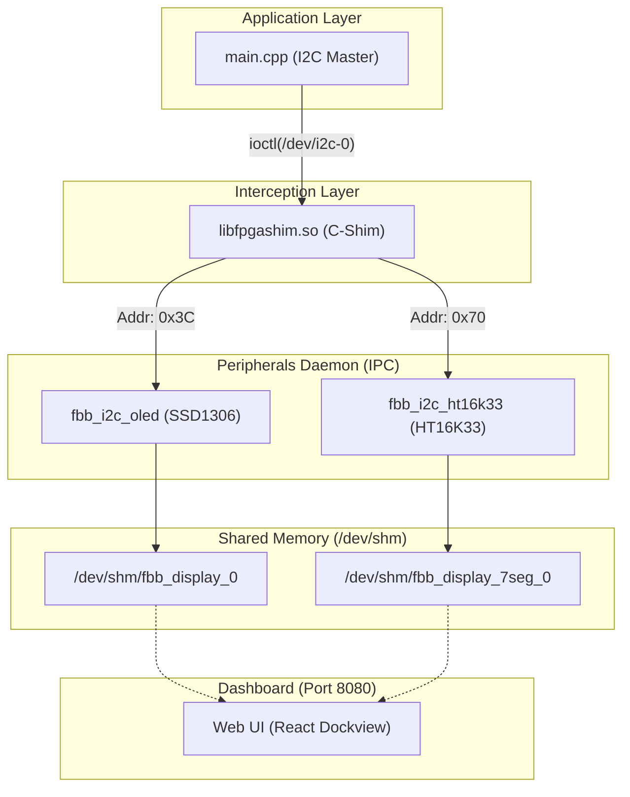

# Scenario 02e: 多重 I2C ペリフェラル制御 (SSD1306 & HT16K33) - 詳細設計 & アーキテクチャ解説

本ドキュメントは、単一 I2C バス上での多重ペリフェラル（OLED + 7セグメントLED）の並行制御、C-Shim によるスレーブアドレス動的ルーティング、および共有メモリ（`/dev/shm`）描画バッファ同期に関する詳細仕様書です。

---

## 1. マルチペリフェラル協調アーキテクチャ

---

## 2. デバイス仕様 & データシート

1. **Adafruit 0.56" 4-Digit 7-Segment Display (HT16K33)**
   - I2C スレーブアドレス: `0x70`
   - [Adafruit 製品ページ (PID: 879)](https://www.adafruit.com/product/879)
   - [Holtek HT16K33 Datasheet (PDF)](https://cdn-shop.adafruit.com/datasheets/ht16K33v110.pdf)
2. **Solomon Systech SSD1306 OLED (128x64)**
   - I2C スレーブアドレス: `0x3C`
   - [Solomon Systech SSD1306 Datasheet (PDF)](https://cdn-shop.adafruit.com/datasheets/SSD1306.pdf)

---

## 3. 実機（Linux / POSIX）完全透過性

本シナリオの `main.cpp` は、Linux 標準の `ioctl(I2C_RDWR)` のみを使用して記述されています。
実機（Zynq, Raspberry Pi, i.MX）へポーティングする際も `#ifdef` 等の分岐コードは一切不要で、そのまま実機 I2C デバイスノードに対してコンパイル・実行可能です。
