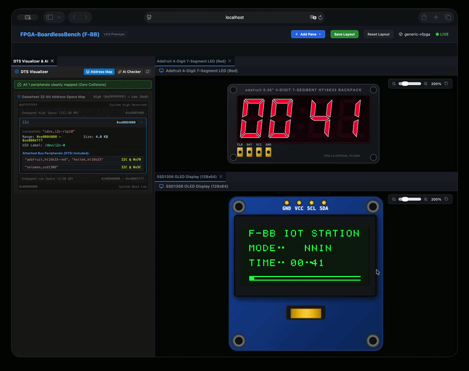
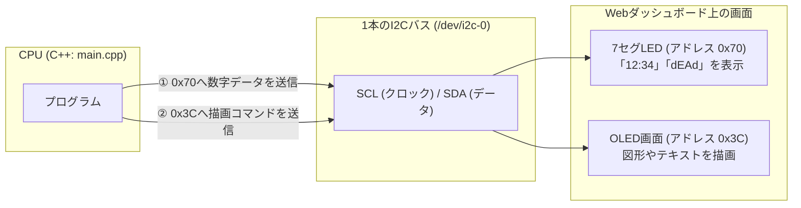

# 02e_ht16k33_7seg_i2c: I2Cで画面と数字を光らせる「ディスプレイ制御」

前回の [02_multi_i2c](../02_multi_i2c/README.md) ではI2C通信の基本手順を学びました。
このシナリオでは、I2C通信の実践編として **「4桁7セグメントLED」** と **「OLEDグラフィック画面」** の2つの表示デバイスを同時に光らせてみます！

Webダッシュボードを開くと、実際に画面上でLEDの数字がカウントアップしたり、OLEDにグラフィックが描画される様子がリアルタイムに確認できます。



---

## このシナリオのゴール
**「1本のI2Cバスから2つの異なるディスプレイ（7セグLEDとOLED）にデータを送り、同時に文字や数字を表示する」**

---

## 直感イメージ：CPUとFPGAのやり取り
同じ1本の通信線（`/dev/i2c-0`）を使って、宛先アドレスを切り替えながら交互に表示データを送信します。



---

## 3つの基本ステップ（コードの読み方）

[main.cpp](main.cpp) で行っていることは、以下の3ステップです。

1. **7セグLED（アドレス `0x70`）の初期化と数字送信**
   - HT16K33チップに「発振器ON（`0x21`）」「表示ON（`0x81`）」コマンドを送り、数字パターン（0〜9のビットマップ）を送信して数字を表示します。
2. **OLED画面（アドレス `0x3C`）の初期化とグラフィック描画**
   - SSD1306チップへ描画フレームバッファを転送し、ボックスやタイトル文字列を表示します。
3. **ループでカウントアップ**
   - タイマーを1秒ずつ進めながら、7セグLEDとOLEDの両方を同時に更新します。

---

## 1. まずは動かしてみよう！

Webダッシュボードで視覚的に楽しむため、プロジェクトルートから以下のコマンドを実行します。

```bash
./start_lab.sh tests/scenarios/02e_ht16k33_7seg_i2c/
```

ブラウザで **`http://localhost:8080`** を開いてみてください！  
画面上に **「7セグLED」** と **「OLEDディスプレイ」** が現れ、数字がカウントアップしたり診断メッセージ（`dEAd` / `bEEF`）が点滅する様子が確認できます。

*(※CLIで自動テストだけ実行したい場合は `./run.sh` を実行します)*

---

## 2. ちょこっと改造チャレンジ！

理解を深めるために、7セグLEDに表示する文字列を変えてみましょう。

- **実験:** [main.cpp](main.cpp#L120) の 120行目付近を見てみてください。
  ```cpp
  display_7seg_hex(fd, 0xdEAd);
  ```
  この `0xdEAd` を `0x1234` や `0xbEEF` に書き換えて、もう一度 `./run.sh`（または `./start_lab.sh`）を実行してみてください。  
  7セグLEDの表示文字が変わることが確認できます！

---

## 次のステップへ
これで「I2Cを使った実践的なデバイス制御」が身につきました！

- **次のシナリオ [02b_multi_spi](../02b_multi_spi/README.md)**:  
  次は、I2Cよりもさらに高速に大量のデータを送受信できる**「SPI通信」**に進みましょう。

---

## さらに詳しく知りたい方へ
SSD1306 / HT16K33 の詳細データシートや、C-Shim による共有メモリ（`/dev/shm`）描画バッファ同期の内部構造は、**[ADVANCED.md](ADVANCED.md)** を参照してください。
