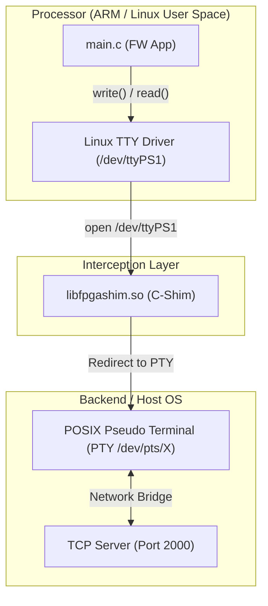

# Scenario 03: UART Serial Console - 詳細設計 & アーキテクチャ解説

本ドキュメントは、Linux TTY サブシステム、UART Lite コントローラ (`xlnx,xps-uartlite-1.00.a`)、および PTY/TCP ソケットブリッジング機構に関する詳細仕様書です。

---

## 1. UART PTY/TCP リダイレクトアーキテクチャ



---

## 2. デバイスツリー定義 (`config.dts`)

```dts
uart1: serial@e0001000 {
    compatible = "xlnx,xps-uartlite-1.00.a";
    reg = <0xe0001000 0x1000>;
    label = "/dev/ttyPS1";
    current-speed = <115200>;
};
```
実機 Linux では `uartlite` ドライバがロードされ、ボーレート（115200bps）等のシリアル設定が termios 経由で制御されます。

---

## 3. TCP ソケット（ポート2000）での外部接続

F-BB では、UART ポートへの入出力を TCP ポート 2000 番へ中継しているため、ホスト PC から `nc localhost 2000` や `telnet localhost 2000` を実行することで、実機のシリアルケーブル（FTDI USB-UART 変換）を接続したのと全く同じ感覚で外部からシリアルターミナルを開くことができます。
