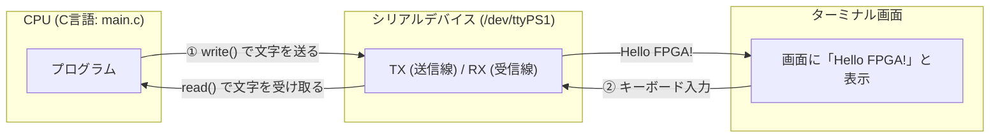

# 03_uart_console: 文字列で対話する「UARTシリアル通信」

組み込み開発において、最も基本的で最もよく使われるのが **「UART（ユーアート: シリアル通信）」** です。
PCと基板をUSBケーブルで繋ぎ、Tera Termやminicomなどのターミナルソフトを開いてログを見たりコマンドを送ったりするアレです。

このシナリオでは、Linuxの標準的なシリアル通信（`/dev/ttyPS1`）を使って文字列を送受信する基本を体験します。

---

## このシナリオのゴール
**「Linux標準のシリアルポートを開き、文字列の送信（ログ出力）と受信（エコーバック）を行う」**

---

## 直感イメージ：CPUとFPGAのやり取り
UARTは、1文字ずつ順番に電線を流す「シリアル（直列）通信」です。Linux上では普通のファイルのように `write` や `read` で読み書きできます。



---

## 3つの基本ステップ（コードの読み方）

[main.c](main.c) で行っていることは、以下の3ステップです。

1. **シリアルポートを開く (`open`)**
   - `int fd = open("/dev/ttyPS1", O_RDWR);` でポートを開きます。
2. **文字列を送信する (`write`)**
   - `write(fd, "Hello UART!\n", 12);` と書くだけで、シリアル線に文字が流れていきます。
3. **返ってきた文字を読み取る (`read`)**
   - `read(fd, buf, sizeof(buf));` で相手（外部ターミナルやループバック）から送られてきた文字を受け取ります。

---

## 1. まずは動かしてみよう！

ターミナルで以下のコマンドを実行します。

```bash
./run.sh
```

**期待される出力例：**
```text
=== Scenario 03: UART Console Test Start ===
[App] Opening /dev/ttyPS1...
[App] Writing test message to UART...
[App] Sent: "Hello from BoardlessBench UART!"
[App] Reading response from UART...
[App] Received: "Hello from BoardlessBench UART!"
[App] SUCCESS: Loopback string matched!
=== Scenario 03: UART Console Test End ===
```

> **外部ターミナルから接続してみよう！**  
> `./start_lab.sh tests/scenarios/03_uart_console/` で起動後、別ターミナルから `nc localhost 2000` を実行すると、実機のシリアルポートに接続したように直接キーボード入力で対話できます！

---

## 2. ちょこっと改造チャレンジ！

理解を深めるために、送信するメッセージを変えてみましょう。

- **実験:** [main.c](main.c#L45) の 45行目付近を見てみてください。
  ```c
  const char *msg = "Hello from BoardlessBench UART!\n";
  ```
  この文字列を自分の好きなメッセージ（例: `"Welcome to my FPGA World!\n"`）に書き換えて、もう一度 `./run.sh` を実行してみてください。  
  送信ログと受信ログが正しく書き換わることが確認できます！

---

## 次のステップへ
これで「I2C・SPI・UART」という組み込み3大シリアル通信の基本をマスターしました！

- **次のシナリオ [06b_hub75_matrix_64x64](../06b_hub75_matrix_64x64/README.md)**:  
  Stage 2の締めくくりとして、フルカラーLEDを敷き詰めた**「LEDマトリクス表示」**に挑戦してみましょう。

---

## さらに詳しく知りたい方へ
Linux TTYサブシステムの内部構造やPTY/TCPブリッジの仕組みは、**[ADVANCED.md](ADVANCED.md)** を参照してください。
