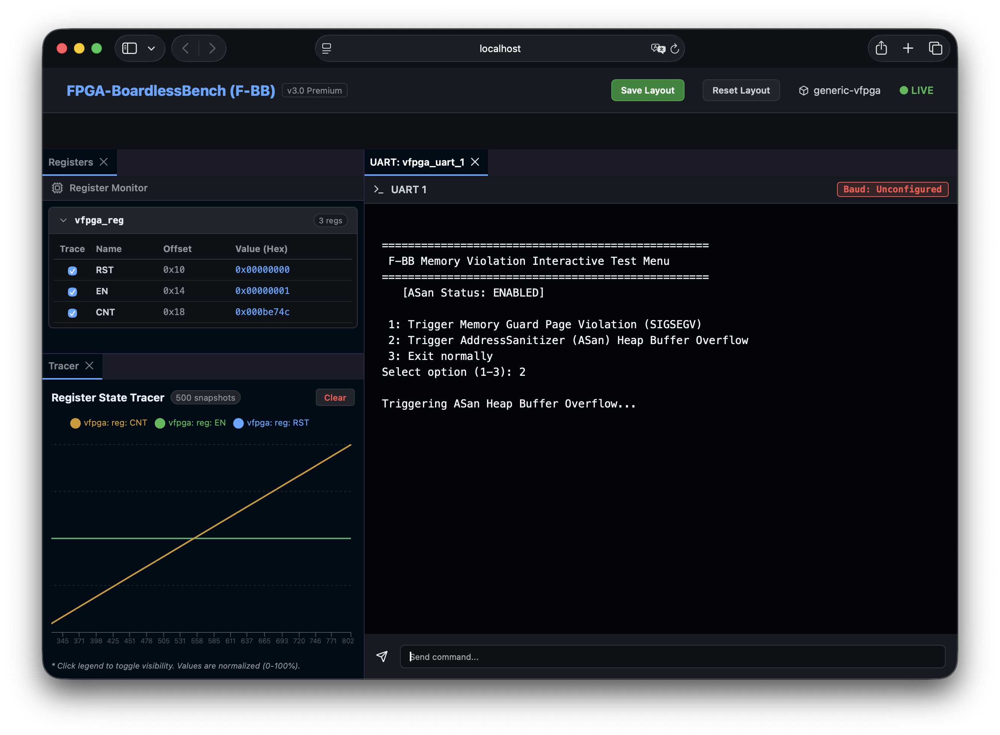
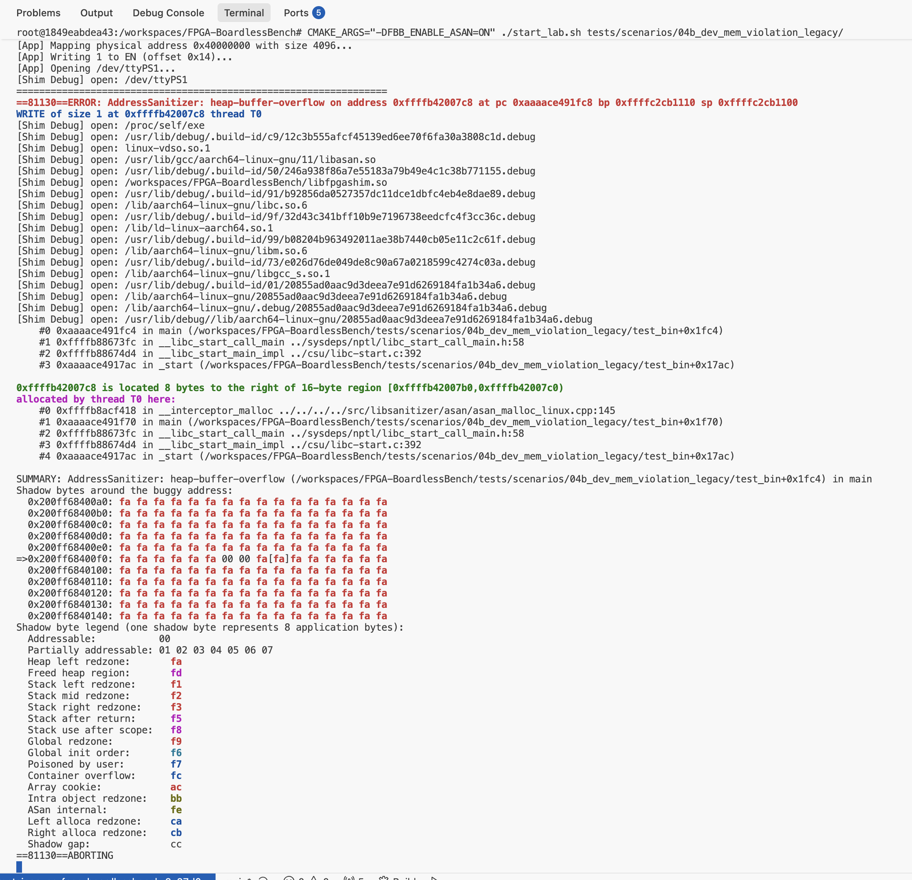
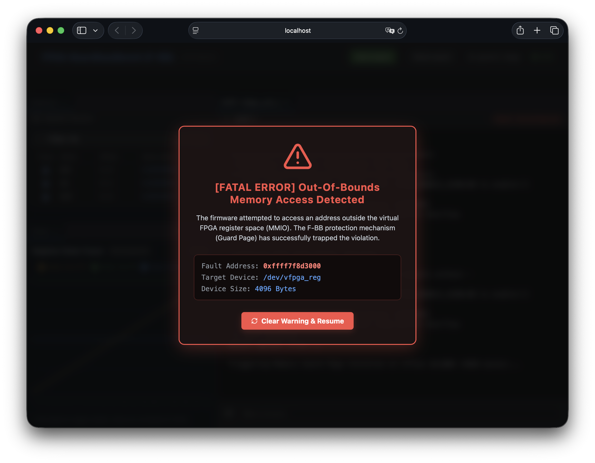

# シナリオ 04b: /dev/mem レガシー領域外アクセス検知テスト (dev_mem_violation_legacy)

このシナリオは、レガシーな `/dev/mem` マッピングを用いた物理ポインタ直接操作において、仮想FPGAのレジスタ空間の範囲外（境界外）へアクセス（メモリオーバーフロー）してしまった場合に、F-BB（FPGA-BoardlessBench）の保護機構である**ガードページ（[Guard Page](../../../docs/architecture/AddInfo_GuardPage.md)）**、およびコンパイラレベルの検出機構である**AddressSanitizer（[ASan](../../../docs/architecture/AddInfo_ASan.md)）** がそれぞれどのように違反を検知するかを検証・比較するためのテストケースです。

特にレガシーなC言語コードで直接レジスタ操作を行う組み込み開発エンジニア向けに、実機やシミュレータ側を変更することなく安全にメモリ安全性を担保するデバッグアプローチを明示します。



---

## 検証可能なメモリ保護技術

本シナリオでは、以下の2つの独立したメモリ保護・バグ検出テクノロジーを学習・検証できます。

### 1. メモリガードページ（Memory Guard Page）による保護
* **概要**: メモリマップされた仮想FPGAレジスタ領域（サイズ：4096バイト）の直後に、OSの機能を用いてアクセス権限のない領域（`PROT_NONE`）を隣接させて配置します。
* **仕組み**: ファームウェアが領域サイズを超えた番地（`virt_base + 4096`）へ直接書き込みを試みると、CPUのMMU（Memory Management Unit）が物理ページ違反を検知し、OSを介して `SIGSEGV`（セグメンテーションフォールト）を発生させます。これを C-Shim レイヤが安全にインターセプトします。
* **特徴**: **ファームウェアソースコードのコンパイルオプション変更が不要**で、レガシーな物理アドレスポインタ直接参照コードを無修正のままトラップできます。
* **詳細な解説**: [Guard Pageのハードウェア・エミュレーション](file:///workspaces/FPGA-BoardlessBench/docs/architecture/AddInfo_GuardPage.md)

### 2. AddressSanitizer（ASan）による検出
* **概要**: GCC/Clangコンパイラがビルド時にコードへ埋め込むメモリエラー検出器です。
* **仕組み**: ヒープ領域にメモリを確保する際、その周辺にアクセス禁止の「レッドゾーン（Redzone）」を自動構成し、境界外アクセスが行われた瞬間を瞬時に検知します。
* **特徴**: コンパイルオプション `-fsanitize=address` を有効にする必要がありますが、ヒープオーバーフロー（`malloc` した領域の境界外書き込み）や解放後参照（Use-after-free）など、動的メモリのバグを極めて正確に検知できます。
* **詳細な解説**: [AddressSanitizer（ASan）によるメモリ安全性強化](file:///workspaces/FPGA-BoardlessBench/docs/architecture/AddInfo_ASan.md)

---

## 動作モードと検証シナリオ

ファームウェア実行バイナリ（`test_bin`）は、起動時に環境変数 `VFPGA_INTERACTIVE` の設定に応じて以下の2つの動作モードを自動選択します。

### A. インタラクティブモード (`VFPGA_INTERACTIVE=1`)
WebダッシュボードのUARTコンソール（`/dev/ttyPS1` にリダイレクト）を介して、メニューから実行したいテストを選択します。

```text
==================================================
 F-BB Memory Violation Interactive Test Menu
==================================================
   [ASan Status: DISABLED (Compile with -DFBB_ENABLE_ASAN=ON to enable!)]

 1: Trigger Memory Guard Page Violation (SIGSEGV)
 2: Trigger AddressSanitizer (ASan) Heap Buffer Overflow
 3: Exit normally
Select option (1-3):
```

#### 選択肢の挙動：
1. **Option 1: メモリガードページ違反のトリガー**
   * マッピングされたベースアドレスから4096バイト離れた領域（`virt_base + 4096`）に対して書き込み（`0xDEADBEEF`）を行います。
   * **結果**: C-Shimのシグナルハンドラが起動し、ダッシュボードに重大なMMIO範囲外アクセス警告（英語の警告ポップアップモーダル）を表示して実行を即時中断します。
2. **Option 2: ASanヒープバッファオーバーフローのトリガー**
   * 16バイトのヒープバッファ（`malloc(16)`）を確保し、そのインデックス `24`（範囲外）へ文字 `'X'` の書き込みを試みます。
   * **結果**: ASanコンパイルオプション（`-DFBB_ENABLE_ASAN=ON`）が有効化されている場合、プログラムはその場でクラッシュし、詳細なASanレポート（クラッシュ時のヒープダンプやコールスタック）を出力します。
3. **Option 3: 正常終了**
   * 例外を発生させずに安全にプログラムを終了します。

### B. 自動検証モード (非対話モード)
環境変数がセットされていない場合（CI/CDや自動リグレッションテストでの実行時）、メニューを表示せずに**即座にガードページ違反（Option 1）を自動実行**します。
* テストスクリプトは `/tmp/fbb_memory_violation` の作成とエラーメッセージを検出し、終了コード `1` を返します。

---

## ダッシュボード画面イメージ

* **AddressSanitizerによるヒープエラー検出画面**
  ASanが有効な状態で Option 2 を実行すると、ダッシュボードターミナル上にクラッシュレポートが出力されます。


* **メモリガードページ違反検出時の警告ポップアップ（英語）**
  Option 1 を実行すると、ダッシュボードの最前面に以下の致命的エラーモーダルがポップアップ表示されます。


---

## 🛠️ テストの実行方法

### 1. 開発ラボの起動（対話モード）
ダッシュボードと周辺エミュレータを起動し、ファームウェアを対話式メニューでテストします。
```bash
./start_lab.sh tests/scenarios/04b_dev_mem_violation_legacy/
```

### 2. ASanを有効化したビルド方法
コンパイラのASan機能を有効化してビルドを行うには、以下のCMakeオプションを指定して起動します。
```bash
CMAKE_ARGS="-DFBB_ENABLE_ASAN=ON" ./start_lab.sh tests/scenarios/04b_dev_mem_violation_legacy/
```
※その後、UARTコンソールで `2` を選択することで、ASanによるヒープオーバーフローのトラップが機能します。

### 3. 環境のクリーンアップ
テストが終了したら、作成された一時ファイルや中間ビルドファイルを完全にクリーンアップして環境を初期化します。
```bash
./tests/run_tests.sh --clean --cleanall
```
