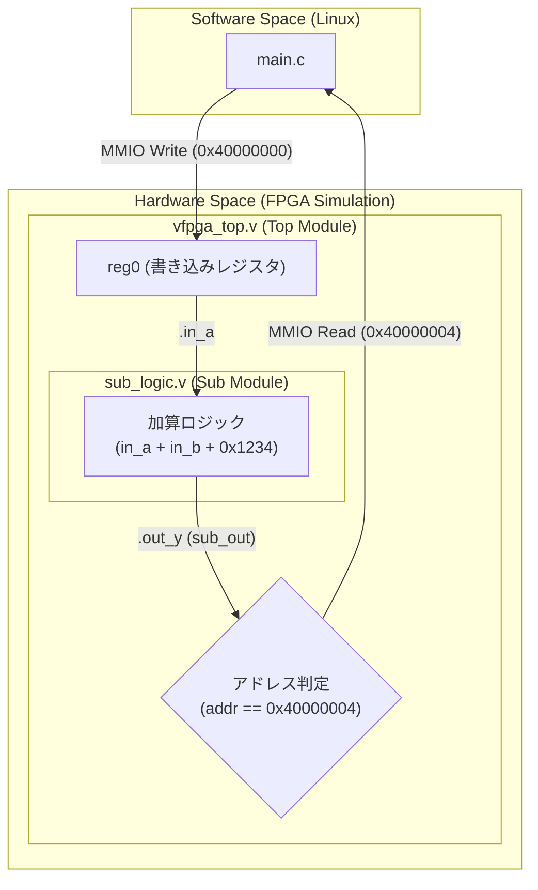

# Scenario 05: 複数 Verilog ソースファイル構成 - 詳細設計 & アーキテクチャ解説

本ドキュメントは、FPGA-BoardlessBench (F-BB) におけるマルチファイル Verilog 回路のビルド・リンク構造および Verilator 協調シミュレーションの詳細仕様書です。

---

## 1. ハードウェア分割アーキテクチャ



---

## 2. 自動収集ビルドメカニズム (`scenario_runner.sh`)

F-BB のビルドシステムは、シナリオディレクトリ内に存在するすべての `.v` ファイル（Verilog ソース）を自動検出して Verilator コンパイラへ渡します。

- **トップモジュール**: `vfpga_top.v`（`--top-module vfpga_top` として指定）
- **サブモジュール群**: `*.v`（自動インクルードおよびコンパイル対象として展開）

これにより、実機開発（Vivado プロジェクト）と同様に、サブモジュールや共通ライブラリを別ファイルとして階層管理できます。

---

## 3. レジスタマップ仕様 (`config.dts`)

```text
ベースアドレス : 0x40000000 (サイズ: 4KB)
デバイスノード : /dev/uio0
```

| オフセット | レジスタ名 | 属性 | 機能説明 |
| :--- | :--- | :--- | :--- |
| `0x00` | `REG0` | R/W | サブモジュールの入力 `in_a` に直結されたデータレジスタ |
| `0x04` | `REG1` | R | サブモジュール `sub_logic` の演算出力 `out_y` を返すレジスタ |
