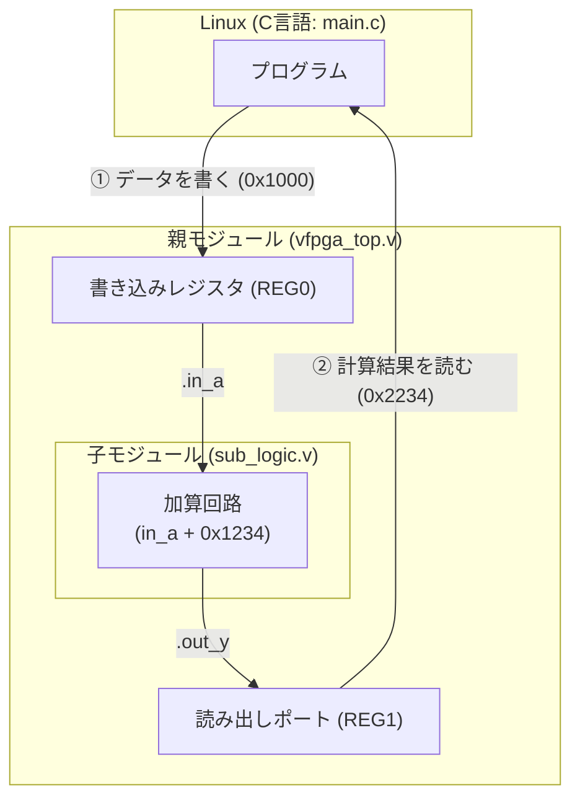

# 05_multi_v_files: 回路を綺麗に分割する「マルチファイル設計」

これまでのシナリオでは、すべてのハードウェア回路を1つの Verilog ファイル（`vfpga_top.v`）にまとめて書いていました。
しかし、実際の製品開発で回路が大きくなると、何千行にもなり見通しが悪くなってしまいます。

C言語でプログラムを複数の `.c` ファイルや関数に分割するように、Verilogでも回路を機能ごとの「部品（モジュール）」に分割して設計します。

このシナリオでは、**「複数ファイルに分かれたVerilog回路を組み合わせる（インスタンス化する）」** 基本を体験します。

---

## このシナリオのゴール
**「Verilogの回路を複数ファイル（トップモジュールとサブモジュール）に分割し、正しく配線して動かす」**

---

## 直感イメージ：CPUとFPGAのやり取り
親モジュールの中に子モジュール（部品）をはめ込んで、電線（ポート）を繋ぎます。



---

## 3つの基本ステップ（コードの読み方）

1. **子モジュールを作る ([sub_logic.v](sub_logic.v))**
   - 入力 `in_a` に固定値 `0x1234` を足して出力 `out_y` に返す、独立した計算部品を作ります。
2. **親モジュールで呼び出して繋ぐ ([vfpga_top.v](vfpga_top.v#L21))**
   ```verilog
   sub_logic u_sub (
       .in_a(reg0),    // 親のレジスタ reg0 を子の入力 in_a に接続
       .in_b(32'h0),   // 固定値 0 を接続
       .out_y(sub_out) // 子の計算結果を親の電線 sub_out で受け取る
   );
   ```
3. **C言語からテストする ([main.c](main.c))**
   - `regs[0] = 0x1000;` と書き込み、`val = regs[1];` で読み出すと、子モジュールが計算した `0x1000 + 0x1234 = 0x2234` が返ってきます。

---

## 1. まずは動かしてみよう！

ターミナルで以下のコマンドを実行します。ビルドシステムが自動的にすべての `.v` ファイルを探して合体・ビルドしてくれます。

```bash
./run.sh
```

**期待される出力例：**
```text
=== Scenario 05: Multi Verilog Files Test ===
[App] Writing 0x00001000 to REG0 (0x40000000)...
[App] Reading from REG1 (0x40000004)...
[App] Expected: 0x00002234, Read: 0x00002234
[App] SUCCESS: Multi-file Verilog logic verified!
=== Scenario 05 Test Result: SUCCESS ===
```
別のファイルに書いた回路（`sub_logic.v`）が正しく連動して計算を行っていることが確認できます！

---

## 2. ちょこっと改造チャレンジ！

理解を深めるために、子モジュールの計算式を変えてみましょう。

- **実験:** [sub_logic.v](sub_logic.v#L17) の 17行目を見てみてください。
  ```verilog
  assign out_y = in_a + in_b + 32'h1234;
  ```
  この `32'h1234` を `32'hAAAA` に書き換えて、もう一度 `./run.sh` を実行してみてください。  
  計算結果が変わる（`0x0000BAAA`）ことが確認できます！

---

## 次のステップへ
これで **Stage 1: はじめてのFPGA制御（レジスタ・割り込み・GPIO・モジュール分割）** は完了です！
FPGAとC言語プログラムがどうやって対話するかの基本はすべて掴めました。

- **次のステージ [02_multi_i2c](../02_multi_i2c/README.md)**:  
  **Stage 2: 周辺機器と通信しよう** に進みます。温度センサーやディスプレイなど、世界中の電子部品で使われている**「I2C通信」**を学びましょう。

---

## さらに詳しく知りたい方へ
マルチファイル自動収集ビルドの詳細仕様やレジスタマップ仕様は、**[ADVANCED.md](ADVANCED.md)** を参照してください。
