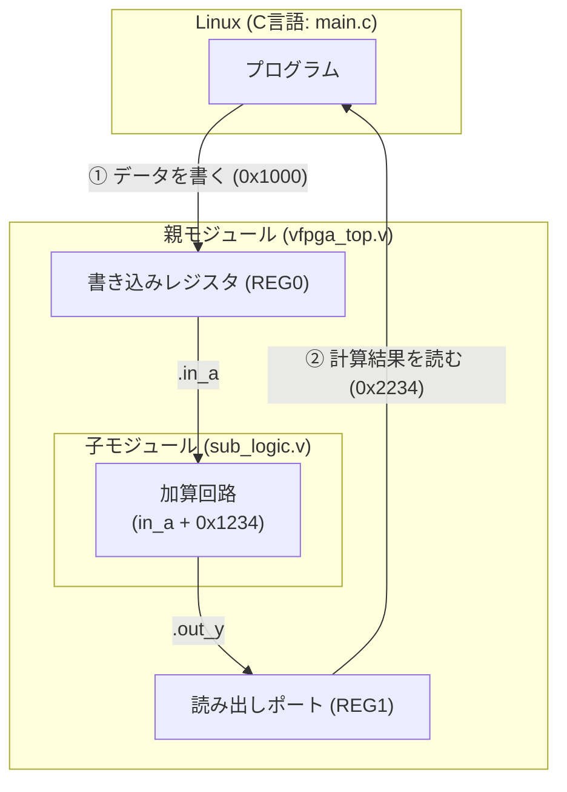

# 05_multi_v_files: 回路を綺麗に分割する「マルチファイル設計」

これまでのシナリオでは、すべてのハードウェア回路を1つの Verilog ファイル（`vfpga_top.v`）にまとめて書いていました。
しかし、実際の製品開発で回路が大きくなると、何千行にもなり見通しが悪くなってしまいます。

C言語でプログラムを複数の `.c` ファイルや関数に分割するように、Verilogでも回路を機能ごとの「部品（モジュール）」に分割して設計します。

このシナリオでは、**「複数ファイルに分かれたVerilog回路を組み合わせる（インスタンス化する）」** 基本を体験します。

---

## このシナリオのゴール
**「Verilogの回路を複数ファイル（トップモジュールとサブモジュール）に分割し、正しく配線して動かす」**

---

## 直感イメージ：CPUとFPGAのやり取り
親モジュールの中に子モジュール（部品）をはめ込んで、電線（ポート）を繋ぎます。


```mermaid
flowchart TD
    subgraph Software ["Linux (C言語: main.c)"]
        C_App["プログラム"]
    end

    subgraph Top ["親モジュール (vfpga_top.v)"]
        Reg0["書き込みレジスタ (REG0)"]
        
        subgraph Sub ["子モジュール (sub_logic.v)"]
            Calc["加算回路\n(in_a + 0x1234)"]
        end

        ReadPort["読み出しポート (REG1)"]
    end

    C_App -->|"① データを書く (0x1000)"| Reg0
    Reg0 -->|".in_a"| Calc
    Calc -->|".out_y"| ReadPort
    ReadPort -->|"② 計算結果を読む (0x2234)"| C_App
```

---

## 3つの基本ステップ（コードの読み方）

1. **子モジュールを作る ([sub_logic.v](sub_logic.v))**
   - 入力 `in_a` に固定値 `0x1234` を足して出力 `out_y` に返す、独立した計算部品を作ります。
2. **親モジュールで呼び出して繋ぐ ([vfpga_top.v](vfpga_top.v#L21))**
   ```verilog
   sub_logic u_sub (
       .in_a(reg0),    // 親のレジスタ reg0 を子の入力 in_a に接続
       .in_b(32'h0),   // 固定値 0 を接続
       .out_y(sub_out) // 子の計算結果を親の電線 sub_out で受け取る
   );
   ```
3. **C言語からテストする ([main.c](main.c))**
   - `regs[0] = 0x1000;` と書き込み、`val = regs[1];` で読み出すと、子モジュールが計算した `0x1000 + 0x1234 = 0x2234` が返ってきます。

---

## 1. まずは動かしてみよう！

ターミナルで以下のコマンドを実行します。ビルドシステムが自動的にすべての `.v` ファイルを探して合体・ビルドしてくれます。

```bash
./run.sh
```

**期待される出力例：**
```text
=== Scenario 05: Multi Verilog Files Test ===
[Main] REG0 (オフセット0) に 0x00001000 を書き込みます
[Main] REG1 (オフセット4) から演算結果を読み出します
[Main] 読み出し値: 0x00002234 (期待値: 0x00002234)
[Main] 成功: サブモジュールの正確な演算結果を確認しました！
=== Scenario 05 Test Result: SUCCESS ===
```
別のファイルに書いた回路（`sub_logic.v`）が正しく連動して計算を行っていることが確認できます！

---

## 2. ちょこっと改造チャレンジ！

親モジュール側の配線（ポート結線）を変更して、子モジュールへの入力を変えてみましょう。
ハードウェアの配線変更に合わせて、ファームウェア（C言語）側も追従させる2ステップの協調開発を体験します。

### ステップ 1: ハードウェアの配線を変えてみる (Verilog)
[vfpga_top.v](vfpga_top.v#L34) の 34行目を見てみてください。
現在は固定値 `32'h0` が子モジュール `u_sub` の入力 `.in_b` に接続されています。

```verilog
    sub_logic u_sub (
        .in_a(reg0),
        .in_b(32'h0), // ここを親の reg0 に繋ぎ替えてみる！
        .out_y(sub_out)
    );
```

この `.in_b(32'h0)` を **`.in_b(reg0)`** に書き換えて、親のレジスタ `reg0` を2つの入力ポート両方に配線してみましょう。  
書き換えたら、ターミナルで `./run.sh` を実行します。

```text
[Main] REG0 (オフセット0) に 0x00001000 を書き込みます
[Main] REG1 (オフセット4) から演算結果を読み出します
[Main] 読み出し値: 0x00003234 (期待値: 0x00002234)
[Main] 失敗: 演算結果が不正確です (期待値: 0x00002234, 実測値: 0x00003234)
```

子モジュールの計算が `reg0 + reg0 + 0x1234`（`0x1000 + 0x1000 + 0x1234 = 0x3234`）となり、読み出し値が変わったことが確認できます！  
しかし、ファームウェア（`main.c`）はまだ古い期待値（`0x2234`）を待っているため、テストは「失敗」となります。

### ステップ 2: ファームウェアを新しいハードウェア仕様に合わせる (C言語)
ハードウェアの回路配線が変わったので、ファームウェア側の検証ロジックも追従させましょう。

[main.c](main.c#L39) の 39行目を見てみてください。
```c
uint32_t expected = test_val + 0x1234; // RTL: reg0 + 0x0 + 0x1234
```

これを、新しいハードウェアの仕様に合わせて書き換えます。
```c
uint32_t expected = test_val + test_val + 0x1234; // RTL: reg0 + reg0 + 0x1234
```

書き換えたら、もう一度 `./run.sh` を実行してみてください。
```text
[Main] REG0 (オフセット0) に 0x00001000 を書き込みます
[Main] REG1 (オフセット4) から演算結果を読み出します
[Main] 読み出し値: 0x00003234 (期待値: 0x00003234)
[Main] 成功: サブモジュールの正確な演算結果を確認しました！
```

見事にテストが「成功」しました！

### このチャレンジで学んだこと
- **ハードウェア設計:** 子モジュール（部品ファイル）の中身を書き換えなくても、**親モジュール側の配線（どのピンにどの信号を繋ぐか）を変えるだけで全体の動作が変わる**という「モジュール結合・階層設計」の基本が身につきました。
- **協調開発 (Co-Design):** 実機のハードウェア設計が更新された際、**ファームウェア側もそれに合わせて適切にドライバや期待値を更新する**という、組み込み開発の実務フローを体験できました。

---

## 次のステップへ
これで **Stage 1: はじめてのFPGA制御（レジスタ・割り込み・GPIO・モジュール分割）** は完了です！
FPGAとC言語プログラムがどうやって対話するかの基本はすべて掴めました。

- **次のステージ [02_multi_i2c](../02_multi_i2c/README.md)**:  
  **Stage 2: 周辺機器と通信しよう** に進みます。温度センサーやディスプレイなど、世界中の電子部品で使われている **「I2C通信」** を学びましょう。

---

## さらに詳しく知りたい方へ
マルチファイル自動収集ビルドの詳細仕様やレジスタマップ仕様は、**[ADVANCED.md](ADVANCED.md)** を参照してください。
