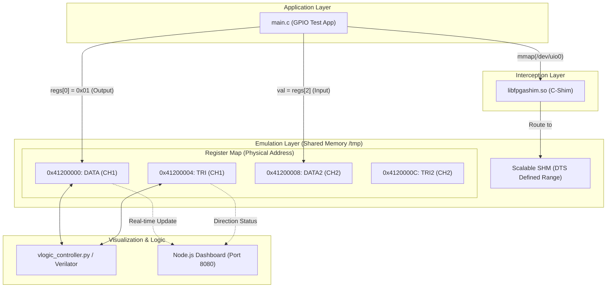

# Scenario 06: AXI GPIO - 詳細設計 & アーキテクチャ解説

本ドキュメントは、Zynq 等の FPGA で広く利用される `AXI GPIO` (xlnx,xps-gpio-1.00.a) のエミュレーション機能および 118 ピン標準インターフェースに関する詳細仕様書です。

---

## 1. アーキテクチャ詳細図 (Interception & SHM Layer)



---

## 2. レジスタ仕様 (`config.dts`)

```text
ベースアドレス : 0x41200000 (サイズ: 4KB)
デバイスノード : /dev/uio0
IP 種別        : xlnx,xps-gpio-1.00.a
```

| オフセット | レジスタ名 | 属性 | 説明 |
| :--- | :--- | :--- | :--- |
| `0x00` | `DATA` | R/W | チャネル1 データレジスタ (出力値または入力ピン状態) |
| `0x04` | `TRI` | R/W | チャネル1 方向レジスタ (`0`: 出力, `1`: 入力 / トライステート) |
| `0x08` | `DATA2` | R/W | チャネル2 データレジスタ |
| `0x0C` | `TRI2` | R/W | チャネル2 方向レジスタ |

---

## 3. 118ピン標準インターフェース (`l_pins_i/o/t`)

SoC 全体の外部入出力ピンを模擬する 118 ピンの信号線セット (`l_pins_i`, `l_pins_o`, `l_pins_t`) と連携し、以下のマッピングが行われます：
- チャネル1 の出力データ $\rightarrow$ `l_pins_o[31:0]`
- チャネル1 の方向設定 $\rightarrow$ `l_pins_t[31:0]` (`0` = 出力イネーブル)
- チャネル2 の入力データ $\leftarrow$ `l_pins_i[63:32]`

---

## 4. 実機ビルド & ポーティング環境

本シミュレーション環境（F-BB）ではホストPCの `gcc` でネイティブ実行していますが、実機（Zynq / ARM）にポーティングする際は以下のいずれかを選択します：

* **実機上のセルフビルド**:
  - ボード上の Linux (Ubuntu 等) 上で直接 `gcc main.c -o test_bin` を実行。
* **ホストPCからのクロスビルド**:
  - 開発PC上でクロスコンパイラ（例: `aarch64-linux-gnu-gcc` や `arm-linux-gnueabihf-gcc`）を指定してビルドし、バイナリをボードへ転送。

実機動作時には、デバイスツリーに `compatible = "generic-uio";` を指定して UIO ドライバをバインドします。
