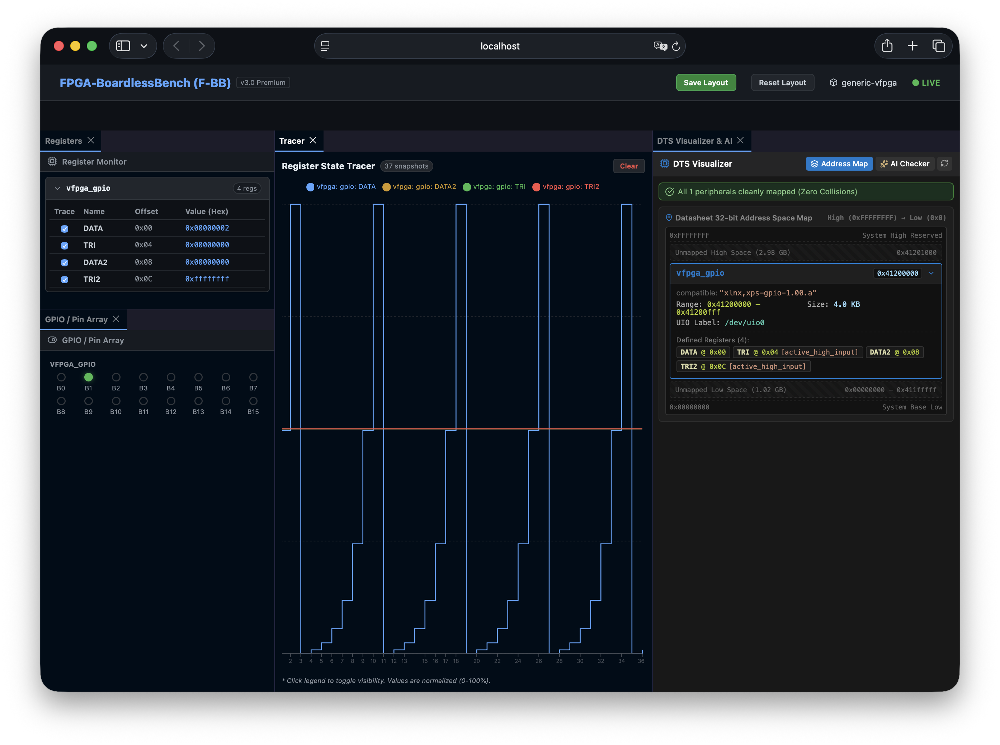
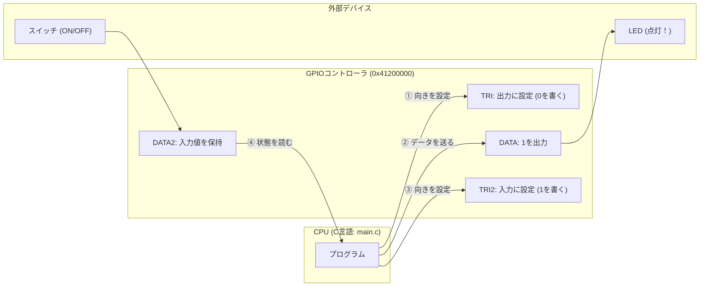

# 06_gpio: 入出力ピンを自由に操る「GPIO」

前回のシナリオでは、FPGA内部のカウンターやタイマーの制御を行いました。
組み込み開発の醍醐味は、LEDをピカピカ光らせたり、物理スイッチの状態を読み取ったりする「外の世界とのやり取り」です。

このシナリオでは、FPGAで最もよく使われる**「GPIO（General Purpose Input/Output: 汎用入出力）」**の制御を体験します。



---

## このシナリオのゴール
**「C言語プログラムからGPIOピンの向き（入力/出力）を設定し、LEDを点灯させたりスイッチ状態を読み取ったりする」**

---

## 直感イメージ：CPUとFPGAのやり取り
GPIOには、**「方向を決めるレジスタ（TRI）」** と **「データを送受信するレジスタ（DATA）」** の2種類があります。



---

## 3つの基本ステップ（コードの読み方）

[main.c](main.c) で行っていることは、以下の3ステップです。

1. **ピンの「向き（入出力）」を決める (`TRI` レジスタ)**
   - `regs[1] = 0x00000000;`（TRIレジスタに0を書く）$\rightarrow$ チャネル1を**「出力（LED用）」**にします。
   - `regs[3] = 0xFFFFFFFF;`（TRI2レジスタに1を書く）$\rightarrow$ チャネル2を**「入力（スイッチ用）」**にします。
2. **LEDを光らせる (`DATA` レジスタへの書き込み)**
   - `regs[0] = 0x01;` と書くと、1番目のLEDに電気が流れて点灯します。
   - ビットシフト（`1 << i`）を使うことで、8個のLEDを端から順番にチカチカ点灯させています。
3. **スイッチの状態を読み取る (`DATA2` レジスタの読み出し)**
   - `uint32_t in_val = regs[2];` と書くだけで、スイッチのON/OFF（0または1）をまとめて読み取れます。

---

## 1. まずは動かしてみよう！

ターミナルで以下のコマンドを実行します。

```bash
./run.sh
```

**期待される出力例：**
```text
--- AXI GPIO Test Start ---
[App] Configuring Channel 1 as output...
[App] Configuring Channel 2 as input...
[App] Automated test mode detected. Running for 5 iterations...
[App] Writing 0x00000001 to DATA (Channel 1)...
[App] Read 0x00000000 from DATA2 (Channel 2)...
[App] Writing 0x00000002 to DATA (Channel 1)...
...
[App] GPIO Test Complete.
```

> **Webダッシュボードで見てみよう！**  
> プロジェクトルートから `./start_lab.sh tests/scenarios/06_gpio/` を実行し、ブラウザ（http://localhost:8080）を開くと、画面上の **LEDがリアルタイムに点滅** します。また、画面上の **トグルスイッチをカチカチ動かす** と、プログラム側がその値を即座に読み取る様子を体験できます！

---

## 2. ちょこっと改造チャレンジ！

理解を深めるために、コードを1箇所だけ変えてみましょう。

- **実験:** [main.c](main.c#L62) の 62行目を見てみてください。
  ```c
  uint32_t out_val = (1 << (i % 8)); // 1個ずつ順番に点灯
  ```
  これを `uint32_t out_val = 0xFF;`（8個すべてのLEDを全点灯）や `0xAA`（市松模様点灯）に書き換えて、もう一度 `./run.sh` を実行してみてください。  
  出力されるデータ値（`Writing 0x...`）が変わることが確認できます！

---

## 次のステップへ
これで「1ビット単位のハードウェアピン制御（GPIO）」が身につきました！

- **次のシナリオ [05_multi_v_files](../05_multi_v_files/README.md)**:  
  回路の規模が大きくなってきたときに、Verilogコードを複数のファイルに綺麗に分割して設計する**「モジュール分割」**を学びましょう。

---

## さらに詳しく知りたい方へ
AXI GPIO IPの内部アーキテクチャや118ピンインターフェース仕様、実機Linuxでのクロスコンパイル環境などの詳細仕様は、**[ADVANCED.md](ADVANCED.md)** を参照してください。
