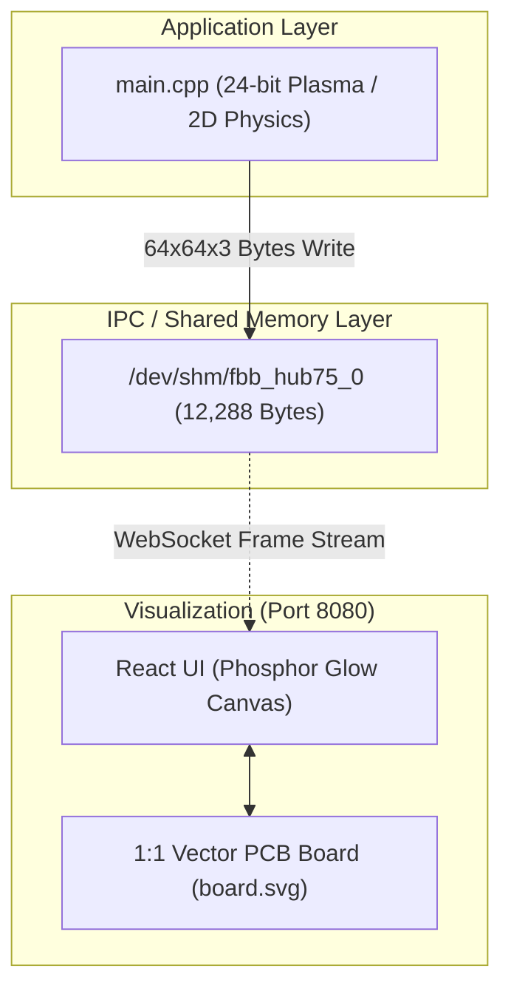

# Scenario 06b: HUB75 64x64 RGB LED マトリクス - 詳細設計 & アーキテクチャ解説

本ドキュメントは、HUB75 パ列シフトレジスタ制御プロトコル、12KB 24-bit RGB フレームバッファ（`/dev/shm/fbb_hub75_0`）、および PCB Vector Board 統合に関する詳細仕様書です。

---

## 1. HUB75 フレームバッファアーキテクチャ

---

## 2. メモリマップ仕様 (12,288 Bytes)

$64 \times 64$ ピクセルのフルカラー（RGB 8bit: 3バイト）データを保持するため、バッファサイズは以下の通りです：

$$64 \times 64 \times 3 = 12,288 \text{ Bytes (12 KB)}$$

ピクセル $(x, y)$ のメモリ配置：
- $R = \text{buf}[(y \times 64 + x) \times 3 + 0]$
- $G = \text{buf}[(y \times 64 + x) \times 3 + 1]$
- $B = \text{buf}[(y \times 64 + x) \times 3 + 2]$
