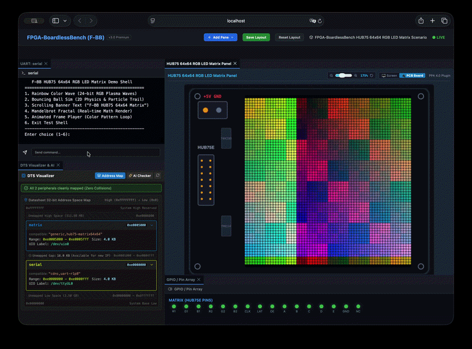
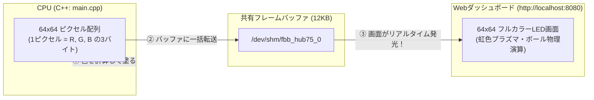

# 06b_hub75_matrix_64x64: フルカラーで光る「RGB LEDマトリクス」

Stage 2（周辺機器と通信しよう）の締めくくりとして、街頭の巨大ビジョンや電光掲示板で使われる **「64x64 フルカラーRGB LEDマトリクスパネル（HUB75規格）」** を制御します。

4096個（64 $\times$ 64）のフルカラーLEDに、プラズマ波動やバウンスボール、スクロール文字などの鮮やかなアニメーションをリアルタイムに描画します！



---

## このシナリオのゴール
**「64x64ピクセルのフルカラーフレームバッファ（12KB）にRGBカラーを描画し、鮮やかなアニメーションを表示する」**

---

## 直感イメージ：CPUとFPGAのやり取り
CPUがメモリ上の配列にRGB（赤・緑・青）の数値を書き込むと、LEDマトリクスパネル全体が一瞬で鮮やかに光ります。



---

## 3つの基本ステップ（コードの読み方）

[main.cpp](main.cpp) で行っていることは、以下の3ステップです。

1. **フレームバッファをメモリにマッピングする**
   - 64x64x3バイト（12,288バイト）の共有メモリを開き、ポインタで直接描画できるようにします。
2. **ピクセルに色を塗る (`set_pixel(x, y, r, g, b)`)**
   - 座標 $(x, y)$ を指定して、赤・緑・青の輝度（0〜255）を書き込みます。
3. **物理シミュレーションや文字を描画する**
   - 2D物理演算（跳ね返るボール）やレインボーグラデーションを計算して毎フレーム画面を更新します。

---

## 1. まずは動かしてみよう！

Webダッシュボードでフルカラーアニメーションを楽しむため、プロジェクトルートから以下を実行します。

```bash
./start_lab.sh tests/scenarios/06b_hub75_matrix_64x64/
```

ブラウザで **`http://localhost:8080`** を開くと、64x64のLEDパネルが美しく発光する様子が確認できます！
画面右上の `[PCB Board]` モードに切り替えると、本物の回路基板上に実装されたリアルな視覚体験も楽しめます。

*(※CLIで自動テストだけ実行したい場合は `./run.sh` を実行します)*

---

## 2. ちょこっと改造チャレンジ！

理解を深めるために、描画パターンの背景色や描画ロジックを少し変えてみましょう。

- **実験:** [main.cpp](main.cpp#L160) の 160行目付近を見てみてください。
  色の計算式を変更して `./run.sh`（または `./start_lab.sh`）を実行すると、LEDパネルのグラデーションの色合いが変化することが確認できます！

---

## 次のステップへ
これで **Stage 2: 周辺機器と通信しよう（I2C・7セグ・OLED・SPI・UART・LEDマトリクス）** はすべて完了です！

- **次のステージ [01c_protocol_assertion](../01c_protocol_assertion/README.md)**:  
  **Stage 3: 高速転送と実践制御** に進みます。まずはハードウェアのバグを未然に防ぐ**「プロトコルアサーション自動検証」**を学びましょう。

---

## さらに詳しく知りたい方へ
HUB75規格のシフトレジスタ制御仕様や24-bit RGBメモリマッピングの詳細は、**[ADVANCED.md](ADVANCED.md)** を参照してください。
