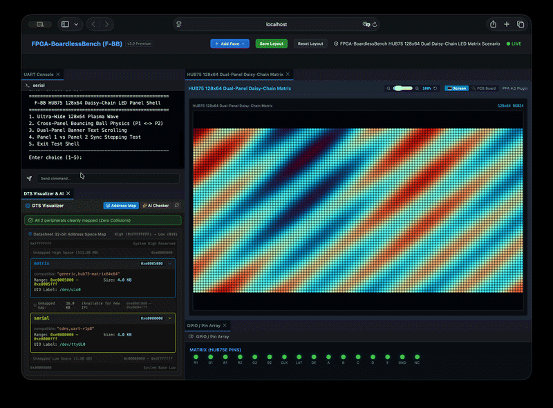

# シナリオ 06c: HUB75 128x64 デイジーチェーン接続 Dual-Panel RGB LED マトリクス

## 概要
シナリオ `06c_hub75_matrix_daisy_chain` は、`generic_hub75_matrix64x64` プラグインアーキテクチャを使用した**複数パネルのデイジーチェーン接続（128x64 高解像度構成）**のエミュレーション環境を提供します。



2枚の HUB75 64x64 パネルが高速シフトレジスタ経由で水平方向にデイジーチェーン接続され、単一の SoC/FPGA コントローラによって駆動される 128x64 解像度の大型 LED ウォールを構成します。

## デバイスツリー設定 (DTS)
```dts
hub75_daisy_chain: matrix@e0005000 {
    compatible = "generic,hub75-matrix";
    reg = <0xe0005000 0x1000>;
    grid_size = <128 64>;
    panel_count = <2>;
    chain_layout = "2x1";
    shm_name = "fbb_hub75_chain0";
    status = "okay";
};
```

## 主な機能
- **128x64 解像度 Dual-Panel ビデオウォール**: 24-bit RGB ピクセルデータ（1フレームあたり 24,576 バイト）のリアルタイムレンダリング。
- **対話式 UART シェル**:
  1. ウルトラワイド 128x64 プラズマウェーブ (24-bit RGB)
  2. パネル横断バウンスボール物理シミュレーション (Panel 1 と Panel 2 を滑らかにバウンド移動)
  3. ウルトラワイド文字スクロール ("F-BB 128x64 MATRIX")
  4. Panel 1 vs Panel 2 同期ステップ検証テスト
- **Web ダッシュボード統合**:
  - `[Screen]` モード: フルウィンドウ対応のレスポンシブ 128x64 シームレス LED ビデオウォール表示。
  - `[PCB Board]` モード: 2枚のパネルがデイジーチェーン接続された物理構成（`board.svg`）を統合表示。

## テストの実行方法

### 1. スタンドアロン自動テスト実行
```bash
./tests/scenario_runner.sh tests/scenarios/06c_hub75_matrix_daisy_chain/
```

### 2. Web ダッシュボード付き対話開発ラボ起動
```bash
./start_lab.sh tests/scenarios/06c_hub75_matrix_daisy_chain/
```
