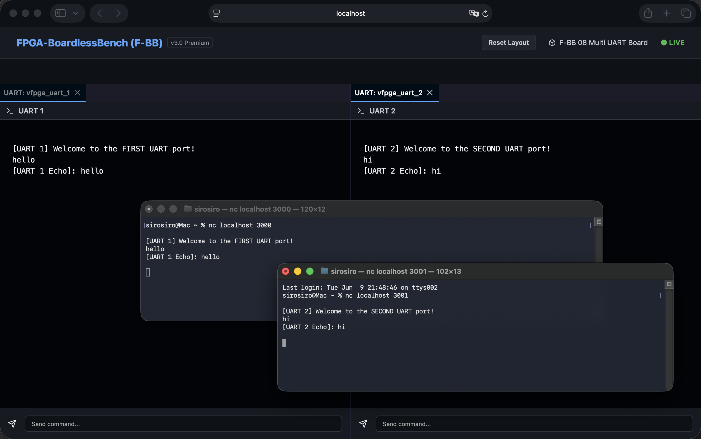
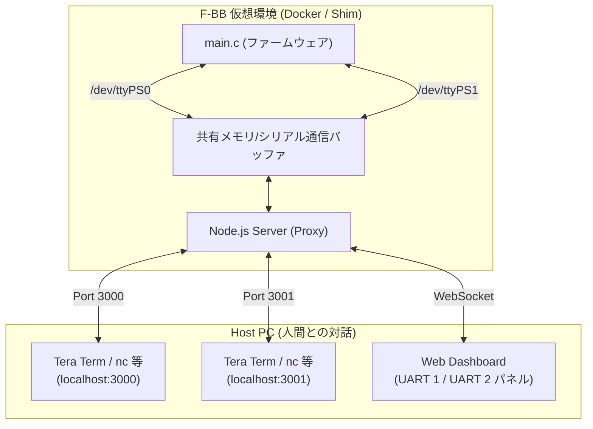

# 08_multi_uart: 複数UARTポートの同時オープンと双方向通信

このシナリオでは、ファームウェア（C言語）から複数の仮想UARTポート（`/dev/ttyPS0` と `/dev/ttyPS1`）を同時にオープンし、双方向でシリアル通信を行うマルチUARTの制御とデバッグ手法を学習します。



## アーキテクチャ概念図



## シナリオの仕組みと特徴

1. **複数UARTデバイスの仮想化**:
   - デバイスツリー定義（[config.dts](config.dts)）にて、`uart1`（`/dev/ttyPS0`）と `uart2`（`/dev/ttyPS1`）の2つのUARTコントローラが定義されています。
   - F-BBのShimライブラリ（`libfpgashim.so`）により、ファームウェアから `/dev/ttyPS0` / `/dev/ttyPS1` へのアクセスが透過的にインターセプトされ、対応する仮想シリアル回線にルーティングされます。

2. **双方向対話（Interactive Mode）**:
   - `VFPGA_INTERACTIVE=1`（対話モード）が有効な場合、ファームウェアは `select()` システムコールを用いて、双方のポートからの入力をノンブロッキングで監視します。
   - いずれかのポートでデータを受信すると、対応するポートへ受け取った内容をオウム返し（エコーバック）します。

3. **外部端末クライアントの統合**:
   - コンテナ内で起動したNode.jsサーバーは、ダッシュボードとのWebSocket通信のほか、TCPポート **`3000`** (ttyPS0用) と **`3001`** (ttyPS1用) をリッスンしています。
   - ホスト側の端末エミュレータ（Tera Term、`nc` コマンドなど）や、Webダッシュボードの内蔵ターミナルから接続し、リアルタイムに双方のUARTポートと個別に双方向通信が可能です。

4. **ダッシュボードによるUART通信のリアルタイム監視 (モニタリング)**:
   - このマルチオープンとNode.jsプロキシの仕組みにより、ファームウェアアプリケーションが外部や対向のUARTポートと通信を行っている最中であっても、そのすべての送受信データはバックエンドを通じてWebダッシュボードにブロードキャストされます。
   - 開発者は、本来のアプリケーションの稼働状態や通信を妨げることなく、ダッシュボード画面から通信内容をリアルタイムで透過的に監視（スヌーピング/キャプチャ）できます。

## 学習のポイント

1. **`select()` による複数I/Oの多重化**:
   - 組み込みLinux開発において、複数のシリアルポートやファイル記述子を1つのスレッドで効率よく監視するための `select()` の実装パターンを理解します。
2. **`termios` を用いたシリアル設定**:
   - `main.c` 内の `configure_raw_mode()` では、シリアルポートを「生モード（Raw Mode）」に設定し、改行コードの自動変換やエコーバックを抑制しています。これにより、エミュレート環境でも厳密なシリアルキャラクタ単位の送受信が保証されます。
3. **複数UARTポートの接続検証**:
   - 外部UARTポートから接続することで、複数のペリフェラルが干渉することなく独立して通信できていることを確認します。

## 実行方法

本ディレクトリに移動して、以下のスクリプトを実行してください。

```bash
./run.sh          # ビルドと実行 (デフォルトでは自動テストが走り2秒で終了します)
./run.sh --clean  # 成果物とログの削除
```

### 対話デモの動かし方 (Webダッシュボード/Tera Term接続)

1. 対話モードを有効にして起動します：
   ```bash
   # プロジェクトのルートディレクトリから実行する場合
   ./start_lab.sh tests/scenarios/08_multi_uart/
   ```
2. 起動後、ブラウザで `http://localhost:8080` にアクセスすると、UART 1 と UART 2 の2つのターミナルが表示されます。
3. または、ホストPC上の Tera Term や `nc` コマンドを使用して接続します：
   - **UART 1 (ttyPS0)**: `nc localhost 3000`
   - **UART 2 (ttyPS1)**: `nc localhost 3001`
4. ターミナルから入力した文字がエコーバックされることを確認してください。
5. **UART 1** に `exit` と入力すると、ファームウェアは終了シーケンスへ移行し、安全に終了します。
