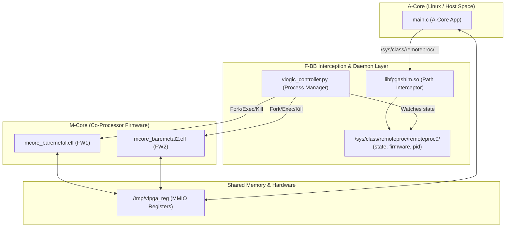

# Scenario 09: remoteproc による M コアライフサイクル制御 - 詳細設計 & アーキテクチャ解説

本ドキュメントは、Linux `remoteproc` フレームワーク（Sysfs インターフェース）、異種マルチコア（Aコア Linux + Mコア マイコン）のライフサイクル管理、および動的ファームウェア・ホットスワップ機構の詳細仕様書です。

---

## 1. remoteproc ライフサイクルアーキテクチャ



---

## 2. Linux 標準 remoteproc Sysfs 制御シーケンス

```bash
# 1. ロードするファームウェアバイナリ名を指定
echo "mcore_firmware.elf" > /sys/class/remoteproc/remoteproc0/firmware

# 2. リモートコアの起動
echo "start" > /sys/class/remoteproc/remoteproc0/state

# 3. 稼働状態の確認 (running が返る)
cat /sys/class/remoteproc/remoteproc0/state

# 4. リモートコアの停止
echo "stop" > /sys/class/remoteproc/remoteproc0/state
```

---

## 3. 動的ホットスワップ時のレースコンディション防止設計

稼働中のファームウェア（FW1）を別ファームウェア（FW2）に差し替える際、以下の厳密なハンドシェイクを実行します：
1. `echo "stop" > state` を発行
2. `state` が `"offline"` に遷移するまでポーリング待機（プロセスの完全回収を保証）
3. `echo "fw2.elf" > firmware` を書き込み
4. `echo "start" > state` を発行して新ファームウェアを起動
