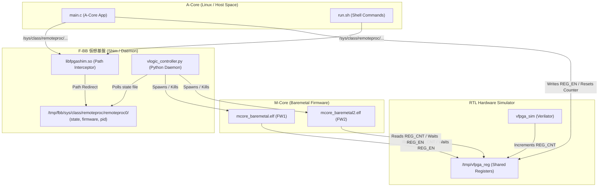

# 09_remoteproc_amp: remoteprocによるMコアライフサイクル制御と動的ファームウェア・ホットスワップ

このシナリオでは、ファームウェア（Aコア側 Linux アプリケーション）から `remoteproc`（リモートプロセッサ・フレームワーク）の Sysfs インターフェースを経由して、ベアメタルで動作するMコアプロセッサの起動・停止を制御し、さらに稼働中に動的にファームウェアバイナリを別のものに差し替える「ホットスワップ（Hot-Swap）」技術の制御と状態同期を学習します。

---

## アーキテクチャ概念図



---

## シナリオの仕組みと特徴

1. **仮想 remoteproc Sysfs のエミュレーション**:
   - デバイスツリー定義（[config.dts](config.dts)）に基づき、仮想 remoteproc インターフェースが構築されます。
   - F-BB の Shim ライブラリ（`libfpgashim.so`）により、Aコアアプリや `bash` コマンドから `/sys/class/remoteproc/...` へのアクセスが透過的に `/tmp/fbb/sys/class/...` の実ファイルオープンにリダイレクトされます。
   - 同様に、非特権（非root）環境でもファームウェアをロードできるようにするため、`/lib/firmware/` へのアクセスも `/tmp/fbb/lib/firmware/` にリダイレクトされます。

2. **自律デーモン（Python）によるプロセスマネージメント**:
   - バックグラウンドで常に稼働する `vlogic_controller.py` が、リダイレクトされた `/tmp/fbb/sys/class/remoteproc/remoteproc0/state` ファイルへの書き込みをポーリング監視しています。
   - 状態が `"start"` に変わると、指定されたファームウェア名（例: `mcore_baremetal.elf`）を読み込み、`subprocess` 経由でMコアプロセスを `fork`/`exec` して起動します。
   - 状態が `"stop"` に変わると、PIDファイルからPIDを読み取ってMコアプロセスにシグナル（`SIGTERM` / `SIGKILL`）を送り、安全に回収します。
   - これにより、`bash`（リダイレクトを伴う `echo` や `cp`）とAコアアプリ（Cプログラム）の双方から全く同じインターフェースを通じて、透過的かつ整合的にMコアの起動・停止が協調制御されます。

3. **動的ホットスワップと状態同期**:
   - 本シナリオでは、起動直後に `run.sh`（bash）からロードされた **FW1 (`mcore_baremetal.elf`)** の動作確認後、Aコアアプリ（`main.c`）が一度FW1を停止し、ファームウェアファイルを **FW2 (`mcore_baremetal2.elf`)** に書き換え、動的にロードし直して再起動する「ホットスワップ」を実行します。
   - ホットスワップを安全に行うため、FW1停止後に `vlogic_controller.py` によるプロセスの終了と状態書き戻しが完了して `state` が `"offline"` に遷移するのをAコアアプリ側でポーリング待機し、レースコンディションを完全に排除する堅牢な同期シーケンスを実装しています。

---

## 学習のポイント

1. **remoteproc の操作モデルと実機互換性**:
   - 組み込みLinux開発においてマルチコア（AMP）構成を採用する際、標準となる `remoteproc` フレームワークの Sysfs 制御 API（`firmware` および `state` ファイルによるファームウェア名指定、起動、停止）の操作作法を理解します。
2. **非同期プロセス制御とレースコンディションの回避**:
   - Aコア（Linux側）から独立したMコア（ベアメタル側）プロセスを非同期にハンドリングする際、ステートマシンの遷移（`stop`指示から実際に`offline`になるまでのラグ）を適切に待機・同期させ、バグのない安全な動的ロードプログラムを実装するノウハウを学びます。
3. **MMIO レジスタによるコア間インターロック**:
   - Mコア側（`mcore_baremetal.c`）は起動後、共有メモリ（UIO/FPGAレジスタ）の `REG_EN` が立つまでビジーループで待機し、Aコアが有効化したことを検知してから動作を開始します。このようなハードウェアレジスタを介した極小のハンドシェイク手法を習得します。
4. **シミュレーション・フック設計**:
   - `libfpgashim.so` による低レイヤのパスリダイレクトと、バックグラウンドの Python デーモンによる高レイヤのプロセスライフサイクル管理を連携させる、F-BB のモック・シミュレーション設計パターンを理解します。

### 実機動作させるための注意点（コンパイル環境）

本シミュレーション環境（F-BB）では、簡便化のためにAコア（Linuxアプリ）およびBコア（ベアメタルFW）の双方をホストPC上の `gcc` でネイティブコンパイルしていますが、実機（Zynq や i.MX95 等）で動作させる場合は、それぞれのコアに適合したクロスツールチェーンを使用するよう `Makefile` を修正する必要があります。

* **Aコア（Linux アプリ: `test_bin`）のコンパイル**:
  - 実機ボード上の Linux 環境で直接セルフコンパイルする場合は、ボード上の `gcc`（ネイティブ）をそのまま利用可能です。
  - 開発ホストPC（x86等）からクロスビルドする場合は、ターゲットに合わせたクロスコンパイラ（例: `aarch64-linux-gnu-gcc`）が必要です。
* **Bコア（Mコア/ベアメタル FW: `mcore_baremetal.elf`）のコンパイル**:
  - AコアとはCPUアーキテクチャや命令セットが異なるため、**Bコア専用のクロスツールチェーン**（例: ARM Cortex-R5F や Cortex-M33 向けなら `arm-none-eabi-gcc`）によるビルドが**必須**になります。
  - また、実機で動作させるためには、実機ボードの物理メモリマップ（TCMや予約DDR領域など）にバイナリを配置するための**リンカスクリプト（`.ld`）**やスタートアップオブジェクトをリンク設定に含める必要があります。

---

## 実行方法

本ディレクトリに移動して、以下のスクリプトを実行してください。

```bash
./run.sh          # ビルドと実行 (自動テストが走り、FW1とFW2の双方が順次実行されてパスします)
./run.sh --clean  # ビルド成果物とログの削除
```

### 期待される出力ログの例
実行が成功すると、以下のようにFW1（`[M-Core]`）の起動・停止ののち、FW2（`[M-Core 2]`）へとホットスワップされてカウンタ監視がそれぞれパスする様子が標準出力に表示されます。

```text
--- remoteproc AMP Test Start ---
[A-Core] Initial remoteproc state: start (または running)
[A-Core] Opening /dev/uio0...
[A-Core] Resetting counter for FW1...
[A-Core] Enabling counter for FW1...
[A-Core] Waiting for FW1 to monitor counter...
[M-Core] EN detected! Starting monitoring loop.
[M-Core] REG_CNT = 3097
[M-Core] REG_CNT = 3297
...
[M-Core] Baremetal firmware finished successfully.
[A-Core] Counter value with FW1: 6096
[A-Core] Stopping FW1...
[A-Core] Waiting for remoteproc to become offline...
[A-Core] Copying FW2 to /lib/firmware...
[A-Core] Writing FW2 name to remoteproc...
[A-Core] Starting FW2...
[Shim M-Core] Successfully mapped 0x40000000 -> 0x40000000 (size: 4096, offset: 0)
[M-Core 2] Baremetal firmware (hot-swapped) started.
[A-Core] Resetting counter for FW2...
[A-Core] Enabling counter for FW2...
[A-Core] Waiting for FW2 to monitor counter...
[M-Core 2] EN detected! Starting monitoring loop.
[M-Core 2] REG_CNT = 3097
...
[M-Core 2] Baremetal firmware finished successfully.
[A-Core] Counter value with FW2: 6096
[A-Core] Stopping FW2...
--- remoteproc AMP Test Finished ---
[A-Core] SUCCESS: Both FW1 and FW2 successfully ran and verified!
```
