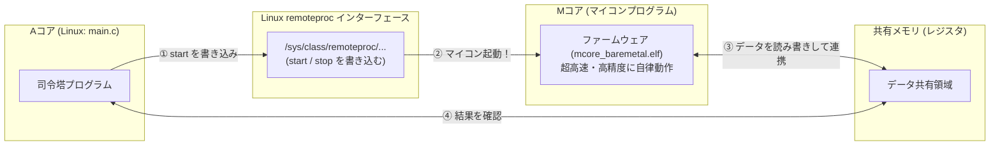

# 09_remoteproc_amp: Linuxからマイコンを動かす「異種マルチコア」

現代の高度なSoC（Zynq, STM32MP1, i.MX等）には、**「リッチなLinuxを動かす大きなCPU（Aコア）」** と **「ミリ秒単位でモーターやセンサーを精密制御する小さなマイコン（Mコア）」** の2種類の頭脳が1つのチップに同居しています。
これを **「AMP（Asymmetric Multiprocessing: 非対称マルチプロセッシング）」** と呼びます。

Linux側から「マイコン側で動くファームウェア」をロードして起動・停止させる標準的な仕組みが **「remoteproc」** です。

このシナリオでは、Linuxからマイコンコアのプログラムを起動・停止し、さらに動作中に別のプログラムへ差し替える（ホットスワップ）基本を体験します！

---

## このシナリオのゴール
**「Linuxからremoteprocを操作してMコアマイコンを起動・停止し、共有メモリ経由で協調動作させる」**

---

## 直感イメージ：CPUとFPGAのやり取り
メインCPU（Linux）が「司令塔」となり、マイコン（Mコア）にプログラムを渡して仕事をさせます。


```mermaid
flowchart LR
    subgraph A_Core ["Aコア (Linux: main.c)"]
        LinuxApp["司令塔プログラム"]
    end

    subgraph Sysfs ["Linux remoteproc インターフェース"]
        State["/sys/class/remoteproc/...\n(start / stop を書き込む)"]
    end

    subgraph M_Core ["Mコア (マイコンプログラム)"]
        MicroApp["ファームウェア (mcore_baremetal.elf)\n超高速・高精度に自律動作"]
    end

    subgraph Memory ["共有メモリ (レジスタ)"]
        Regs["データ共有領域"]
    end

    LinuxApp -->|"① start を書き込み"| State
    State -->|"② マイコン起動！"| MicroApp
    MicroApp <-->|"③ データを読み書きして連携"| Regs
    LinuxApp <-->|"④ 結果を確認"| Regs
```

---

## 3つの基本ステップ（コードの読み方）

[main.c](main.c) で行っていることは、以下の3ステップです。

1. **ファームウェア名を指定してマイコンを起動する**
   - `echo "mcore_baremetal.elf" > firmware`
   - `echo "start" > state` と書き込むだけで、マイコンが起動して自律的に動き始めます。
2. **共有メモリで協調動作を確認する**
   - Aコア（Linux）とMコア（マイコン）が同じレジスタを見ながら、フラグの受け渡しを行います。
3. **マイコンを停止し、別のプログラムに差し替える（ホットスワップ）**
   - `echo "stop" > state` ➔ `echo "mcore_baremetal2.elf" > firmware` ➔ `echo "start" > state` で、再起動なしにマイコンのプログラムを更新します。

---

## 1. まずは動かしてみよう！

ターミナルで以下のコマンドを実行します。

```bash
./run.sh
```

**期待される出力例：**
```text
=== Scenario 09: remoteproc AMP Lifecycle Test Start ===
[A-Core] Booting M-Core firmware 1 (mcore_baremetal.elf)...
[A-Core] M-Core is RUNNING! Synchronizing data via MMIO...
[A-Core] Stopping M-Core for hot-swap...
[A-Core] Booting M-Core firmware 2 (mcore_baremetal2.elf)...
[A-Core] SUCCESS: M-Core hot-swap and coordination verified!
=== Scenario 09 Test Result: SUCCESS ===
```

---

## 2. ちょこっと改造チャレンジ！

理解を深めるために、マイコン側の動作ログを確認してみましょう。

- **実験:** [mcore_baremetal.c](mcore_baremetal.c) のコードを見てみてください。マイコン側がいかにシンプルなC言語（ベアメタル）で書かれているかが確認できます！

---

## 次のステップへ
これで「Linuxからマイコンを操る（AMP）」の第一歩を踏み出しました！

- **次のシナリオ [10_amp_mcore_freertos](../10_amp_mcore_freertos/README.md)**:  
  次は、マイコン側で本格的な**「リアルタイムOS（FreeRTOS）」**を動かしてみましょう。

---

## さらに詳しく知りたい方へ
Sysfsインターフェースの詳細仕様やホットスワップ時のレースコンディション防止設計は、**[ADVANCED.md](ADVANCED.md)** を参照してください。
