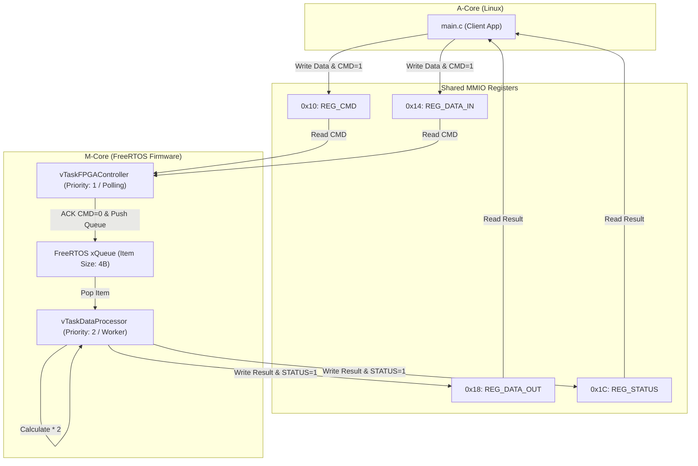

# Scenario 10: FreeRTOS による M コアマルチタスク制御 - 詳細設計 & アーキテクチャ解説

本ドキュメントは、FreeRTOS POSIX Port、マルチタスク間通信（`xQueue`）、優先度ベースプリエンプション、および Aコア（Linux）との共有レジスタコマンドプロトコルの詳細仕様書です。

---

## 1. FreeRTOS タスク間連携アーキテクチャ

---

## 2. FreeRTOS タスク設計と優先度

1. **`vTaskFPGAController` (優先度 1 / 低)**:
   - 仮想レジスタ `REG_CMD` を定期監視。
   - 要求を検知したら `REG_CMD` を 0 にクリア（ハンドシェイクACK）し、データを `xQueue` にプッシュ。
2. **`vTaskDataProcessor` (優先度 2 / 高)**:
   - `xQueueReceive()` でブロッキング待機。
   - キュー着弾時にプリエンプト起動し、データ加工（2倍演算）を実行して `REG_DATA_OUT` と `REG_STATUS` を更新。
