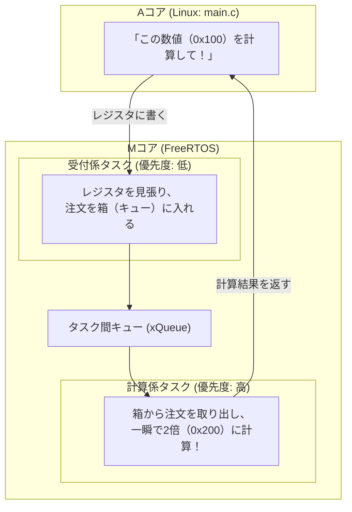

# 10_amp_mcore_freertos: マイコンでOSを動かす「FreeRTOS」

マイコン側（Mコア）で複数の仕事を同時にこなすとき、ベアメタル（OSなしの単純なwhileループ）では「時間のかかる計算」をしている間に「センサーの合図」を見落としてしまう危険があります。

そこで使われるのが **「RTOS（リアルタイムOS）」** です。
世界で最も普及しているオープンソースRTOSである **「FreeRTOS」** をマイコン側で動かし、複数の仕事（タスク）を優先度順に並行処理させてみましょう。

---

## このシナリオのゴール
**「Mコア側でFreeRTOSを起動し、タスク間キュー（xQueue）を使ってAコア（Linux）からの計算リクエストを並行処理する」**

---

## 直感イメージ：CPUとFPGAのやり取り
マイコンの中で2人の職人（タスク）が役割分担して、Linuxからの依頼をこなします。



---

## 3つの基本ステップ（コードの読み方）

[mcore_rtos.c](mcore_rtos.c) で行っていることは、以下の3ステップです。

1. **タスクとキュー（通信箱）を作る**
   - `xQueueCreate(...)` でタスク同士がデータを受け渡すキューを作成します。
   - `xTaskCreate(...)` で受付係タスクと計算係タスクの2つを作成します。
2. **OSのスケジューラをスタートする**
   - `vTaskStartScheduler();` を呼ぶと、FreeRTOSがタスクの切り替え（マルチタスク）を自動管理し始めます。
3. **Linuxからのリクエストを処理して返す**
   - 受付係がリクエストを受け取りキューに入れ、計算係が2倍に計算して結果をレジスタに書き込みます。

---

## 1. まずは動かしてみよう！

ターミナルで以下のコマンドを実行します。

```bash
./run.sh
```

**期待される出力例：**
```text
=== Scenario 10: FreeRTOS on M-Core Test Start ===
[A-Core] Booting M-Core FreeRTOS firmware...
[M-Core RTOS] FreeRTOS Kernel Started. Tasks running!
[A-Core] Sending Task Request: DATA_IN = 0x00000100...
[M-Core RTOS] Processed Request in TaskDataProcessor: Result = 0x00000200
[A-Core] Received Result: DATA_OUT = 0x00000200
[A-Core] SUCCESS: FreeRTOS multi-task coordination verified!
=== Scenario 10 Test Result: SUCCESS ===
```

---

## 2. ちょこっと改造チャレンジ！

理解を深めるために、計算係タスクの演算式を変えてみましょう。

- **実験:** [mcore_rtos.c](mcore_rtos.c#L70) の 70行目付近を見てみてください。
  ```c
  uint32_t result = data * 2; // 2倍演算
  ```
  これを `uint32_t result = data + 0x1000;` や `data * 3;` に書き換えて `./run.sh` を実行してみてください。  
  マイコン側が計算結果を更新してAコアへ返す様子が確認できます！

---

## 次のステップへ
これで「マイコン側でのFreeRTOSマルチタスク制御」が身につきました！

- **次のシナリオ [11_amp_mcore_threadx](../11_amp_mcore_threadx/README.md)**:  
  次は、航空宇宙や医療機器などの高信頼分野で標準採用されているマイクロソフトの**「Eclipse ThreadX（Azure RTOS）」**を試してみましょう。

---

## さらに詳しく知りたい方へ
FreeRTOS POSIX Portの内部構造やタスク優先度プリエンプションの詳細は、**[ADVANCED.md](ADVANCED.md)** を参照してください。
